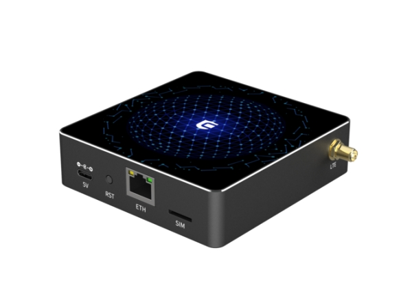
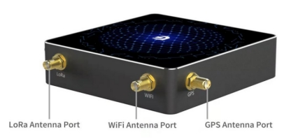
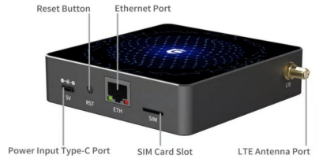

# COTX X1

COTX X1 is a standard LoRa WAN indoor gateway and a Helium Light gateway.

It is highly compatible and has a user-friendly interface.

Rich in software tools, powerful back office management and technical support.

Compact and exquisite appearance, easy to install and deploy.

 

## Key Features

l A complete 8-channel gateway based on the LORAWAN protocol.

l LoRa band support：CN470,EU868,US915,AS923,KR920,AU915.

l LoRa power support up to 27dbm.

l Built-in Ethernet. Supports WiFi-AP mode as well as LTE-CAT4 uplink connectivity for easy adaptation to different scenarios.

l Gateway management and configuration based on OPENWRT, supporting MQTT bridging mode for easy deployment of gateways and integration environments.

## Provisioning on TTN Network Server 

### 1.1 Required Equipment 

- COTX X1 Gateway
- Power source
- Internet ready

### 1.2 Gateway Setup 

**Step 1**: First  insert the SMA male connector of the antenna feeder into the LoRa®  Antenna port of the device and tighten it.

 

 

**Step 2**: Place  your gateway to a suitable location (eg. near a window) to provide the best coverage for devices. 

 

**Step 3**: If you are using a wired Ethernet connection, connect an Ethernet cable between a router or switch and the Ethernet Port on the gateway，so the gateway can connect to the internet.

 

 

**Step 4**: Finally Insert the power adapter into the 110~220VAC mains socket, connect the  power supply into the PWR INPUT on the gateway.

After plugging in the power, If the device indicator is green, the system is running properly. The Gateway should now connect to The Things Network .

### 1.3 Registering the Gateway on TTN 

1. Create a new TTN account or login to your previously created TTN account.

2. Select **CONSOLE** for **Europe1**.

   

 

3. Select **Gateways** , and then select **Register Gateway**.

4. Under Gateway ID,enter the 8 byte gateway ID recorded on the bottom of gateway’s label named **ID**.

5. Under Gateway EUI, enter the 8 byte gateway ID recorded on the bottom of gateway’s label named **ID**.

6. Under Description add a human readable description of the gateway.

7. Select a frequency plan from the dropdown box that corresponds to the frequency band supported by the Gateway.

8. The default connection of Gateway is **Europe1**, Gateway Server Address is: **eu1.cloud.thethings.network,** no additional other configuration. 

   

 

9. Click **Create  Gateway**. 

