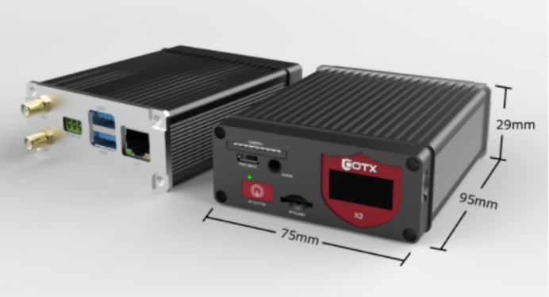
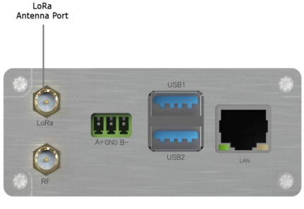
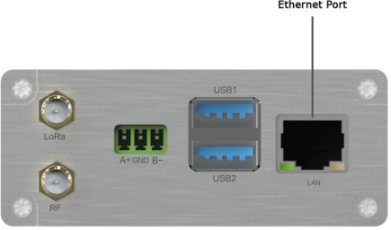
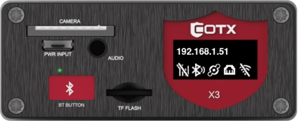

# COTX X3 GATEWAY

COTX X3 is a standard LoRaWAN indoor gateway and a Helium Full hotspot.

It is highly compatible and has a user-friendly interface.

Rich in software tools, powerful back office management and technical support.

Compact and exquisite appearance, easy to install and deploy.

 

 

## Key Features

- COTX-X3 is a standard LoRaWAN gateway that supports indoor and outdoor deployments(Outdoor accessories required).
- Powered by Raspberry Pi Compute Module 4B.
- Built-in Semtech SX1302&SX1303 ECC chipset.
- A complete 8-channel gateway based on the LORAWAN protocol.
- LoRa band support：CN470,EU868,US915,AS923,KR920,AU915.
- LoRa power support up to 27dbm.
- Support BLE/WiFi to implement the local and remote settings and management, and also manage other maker's gateways.
- A small screen for easy to monitor gateway status.
- Support BLE/WiFi to implement the local and remote settings and management, and also manage other maker's gateways.

## Provisioning on TTN Network Server

### 1.1 Required Equipment

- COTX X3 Gateway
- Power source
- Internet ready

### 1.2 Gateway Setup

**Step 1**: Install the LoRa antenna on the LoRa Antenna port.

**Step 2**: Place the gateway in a proper location (e.g. near a window) to have the optimum coverage and signal reception.

**Step 3**: For Ethernet access to WAN/Internet scenario, please connect Ethernet port on the gateway to an existing router with an Ethernet cable.

 

**Step 4**: Power supply connection-plug the power adapter to a 110~220V AC power source(socket), connect the micro USB connector to the PWR INPUT port on the gateway.

 

After the power connection, the LED would light up and turn green when it's ready for further configuration. IP address would show on the screen for Ethernet cable connect to WAN/Internet scenario. Click the BT button and the screen will display the Ethernet IP and device status.The Gateway should now connect to The Things Network .

 

### 1.3 Registering the Gateway on TTN 

1. Create a new TTN account or login to your previously created TTN account.

2. Select **CONSOLE** for **Europe1**.

   

 

3. Select **Gateways**, and then select **Register Gateway.**

4. Under Gateway ID,enter the 8 byte gateway ID recorded on the bottom of gateway’s label named “**ID**”.

5. Under Gateway EUI, enter the 8 byte gateway ID recorded on the bottom of gateway’s label named “**ID**”

6. Under Description add a human readable description of the gateway.

7. Select a frequency plan from the dropdown box that corresponds to the frequency band supported by the Gateway.

8. The default connection of Gateway is **Europe1**, Gateway Server Address is: **eu1.cloud.thethings.network,** no additional other configuration. 

   

 

9. Click **Create Gateway**. 

