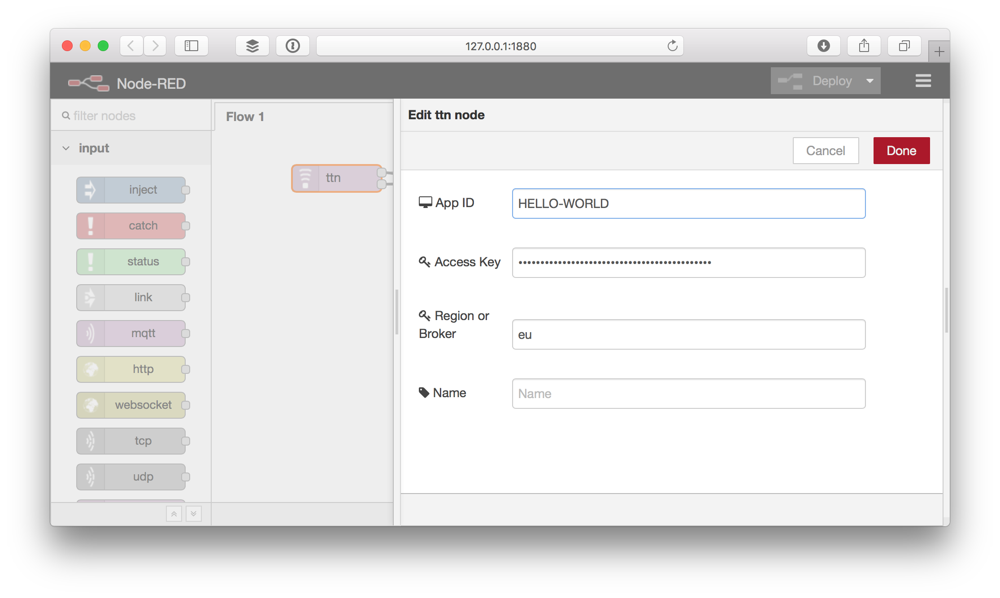

# Configure
To use the TTN node you need to configure it for your The Things Network Application.

## Lookup your application info

1.  Open [The Things Network Dashboard](https://preview.dashboard.thethingsnetwork.org/) a new window.
2.  Select the application you'd like to connect to.

## Edit the TTN node

1.  In Node-RED, drag a **ttn** node from the input category in the toolbox on the left to your workflow.
2.  Double click the node to edit it.

    Copy-paste the following information from the dashboard:

    * For **App ID**, copy **Application ID** from the **Application Overview** box.
    * For **Access Key**, scroll down to the **Access Keys**. For the key you'd like to use, click 👁 to show the key and then 📋 to copy it.
    * For **Region or Broker**, scroll back again to use **Handler Status** from the **Application Overview** box. Only copy the last bit following `ttn-handler-`.

    

4.  Click **Deploy** on the top right. The node should say it's connected:

    

    In the terminal you should see something like:

        8 Sep 11:53:41 - [info] [ttn:f2d6214.9aaa5e] Connected to TTN application hello-world