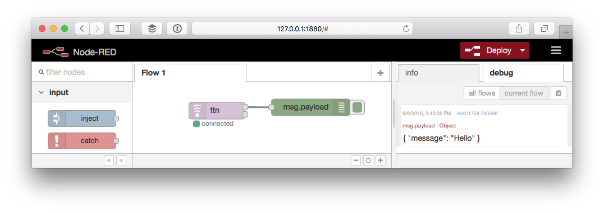
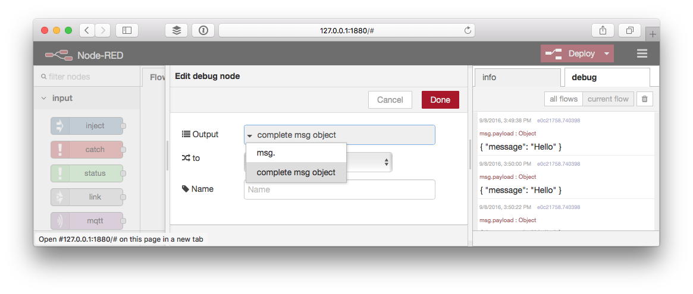

# Test
Let's verify if Node-RED receives your application messages.

## Messages
Messages sent by devices on the application can be received via the upper output of the **ttn** node.

1.  Drag a **debug** node from the output category of the toolbox.
2.  Drag the upper output of the **ttn** node to the input of the **debug** node.

    

3.  Click **Deploy**.
4.  In the right sidebar select the **debug** tab.
5.  Soon after a device sends a message to your application you should see it come in like this:
    
    

    By default the debug node only shows `msg.payload`, which is mapped to `msg.payload_fields` or `msg.payload_raw` of the original message received via MQTT. If you followed the [The Things Uno Quick Start](/uno/#quick-start) this would look like:

    ```json
    { 
      "message": "Hello"
    }
    ```
    
6.  Double click the **debug** node to edit it.
7.  Click the gray part of the **Output** value, select **complete msg object** and click **Done**:

  
  
8.  Click **Deploy** to see the next message in full, e.g.:

    ```json
    {
      "dev_id": "my-uno",
      "app_id": "hello-world",
      "port": 1,
      "counter": 19,
      "payload_raw": "SGVsbG8=",
      "payload_fields": {
        "message": "Hello"
      },
      "metadata": {
        "time": "2016-09-08T13:52:35.929159899Z",
        "frequency": 867.3,
        "modulation": "LORA",
        "data_rate": "SF7BW125",
        "coding_rate": "4/5",
        "gateways": [{
          "eui": "B827EBFFFE87BD22",
          "timestamp": 792136819,
          "time": "2016-09-08T13:52:35.912385Z",
          "channel": 4,
          "rssi": -55,
          "snr": 10.2
        }]
      },
      "payload": "[circular]",
      "_msgid": "f4fb1670.0b04e8"
    }
    ```

## Activations
Device activations are sent from the lower node output.

1.  Drag the lower output to the input same debug node.
2.  Restart a device by briefly disconnecting it from power or uploading a new Sketch.
3.  Soon, you should see the the activation message coming in like:

    ```json
    {
      "dev_id": "my-uno",
      "app_id": "hello-world",
      "app_eui": "70B3D57EF000001C",
      "dev_eui": "0004A30B001B7AD2",
      "dev_addr": "26012084",
      "metadata": {
        "time": "2016-09-08T14:04:52.755064047Z",
        "frequency": 868.5,
        "modulation": "LORA",
        "data_rate": "SF7BW125",
        "coding_rate": "4/5",
        "gateways": [{
          "eui": "B827EBFFFE87BD22",
          "timestamp": 1528942955,
          "time": "2016-09-08T14:04:52.716713Z",
          "channel": 2,
          "rssi": -57,
          "snr": 7.5,
          "rf_chain": 1
        }]
      },
      "payload": "my-uno",
      "_msgid": "10d6a2ba.ef295d"
    }
    ```
  
    The default `msg.payload` field has the ID of the activated device.