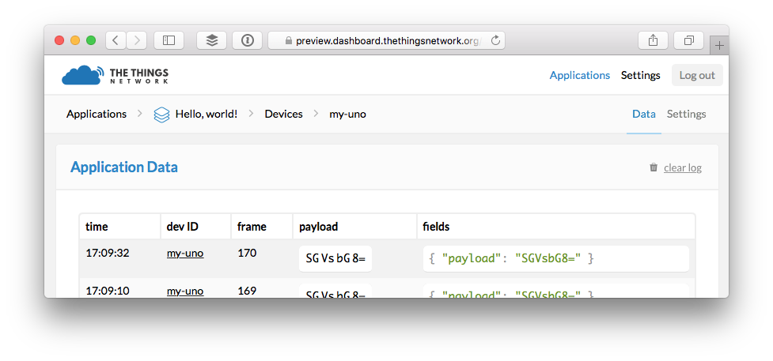
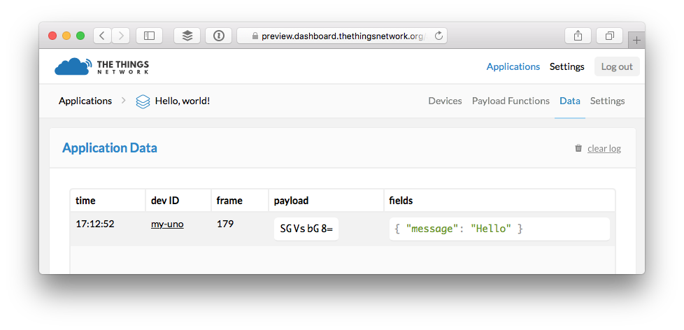
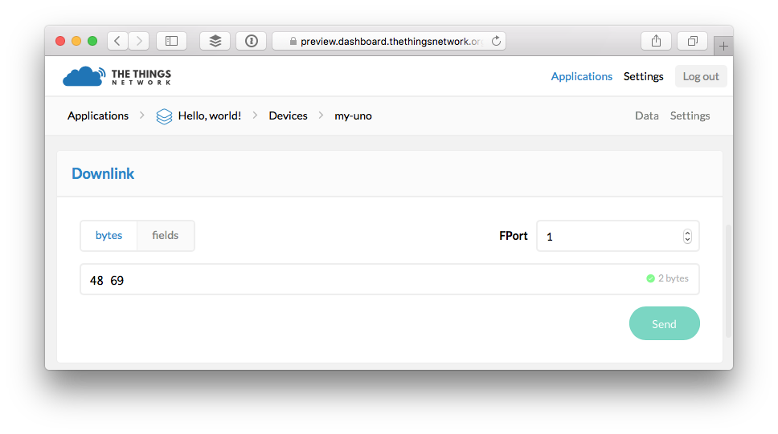

# Quick Start

This guide will walk you through programming The Things Uno to send and receive your first message via The Things Network.

## Setup Arduino IDE

1. [Download](https://www.arduino.cc/en/Main/Software) and install the latest Arduino Software (IDE).
2. Navigate to **Sketch > Include Library > Manage Libraries...**.
3. Search for **TheThingsNetwork** and click the result to select it.
4. Click the **Install** button which should appear:

  

The Arduino IDE will notify you of updates for the IDE and library automagically. :open_mouth:

> See the [Arduino Guide](/arduino/) for more details.

## Connect Device

1. Use the included Micro-USB cable to connect The Things Uno to an USB power of your computer.
2. In Arduino IDE select **Tools > Board > Arduino Leonardo**.
3. Navigate to **Tools > Port** and select the port that identifies as **Arduino Leonardo**.

If you don't see a port that identifies as **Arduino Leonardo** make sure The Things Uno's power LED is on and check the cable and USB port you have used. See [Arduino Troubleshooting](https://www.arduino.cc/en/Guide/Troubleshooting#toc16) for more suggestions.

## Get your DevEUI

The *DevEUI* is an unique address hard coded into the LoRa module. We need this address to register a device for OTAA with The Things Network.

1.  In the Arduino IDE open **File > Examples > TheThingsNetwork > [DeviceInfo](https://github.com/TheThingsNetwork/arduino-library/blob/master/examples/DeviceInfo/DeviceInfo.ino)**.
2.  Select **Sketch > Upload** `Ctrl/⌘ + U` to upload the sketch.
3.  Select **Tools > Serial Monitor** `Ctrl/⌘ + Shift + M` to open the [Serial Monitor](/arduino/#serial-monitor).
4.  Soon, it should print a list with **Device Information**, including the **DevEUI**:

    ```
    Device Information

    EUI: 0004A30B001B672F
    Battery: 3304
    AppEUI: 0000000000000000
    DevEUI: 0004A30B001B672F
    DevAddr: 00000000
    Data Rate: 5
    RX Delay 1: 1000
    RX Delay 2: 2000

    use the device `EUI` to register the device for OTAA
    ```

## Create Application
Messages to and from devices are routed via applications.

1.  On the dashboard, click [create application](https://preview.dashboard.thethingsnetwork.org/applications/create).

	* For **Application ID**, choose a unique ID of lower case, alphanumeric characters and nonconsecutive `-` and `_`.
	* For **Application Description**, enter anything you like.
	* Leave the checkbox enabled to automatically register the application to your default region.

	

2.  Click **Create application** to finish.

    You will be redirected to the newly created Application page where you can find the generated **App EUI** and **Access Keys**.

## Register Device
Devices need to be registered with an application in order to send and receive messages via it.

1.  Form the application page, select **Devices** from the top right menu.
2.  In the **Devices** box, click **register device**.
3.  On the **Register Device** screen leave **OTAA** selected.

    * For **Device ID**, choose a unique ID of lower case, alphanumeric characters and nonconsecutive `-` and `_`.
    * For **Device EUI**, click **customize it** and copy-paste the **DevEUI** you retrieved from your device.
    * Leave the **App Key** to be randomly generated.
    * For **App EUI**, select the generated EUI from the list.

    

4.  Click **Register** to finish.

    You will be redirected to the newly created device page where you can find the generated **App Key**.

## Activate Device
Now that you have registered the device you need to activate it from the device itself.

1.  In Arduino IDE, select **File > Examples > TheThingsNetwork > [SendOTAA](https://github.com/TheThingsNetwork/arduino-library/blob/master/examples/SendOTAA/SendOTAA.ino)**.
2.  Copy the **Application EUI** and **App Key** from the **Device Overview** box on the device page of the dashboard.

    > Use `👁` to show obfuscated keys and then use `📋` to copy. For the Arduino library we'll need the values in msb format. Toggle the format with `<>`.

    For OTAA, the example calls `ttn.join()` with the `appEui` and `appKey` you declared.

    ```c
    // ..

    // Runs once
    void setup() {

      // ..

      // Try OTAA with pauses of 6 seconds
      while(!ttn.join(appEui, appKey)){
        delay(6000);
      }
    }
    ```

3.  Select **Sketch > Upload** `Ctrl/⌘ + U` to upload the sketch.

    > Uploads might fail if you still have the Serial Monitor open.

## Message the application
The example you uploaded calls `ttn.sendBytes()` to send an uplink message from the device to your application on The Things Network.

Messages are arrays of bytes. You need to encode any (sensor) data you'd like to send as bytes.

```c
// Runs continuously with pauses of 10 seconds
void loop() {

  // Declare and send an array of bytes
  byte payload[] = { 0x48, 0x65, 0x6C, 0x6C, 0x6F };
  ttn.sendBytes(payload, sizeof(payload));

  delay(10000);
}
```

## Decode Messages
Let's watch the messages come in.

1.  Still on the dashboard device page, select **Data** from the top right menu.

    You should now see the messages come in:

    

    What you see is a base64 encoded version of the bytes you've sent. You can use MQTT or one of the libraries to receive the message as this and decode it there, but it's advisable to let the network do that before it forwards the messages.

2.  In the breadcrumbs on the top left, click the name of your application.
3.  From the top right menu, select **Payload Functions**.
4.  Leave **decoder** selected, copy paste the following JavaScript code and click **Save**.

    ```js
	function Decoder(bytes) {
	  // Here you can decode the payload into json.
	  // bytes is of type Buffer.
	
	  // todo: return an object
	  return {
	    message: String.fromCharCode.apply(null, bytes)
	  };
	}
    ```

5.  Select **Data** from the top right menu to monitor data from all connected devices. The next message should show decoded:

    

## Message a device
Now let's send a message back to the device. Devices can only receive the last message sent to them in response to a message they send themselves. This means that you need to poll The Things Network frequently to not miss any downlink messages.

1.  In the Arduino IDE, replace the call to `ttn.sendBytes()` with the following:

    ```c
    int downlinkBytes = ttn.sendBytes(payload, sizeof(payload));

    if (downlinkBytes > 0) {
      debugSerial.print("Received: ");
      
      for (int i = 0; i < downlinkBytes; i++) {
        debugSerial.print((char) ttn.downlink[i]);
      }
      
      debugSerial.println();
    }
    ```

2.  Select **Sketch > Upload** `Ctrl/⌘ + U` to upload the sketch.
3.  Select **Tools > Serial Monitor** `Ctrl/⌘ + M` to open the Serial Monitor.
4.  On the dashboard, go to the device page.
5.  In the **Downlink** box, copy paste the following hex-encoded list of bytes and click **Send**.

    ```
    48 69
    ```
    
    

7.  In the Arduino IDE, you should see the next succesful transmission followed up with the response:

    ```
    Sending: mac tx uncnf 1 with 5 bytes
    Successful transmission. Received 2 bytes
    Received: Hi
    ```