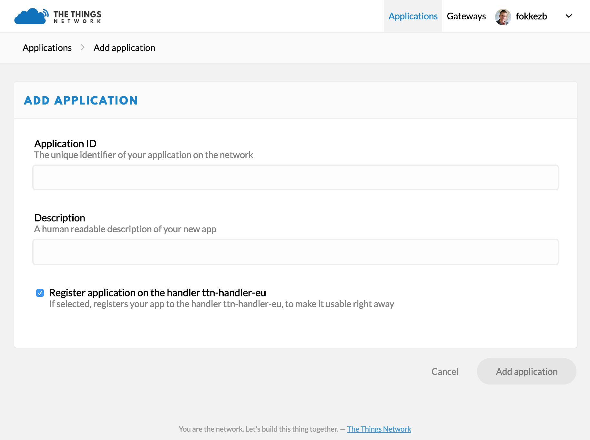

# Add Application
Devices can communicate with applications that they've been registered to. To register a device, you'll first need to add an application.

1.  In the console, click [add application](https://console.thethingsnetwork.org/applications/add).

    * For **Application ID**, choose a unique ID of lower case, alphanumeric characters and nonconsecutive `-` and `_`.
    * For **Application Description**, enter anything you like.
    * Leave the checkbox enabled to automatically register the application to your default region.

    

2.  Click **Add Application** to finish.

    You will be redirected to the newly added Application page where you can find the generated **App EUI** and **Access Keys**.
