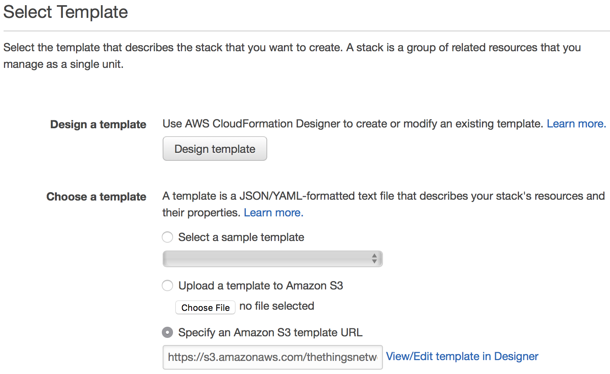
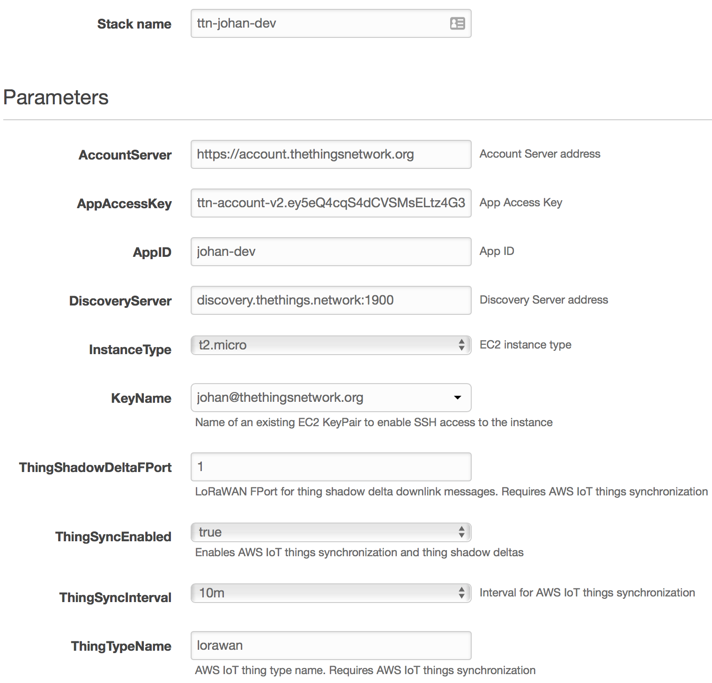

# Quick Start

This guide will walk you through setting up the AWS IoT integration using AWS CloudFormation, sync thing registry, sync thing shadows and work with uplink and downlink messages.

## Setup

1. Log in to the [AWS Management Console](http://console.aws.amazon.com)
2. In **Services** under **Management Tools**, go to **CloudFormation**
3. Click **Create Stack**
4. Under **Choose a template**, select **Specify an AWS S3 template URL** and enter:

   ```
   https://s3.amazonaws.com/thethingsnetwork/builds/integration-aws/dist/cloudformation.template
   ```

   

5. Click **Next**
6. In the **Specify Details**, configure the integration:

   * Enter a **Stack name**, for example `ttn-app`
   * Enter the **AppID** and an **AppAccessKey** of your application in The Things Network
   * Enter an **EnvironmentName** for Elastic Beanstalk, for example `ttn-app`
   * If you are using a private network, change the **AccountServer** and **DiscoveryServer** to the endpoints of your private network
   * Select an existing EC2 KeyPair in **KeyName** to access the EC2 instance. [Read more](https://docs.aws.amazon.com/AWSEC2/latest/UserGuide/ec2-key-pairs.html)

   > The **AppAccessKey** that you enter should at least have the `messages` and `devices` rights.

   Example parameters:
   

7. Click **Next**
8. Leave the **Tags**, **Permissions** and **Advanced** as is, and click **Next** again
9. Review your settings and check the **I acknowledge** box to acknowledge that resources for the integration may be created in your AWS account
10. Click **Create** to initiate the creation of the stack
11. After a coffee break of about six minutes, you will see two new stacks:

    

    > The `awseb-...` stack is an AWS Elastic Beanstalk stack that is created as part of the stack of the integration process.

🎉 You have now successfully configured the AWS IoT integration! See the guides on the left to learn working with the [thing registry](thing-registry), [test messages](test-messages), [thing shadows](thing-shadows), [act on data](act-on-data), [view metrics](view-metrics) and [update](update) the integration.
