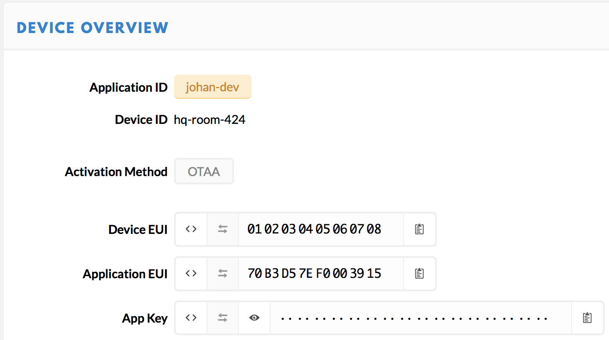

# Thing Registry

A key feature of the integration is synchronizing the thing registries of AWS IoT and The Things Network.

Synchronization happens in two ways: devices on The Things Network are created as things on AWS IoT, and things on AWS IoT are created as devices on The Things Network. In addition, changes to AWS IoT things are applied to The Things Network devices.

> The integration process synchronizes the thing registry by default every 10 minutes, see the AWS CloudFormation stack parameters in the [Quick Start](quick-start).

## Manage things

1. Log in to the [AWS Management Console](http://console.aws.amazon.com)
2. In **Services** under **Internet Of Things**, go to **AWS IoT**
3. In the menu on the left under **Manage**, go to **Things**
4. Here you see all devices of your application in The Things Network
5. Click on one device to see its attributes:

   

## Create thing in AWS IoT

1. In **AWS IoT**, under **Manage**, go to **Things**
2. Click **Create**
3. Click **Create a single thing**
4. Give your thing a distinctive name, e.g. `hq-room-424`
5. For **Thing Type**, select `lorawan`
6. Enter the searchable attributes **app_id**, **dev_eui** and **dev_id**
7. Add the attributes **app_eui** and **app_key** to enable Over The Air Activation (OTAA)

   > The **app_eui** and **dev_eui** are 8 byte hex values and **app_key** is a 16 byte hex value.

   

8. Click **Next**
9. Click **Create thing without certificate**

   > The integration has full access to AWS IoT; there is no need for a certificate per thing.

10. Log in to **The Things Network Console**
11. Under your application, go to **Devices**
12. After a synchronization took place, you will see your newly created device:

    

> Managing devices manually in The Things Network Console is typically easier and less error prone than in AWS IoT. However, thing registry synchronization with AWS IoT allows you and your applications to work with LoRaWAN things like any other things in AWS IoT.
