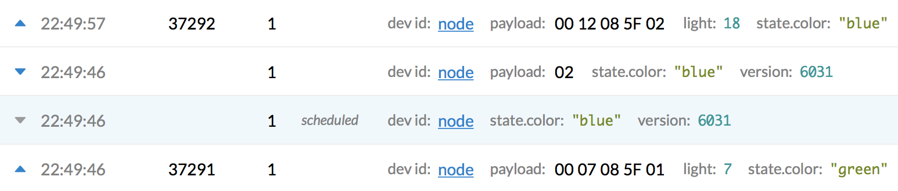
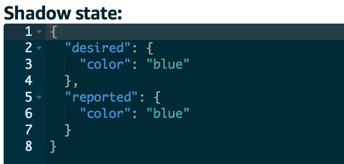

# Thing Shadows

A very powerful feature of AWS IoT are [Thing Shadows](https://docs.aws.amazon.com/iot/latest/developerguide/iot-thing-shadows.html): a JSON document that is used to store and retrieve current state information.

The integration supports reporting shadow state on uplink messages, and send shadow delta updates as downlink messages.

## Report shadow state

Reporting shadow state on uplink messages requires you to return a `state` object from your decoder or converter payload function in The Things Network, for example:

```js
function Decoder(bytes, port) {
  var colors = ["red", "green", "blue"];
  return {
    light: (bytes[0] << 8) | bytes[1],
    temperature: ((bytes[2] << 8) | bytes[3]) / 100,
    state: {
      color: colors[bytes[4]]
    }
  };
}
```

This function returns `light` and `temperature` as **telemetry** and `color` as **reported shadow state**.

1. Log in to the [AWS Management Console](http://console.aws.amazon.com)
2. In **Services** under **Internet Of Things**, go to **AWS IoT**
3. In the menu on the left under **Manage**, go to **Things**
4. Go to a thing that reports shadow state
5. Click **Shadow** to see its shadow:

   

## Send shadow delta updates

Sending shadow delta updates as downlink messages requires you to encode a `state` object in your encoder payload function to bytes, for example:

```js
function Encoder(object, port) {
  var colors = ["red", "green", "blue"];
  var bytes = [];
  if (object.state && object.state.color) {
    bytes.push(colors.indexOf(object.state.color));
  }
  return bytes;
}
```

This function returns the color index of the specified color in `state`.

1. Still in the AWS IoT thing's **Shadow**, click **Edit** next to **Shadow Document**
2. Add a `desired` object:

   

3. Click **Save**. This triggers a shadow delta update
4. When this happens, you will see the following in The Things Network Console's **Data** of your application:

   

   The integration schedules a downlink message with the shadow delta, to set the `color` to `blue` (row 3). This is sent to the device (row 2). The device changes its color and sends `blue` in the next message (row 1).

5. The thing shadow is automatically updated in AWS IoT:

   

> AWS IoT has extensive documentation on reported, desired and delta thing shadow states. In this guide, we use manual interaction. Programmatic interaction is easy and highly scalable by using the AWS IoT HTTP API and MQTT protocols. [See Using Thing Shadows](https://docs.aws.amazon.com/iot/latest/developerguide/using-thing-shadows.html)
