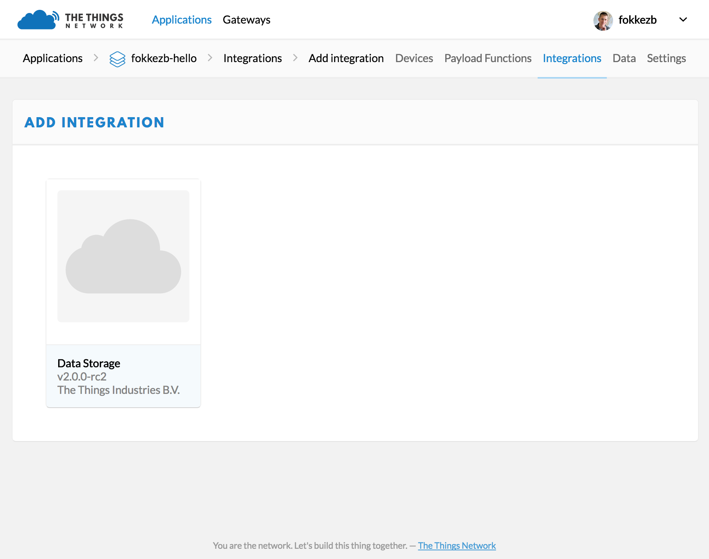
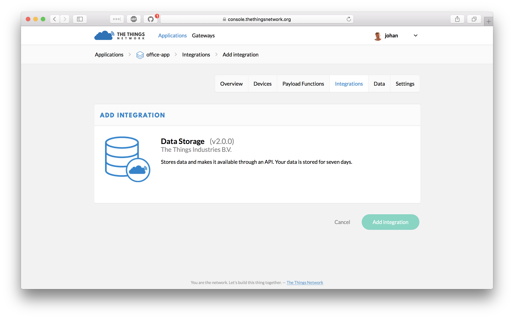

# Integrations

Integrations are the easiest way to connect your devices to an applications. An integration uses the same APIs or SDKs an application could use directly. Together with the private or public APIs of the platform it ties up the application running on the platform with The Things Network:

Platform Integrations completely you from any code and even The Things Network Console or CLI. A good example is an integration for Azure IoT Hub or Amazon IoT, where the user could manage his application and devices from there, while the integration takes care of synchronizing with The Things Network.

## HTTP Integration

A common integration is to forward messages to some webhook or other HTTP endpoint. Good examples are [IFTTT](https://ifttt.com/maker) and [Zapier](https://zapier.com/zapbook/webhook/). For these situations we provide an single HTTP Integration which acts as a bridge between the Handler Data API and any HTTP request you configure. It also provides you with a unique HTTP endpoint to send messages back to devices.

For some platforms we provide a configuration template. Instead of directly configuring the HTTP requests, we ask you only for variables like a platform key and generate the configuration for you.

## Add an Integration

1.  Go the application in the Console.
2.  Select **Integrations** from the top-right menu.
3.  Click the **add integration** link.
4.  Click to select the integration you'd like to add:

    
    
5.  Select the **Access Key** to use for this integration:

    
    
    > Depending on the integration, there might be more options to set. See the guide for the integration for details.
    
6.  Click **Create integration**.
