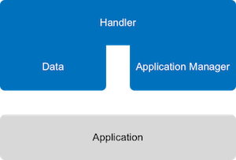

# Application Manager

The Handler's Application Manager API offers methods manage Applications and Devices registered to The Things Network. To use the API you need an Application Access Key or Access (JSON Web) Token. You can use either the [gRPC API or the HTTP API](usage.md#grpc-or-http) which wraps it.

## Use and Context

The Handler Application Manager API is mostly used to [build Platform Integrations](../../platforms/index.md). To actually communicate with devices over The Things Network you need the [Data API](../../applications/mqtt/index.md) of the Handler.

## Community endpoints
Use the following endpoints for the community network:

- [gRPC](http://www.grpc.io/): `<Region>.thethings.network:1904`
- HTTP: `http://<Region>.thethings.network:8084`

  > A secure endpoint at `https` will follow soon.

Replace `<Region>` with the last part of the handler you registered your application to, e.g. `eu`.

## Example

To demonstrate the usage of this API we have an [example in Go](https://github.com/htdvisser/ttn-application-manager-example).

## SDKs

Only the [Java SDK](https://github.com/TheThingsNetwork/java-app-sdk) has experimental support for the Application Manager API.
