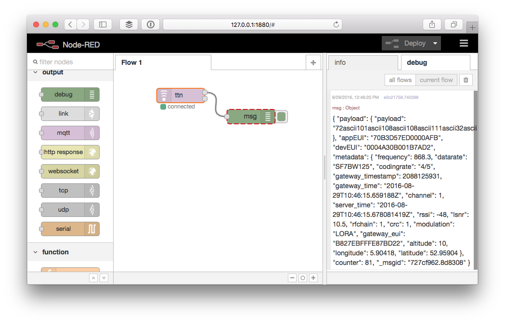

# Test
Let's verify if Node-RED receives your application messages.

## Messages
Messages sent by devices on the application can be received via the upper output of the **ttn** node.

1.  Drag a **debug** node from the output category of the toolbox.
2.  Drag the upper output of the **ttn** node to the input of the **debug** node.
3.  Double click the **debug** node to edit it.
4.  Click the gray part of the **Output** value, select **complete msg object** and click **Done**:

    

5.  Click **Deploy**.
6.  In the right sidebar select the **debug** tab.
7.  Soon after a device sends a message to your application you should see it come in like this:

    

    The output has the following format:

    ```json
    { 
      "payload": {
        "foo": "AA=="
      },
      "appEUI": "70B3D57ED00001DA",
      "devEUI": "00000000973572D0",
      "counter": 38,
      "_msgid": "6e29afc4.91d65",
      "metadata": { 
        "frequency": 868.32684,
        "datarate": "SF8BW125",
        "codingrate": "4/5",
        "gateway_timestamp": 1,
        "gateway_time": "2016-05-25T20:34:12.55856605Z",
        "channel": 0,
        "server_time": "2016-05-25T20:34:12.555147951Z",
        "rssi": -1,
        "lsnr": 1.4,
        "rfchain": 0,
        "crc": 0,
        "modulation": "LoRa",
        "gateway_eui": "0102030405060708",
        "altitude": 0,
        "longitude": 0,
        "latitude": 0
      }
    }
    ```

## Device activation events
Device activation events are sent from the lower node output.

Follow the same steps as for **Messages** to verify you get an output like:

```json
{ "devEUI": "00000000973572D0" }
```
