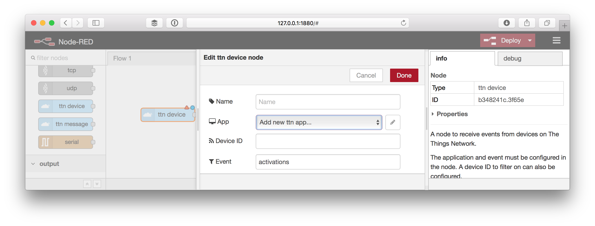
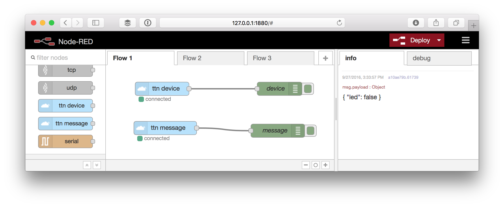

# Quick Start
This guide will walk you through setting up a Node-RED flow that listens to device activations and messages and responds with a message in return.

> This guide assumes the sketch and payload functions of [The Things Uno / Quick Start](../../devices/uno/quick-start.md), but can be easily applied to any other.

The full flow that we will build is also included as [example](https://github.com/TheThingsNetwork/nodered-app-node/blob/master/examples/quickstart.json) in the Node-RED library.

## Setup
To get started you need to install Node-RED and add the TTN node, both via [NPM](https://www.npmjs.com/).

### Node-RED

1.  Make sure you have [Node.js](https://nodejs.org/) and then install Node-RED:

    ```bash
    sudo npm install -g --unsafe-perm node-red
    ```

    See Node-RED's [Getting Started / Installation](http://nodered.org/docs/getting-started/installation) for details.
  
2.  Run Node-RED:

    ```bash
    node-red
    ```

    See Node-RED's [Getting Started / Running](http://nodered.org/docs/getting-started/running) for details.
	
3.  Spot a line like this to know what URL to open in your browser:

    ```bash
    29 Aug 11:13:01 - [info] Server now running at http://127.0.0.1:1880/
    ```

    You should see something like:

    

### The Things Network nodes
    
1.  Add The Things Network nodes using the refactor tag:

    ```bash
    cd $HOME/.node-red
    npm install node-red-contrib-ttn@refactor
    ```
        
    See Node-RED's [Getting Started / Adding Nodes](http://nodered.org/docs/getting-started/adding-nodes) for details.
    
2.  Restart (`Ctrl+C` to stop) Node-RED and refresh your browser.

    You should now see several **ttn** nodes in the sidebar:

    

## Configure 

All The Things Network nodes can share the same app configuration.

1.  Drag the **ttn device** node to the flow and double-click it to edit.

    

2.  Now for **App** either select an existing configuration or select **Add new ttn app...** selected and click the `✏️`  button.

    
    
    Copy-paste the following information from your application in your console:

    * For **App ID**, copy **Application ID** from the **Application Overview** box.
    * For **Access Key**, scroll down to the **Access Keys**. For the key you'd like to use, click <i class="ion-eye"></i> to show the key and then <i class="ion-clipboard"></i> to copy it.
    * For **Region or Broker**, scroll back again to use **Handler Status** from the **Application Overview** box. Only copy the last bit following `ttn-handler-`.

3.  Click **Add** to save the configuration.

## Receive Events
[Activations](../mqtt/api.md#device-activations) and other [devices events](../mqtt/api.md#device-events) can be received via the **ttn device** node.

1.  Still editing the **ttn device** node, enter `activations` in the **Event** field.
2.  Click **Add** to create the node.
3.  Drag a **debug** node from the output category of the toolbox.
4.  Drag the output of the **ttn device** node to the input of the **debug** node.

    
    
5.  Click **Deploy** to deploy the flow.
6.  In the right sidebar select the **debug** tab.
7.  Restart a device by briefly disconnecting power or upload a sketch.
8.  Soon, you should see the activation message coming in like:

    ```
    my-uno
    ```

    By default the debug node only shows `msg.payload`, which in the case of the `activations` event is just the Device ID.
    
9.  Double click the **debug** node to edit it.
10. Click the gray part of the **Output** value, select **complete msg object** and click **Done**:
    
    
    
11. Click **Deploy** to see the next message in full:

    ```json
    {
      "app_eui": "70B3D57EF000001C",
      "dev_eui": "0004A30B001B7AD2",
      "dev_addr": "26012084",
      "metadata": {
        "time": "2016-09-08T14:04:52.755064047Z",
        "frequency": 868.5,
        "modulation": "LORA",
        "data_rate": "SF7BW125",
        "coding_rate": "4/5",
        "gateways": [{
          "eui": "B827EBFFFE87BD22",
          "timestamp": 1528942955,
          "time": "2016-09-08T14:04:52.716713Z",
          "channel": 2,
          "rssi": -57,
          "snr": 7.5,
          "rf_chain": 1
        }]
      },
      "dev_id": "my-uno",
      "payload": "my-uno",
      "_msgid": "10d6a2ba.ef295d"
    }
    ```

## Receive Messages
Messages sent by devices on the application can be received via the **ttn message** node.

1.  Drag a **ttn message** node from the input category of the toolbox.
2.  Double click the node to [configure](#configure) it.
3.  Drag a **debug** node from the output category of the toolbox.
4.  Drag the output of the **ttn message** node to the input of the **debug** node.

    

5.  Click **Deploy**.
6.  In the right sidebar select the **debug** tab.
7.  Soon after a device sends a message to your application you should see it come in like this:
    

    ```json
    {
      "led": false
    }
    ```
    
    By default the debug node only shows `msg.payload`, which does not include the ID of the device that sent the message.
    
8.  Double click the **debug** node to edit it.
9.  Click the gray part of the **Output** value, select **complete msg object** and click **Done**:
    
    
    
10. Click **Deploy** to see the next message in full, including `dev_id`:

    ```json
    {
      "port": 1,
      "counter": 31,
      "payload_raw": {
        "type": "Buffer",
        "data": [0]
      },
      "payload_fields": {
        "led": false
      },
      "metadata": {
        "time": "2016-09-27T12:35:46.8640105Z",
        "frequency": 867.1,
        "modulation": "LORA",
        "data_rate": "SF7BW125",
        "coding_rate": "4/5",
        "gateways": [{
          "gtw_id": "eui-b827ebfffe87bd22",
          "timestamp": 1329587859,
          "time": "2016-09-27T12:35:46.842692Z",
          "channel": 3,
          "rssi": -111,
          "snr": 6.2
        }]
      },
      "dev_id": "my-uno",
      "payload": {
        "led": false
      },
      "_msgid": "426db946.bd9248"
    }
    ```

## Send Messages

Use the **ttn send** node to send messages to devices.

1.  Drag a **ttn send** node from the output category of the toolbox.
2.  Double click the node to [configure](#configure) it.

    > We could specify a device and port to address here, but instead we'll do this via the message that we'll send to the node.

3.  Drag a **function** node from the function category of the toolbox and double click to configure it.

    Use the following code for the function:

    ```js
    return {
        dev_id: msg.dev_id,
        port: msg.port,
        payload: {
            led: !msg.payload.led
        }
    };
    ```
    
5.  Drag the output of the **ttn message** node to the input of the **function** node.
6.  Drag the output of the **function** node to the input of the **ttn send** node.
7.  Drag a **debug** node from the output category of the toolbox.
8.  Drag the output of the **function** node to the input of the **debug** node.

    

7.  Click **Deploy**.

    The next time your device sends a message, a message will be send in response to toggle the LED. You can use the last **debug** node we added to verify the message we use as input for the **ttn send** node is correct.

👏 You now know how to receive events and messages in Node-RED as well as how to trigger actions on that, for example by sending a message in response. Now go build something awesome and share it on [labs](https://www.thethingsnetwork.org/labs/)!
