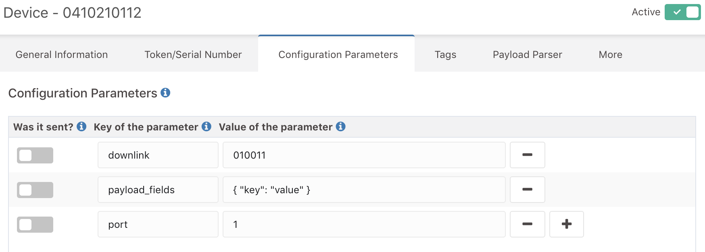

# Tago

[Tago](https://tago.io/) allows you to quickly store, visualize, and act on sensor data.

After creating an account on [Tago.io](https://tago.io/), activate the integration in The Things Network [Developer Console](https://console.thethingsnetwork.org/) by going to your application and Select Tago from the integration options.

Think of a Process ID, select your access key and add (optional) the Authorization.

> The **Authorization field** is not required, but it adds security to your integration, to use it, just type any secret text there and type the same code when generating the token at Tago

## Uplink

For your application to authenticate to Tago, you need to register your device at Tago.

Go to the [Tago admin](https://admin.tago.io/), then go to **Device** and create a new one

Go to tokens and type your *device EUI*.

> If you use the Authorization at TTN, type the same secret text in the Verification Code

Now when your device sends data to The Things Network, it will automatically send it to Tago.

## Downlink

To send data back to your device, just go to your device at Tago and visit the tab **Configuration Parameters**.

Here you can add two parameters, for different data formats.

**payload_raw** 
Will send the raw payload to your device.

**payload_fields** 
The payload fields value needs to be a **valid JSON Object**, and Tago will send that object to your device.

You can choose between these two data formats, or you can send both.

When your data is sent to The Things Network and scheduled to send to your device, your parameter will be **marked as sent**, to **send it again**, mark the parameter as not sent.

