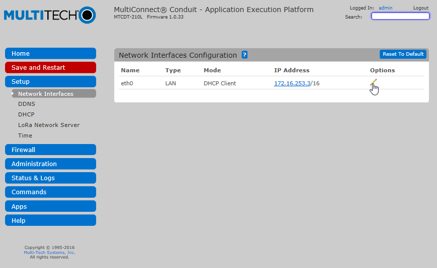

# AEP model

## Login to web interface

To start configuring your conduit connect a computer to its LAN interface and open a browser to `http://192.168.2.1/`. This opens the login dialog for the configuration interface of the conduit:


The default credentials are:

* **Username**: `admin`
* **Password**: `admin`

## First-Time Setup Wizard
After login (be patient, it takes a while) the **First-Time Setup Wizard** opens:


Click **Next** to begin.

### Choose Password

The first step it to change the current default password (`admin`):


> Keep your new password in a safe place, you will have to reset to factory defaults if you lose it!

### Time Configuration

Select your time zone and update both date and time if required.


Click **Next** to proceed.

### Internet Configuration

Set the **Mode** to *DHCP Client* if you use DHCP on your network (most likely) or manually configure your internet connection. Click **Finish** once you are done.


If you changed the IP Address or selected DHCP a popup will appear warning you that the DHCP Server of the Conduit itself will be disabled. This is fine, so click **OK** to continue.


## Access & Network Configuration

As the LAN interfaces do not allow specifying a DNS server and we need DNS to work later on we will now change to network to WAN. However as this would lock us out we need to allow remote access for the management first.

> Skip this step if you are using a cellular modem to connect the gateway to the internet. Just configure the cellular modem per instructions on the MultiTech website.

### Access Configuration

In the left hand menu choose **Administration** followed by **Access Configuration**:


On the next screen tick the boxes marked yellow in the next screenshot:


When you select **Via WAN** under HTTPS a warning will appear. Just click **Continue**.


Once you have selected the 3 checkboxes, click **Submit** to save the changes.

### Network Interfaces

Select **Setup > Network Interfaces** from the left menu:


In the next screen select the pencil in the **eth0** row:



In the configuration popup change the **Type** from *LAN* to *WAN*.

> If you use a static IP, fill out the gateway and DNS entries. Use 8.8.8.8 for Google's public DNS if you do not have (or know) the local DNS server information.


Click **Finish** to save.

Now select **Save and Restart** from the menu:


You will be prompted to confirm the restart. Choose **OK** to proceed.

Disconnect the temporary network cable and connect the Conduit to the target network while it is restarting.

## Configure AEP for TTN

Once the Conduit has finished restarting and is connected to the target network, connect a computer to the same network and login to the Conduit.

> If you have not configured your Conduit with a static IP, you will have to [find out which IP the DHCP assigned to it](http://apple.stackexchange.com/questions/19783/how-do-i-know-the-ip-addresses-of-other-computers-in-my-network).

* For Windows use a terminal program like Putty to connect to `admin@<IP>`:

  

  You will get a security alert concerning the host key. Accept the new key with **Yes**.

  

* For Linux/OSX open terminal and connect via `ssh admin@<IP>`.

Download the installer by entering the next command:

```bash
wget https://github.com/kersing/multitech-installer/raw/master/installer.sh --no-check-certificate
```


Now run the installer and provide the prompted information. (Answer **Yes** to the first question, since we've already set up the conduit network etc in the previous steps.

```bash
sh installer.sh
```


👏 Your gateway is now connected to The Things Network!
