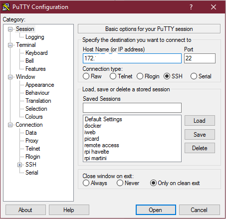
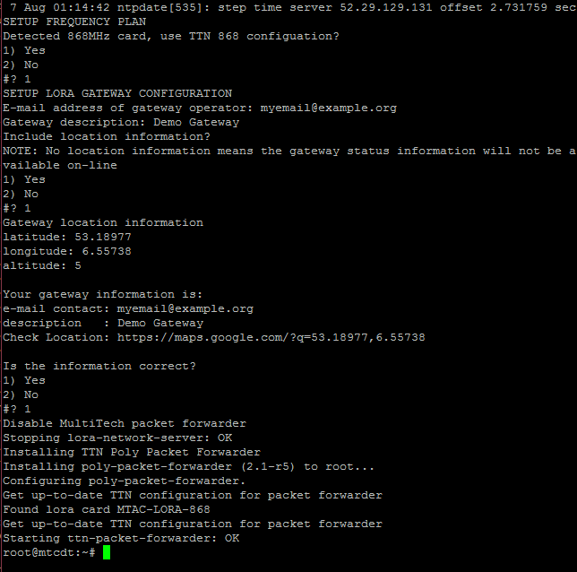

# Configure mLinux model
mLinux is an open source embedded Linux distribution for the MultiConnect Conduit and is the next generation version of CoreCDP.

<!-- DO NOT EDIT THIS FILE FROM THE DOCS REPOSITORY BUT ONLY FROM: -->
<!-- https://github.com/kersing/multitech-installer/blob/master/docs/_mlinux.md -->

## Prepare USB stick

Find a FAT or FAT32 formatted USB stick and download [installer.sh](https://github.com/kersing/multitech-installer/raw/master/installer.sh) to it.

## Connect

Wait to connect the power of the Conduit until we say so. ☝️

1. Remove the panel with the MultiTech logo from the front of the Conduit by remove the single screw to the left of the logo.
2. Use a Micro-USB cable between the connector you just uncovered and your computer.
3. Insert the USB stick to USB port on the back of the conduit.

### Windows

Use Windows Device Manager to look up the `COM*` for the Conduit, identified by `* USB UART`:


Start PuTTY, select **Serial**, enter the COM port you found and set the **Speed** to `115200`:


### Mac OS / Linux

Run the following command in terminal to look up the USB connection:

```bash
ls /dev/tty.usb*
```

If that doesn't work, try this instead and look for the value of `IOSerialCalloutDevice`.   

```bash
ioreg -c IOSerialBSDClient  | grep usb
```

Now connect to the USB device using `115200` for speed. For example:

```bash
screen /dev/cu.usbserial 115200
```

## Login via terminal

Connect the Conduit's power cable. You will now see its boot messages. Wait for the login prompt to appear:


The default credentials are:

* **Username**: `root`
* **Password**: `root `

## Copy installer

To get the installer we need mount the USB drive:

```bash
mount /dev/sda1 /mnt
```

Copy the installer to the conduit:

```bash
cp /mnt/installer* /home/root
```

Tell Linux to release the USB drive:

```bash
umount /mnt
```

> During the download to the USB stick the `installer.sh` file might have been renamed to `installer.txt`. If that happened, just use `installer.txt` whenever the instructions say `installer.sh`.

## Network Setup

Start the installer:

```bash
sh installer.sh
```

The installer will prompt you for information it requires to configure the Conduit:

* A new password to secure access to the conduit.
* Your time zone.
* Network Setup.


Once it is done, hit the enter button to shutdown and wait for the led to stop blinking.

## Reconnect

Once the led has stopped blinking you can remove the power cable, USB drive, the Micro-USB cable and replace the front panel.

Now use an ethernet cable to connect the Conduit to the target network and reconnect the power cable. Wait for the conduit to finish booting (the heartbeat led starts blinking), connect a computer to the same network and login to the Conduit.

> If you have not configured your Conduit with a static IP, you will have to [find out which IP the DHCP assigned to it](http://apple.stackexchange.com/questions/19783/how-do-i-know-the-ip-addresses-of-other-computers-in-my-network).

* For Windows use a terminal program like Putty to connect to `<IP>`:

  

  You will get a security alert concerning the host key. Accept the new key with **Yes**.

  

* For Linux/OSX open terminal and connect via `ssh <IP>`.

Login as user `root` with the password you set via the installer.


## TTN Configuration {#ttn-configuration-mlinux}

Now restart the installer and provide the required answers when prompted:

```bash
sh installer.sh
```



The installation is complete once the `Starting ttn-packet-forwarder: OK` message appears.

Check the output of the packet forwarder for any errors:

```bash
tail /var/log/lora-pkt-fwd.log
```

The installation was successful if the output looks like:

```
##### 2016-08-06 23:19:11 GMT #####
### [UPSTREAM] ###
# RF packets received by concentrator: 1
# CRC_OK: 100.00%, CRC_FAIL: 0.00%, NO_CRC: 0.00%
# RF packets forwarded: 1 (19 bytes)
# PUSH_DATA datagrams sent: 2 (461 bytes)
# PUSH_DATA acknowledged: 100.00%
### [DOWNSTREAM] ###
# PULL_DATA sent: 3 (100.00% acknowledged)
# PULL_RESP(onse) datagrams received: 0 (0 bytes)
# RF packets sent to concentrator: 0 (0 bytes)
# TX errors: 0
### [GPS] ###
# Invalid gps time reference (age: 1470525551 sec)
# Manual GPS coordinates: latitude 53.18977, longitude 6.55738, altitude 5 m
##### END #####
INFO: [up] PUSH_ACK for server router.eu.thethings.network received in 13 ms
INFO: [down] for server router.eu.thethings.network PULL_ACK received in 13 ms
```
