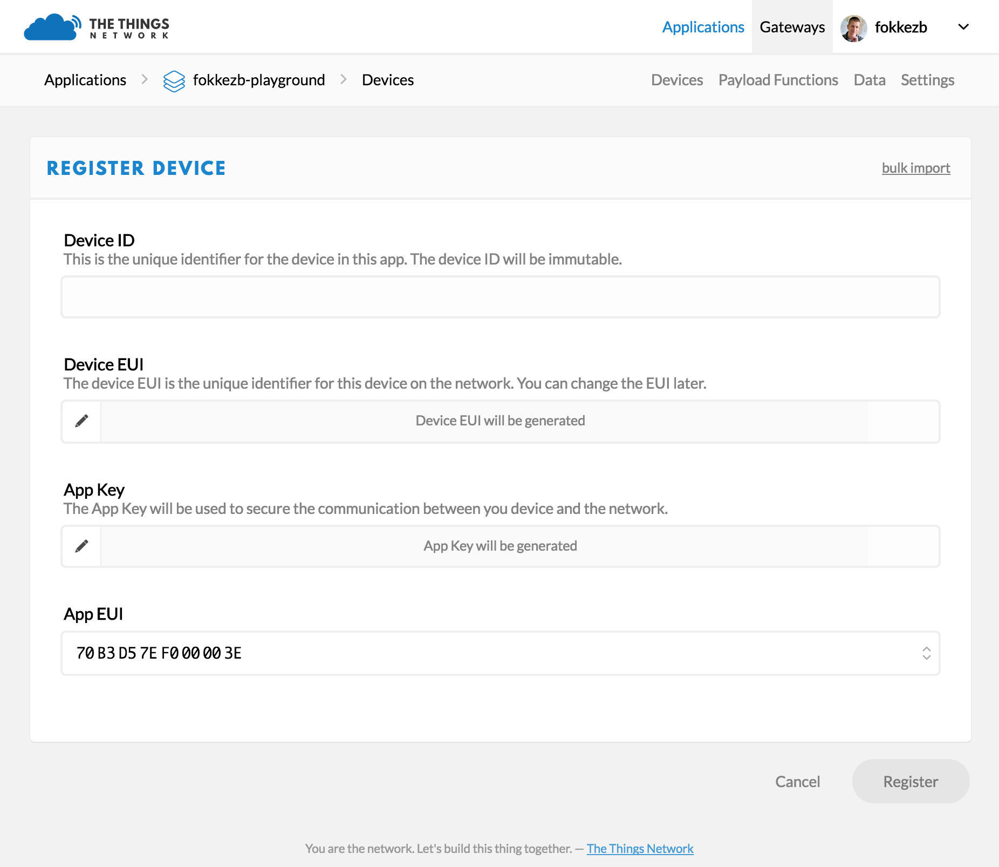

# Quick Start
This guides walks you through programming your The Things Node with your first sketch to send its measurements over The Things Network.

## Setup Arduino IDE

1.  Follow [Arduino / IDE Setup & Usage](../arduino/ide.md) to setup the IDE.

    > Skip the installation of TheThingsNetwork library. Instead, [download](https://github.com/TheThingsNetwork/arduino-device-lib/archive/feature/node.zip) the [`feature/node`](https://github.com/TheThingsNetwork/arduino-device-lib/tree/feature/node/) branch of the The Things Network Arduino Library and follow the instructions on [Importing a .zip Library](https://www.arduino.cc/en/Guide/Libraries#toc4).

2.  Follow SparkFun's [Installation Instructions](https://github.com/sparkfun/Arduino_Boards#installation-instructions) to add the additional board manager and install the **SparkFun AVR Boards**.

## Connect your Device

1.  Open the case.

    > You do not need to insert batteries since while we program it, the Node will be powered over USB.

2.  Connect the Micro-USB cable to the connector found between the batteries compartment and the top side of the case.

    

    > Some Micro-USB cables might not fit the limited space between the batteries compartment and the casing. The one we ship with the Node does.
    
3.  Connect the USB cable to your computer.
4.  In the Arduino IDE, select **Tools > Boards > SparkFun Pro Micro**.
5.  Select **Tools > Processor > ATmega32U4 (3.3V, 8Mhz)**.
6.  Select the Node's Serial Port under **Tools > Port**.

    > Unlike The Things Uno, which the Arduino IDE recognizes as *Arduino Leonardo*, it does not recognize the No as *SparkFun Pro Micro*. You will have to see what `/dev/*usb*` (Mac/Linux) or `COM` (Windows) option appears in the menu after connecting the Node.
    
## Get your Device EUI
To communicate via The Things Network, you need to register your device. For this, we'll need its unique **Device EUI**. This is a unique address, hard coded into the LoRa module.

1.  In the Arduino IDE, select **File > Examples > TheThingsNetwork > [DeviceInfo](https://github.com/TheThingsNetwork/arduino-device-lib/blob/master/examples/DeviceInfo/DeviceInfo.ino)**.

    > Replace `REPLACE_ME` with either `TTN_FP_EU868` or `TTN_FP_US915` depending on the frequency plan of your device.

2.  Select **Sketch > Upload** `Ctrl/⌘ U` to upload the sketch.

    > Uploads might fail if the Serial Monitor is open or if the IDE lost track of [the port you selected](#connect-your-device). Close the monitor, check the port selection and try again. If it still fails, check [Arduino Troubleshooting](https://www.arduino.cc/en/Guide/Troubleshooting#toc1).

2.  Within 10 seconds, select **Tools > Serial Monitor** `Ctrl/⌘ Shift M` to open the [Serial Monitor](https://www.arduino.cc/en/Guide/Environment#toc12).

    Soon, it should print a list of information:

    ```
    -- STATUS
    EUI: 0004A30B001B7AD2
    Battery: 3223
    AppEUI: 70B3D57EF000001C
    DevEUI: 0004A30B001B7AD2
    Band: 868
    Data Rate: 5
    RX Delay 1: 1000
    RX Delay 2: 2000
    Total airtime: 0.00 s
    ```
    
    Use the first `EUI` value to register your device.
    
🎉 You have connected your device, written your first sketch, uploaded it to your device and monitored your device logs to retrieve its Device EUI.
    
## Create an Account
To register your device you'll need a The Things Network account.

1.  Go to [account.thethingsnetwork.org](https://account.thethingsnetwork.org) and click [create an account](https://account.thethingsnetwork.org/register).

    You will receive an email to confirm your email address. You have 24 hours to do so, so let's now wait for that and carry on! 🚀

    > You can change all but your username later via your [Profile](https://account.thethingsnetwork.org/users/profile).

2.  Select [Console](https://console.thethingsnetwork.org) from the top menu.
3.  From the top right menu, select your name and then [Settings](https://console.thethingsnetwork.org/settings) from the dropdown menu to change the default Handler if the one currently selected is not where you'll be deploying most of your devices.

## Add an Application
Devices need to be registered with an application to communicate with. Let's add one.

1.  On [console.thethingsnetwork.org](https://console.thethingsnetwork.org/), click [add application](https://console.thethingsnetwork.org/applications/add).

	* For **Application ID**, choose a unique ID of lower case, alphanumeric characters and nonconsecutive `-` and `_`.
	* For **Description**, enter anything you like.
	* Leave the checkbox enabled to automatically register the application to your default region.

	

2.  Click **Add application** to finish.

    You will be redirected to the newly added application.

## Register your Device
You are now ready to register your device to the application.

1.  On the application's screen, scroll down to **Devices** or select **Devices** from the top right menu.
2.  In the **Devices** box, click **register device**.

    * For **Device ID**, choose a - for this application - unique ID of lower case, alphanumeric characters and nonconsecutive `-` and `_`.
    * For **Device EUI**, copy-paste the **DevEUI** [you retrieved from your device](#get-your-device-eui).
    * Leave the **App Key** to be randomly generated.
    * Leave the default **App EUI** selected.

    

4.  Click **Register** to finish.

    You will be redirected to the newly registered device, where you can find the generated **App Key** which we'll need next.

## The Things Node example
The The Things Network [Arduino Library](../arduino/index.md) comes with a class dedicated to The Things Node. It wraps the commands to work with the various sensors in simple APIs.

The library also comes with an example demonstrating most of these APIs. Let's hit the ground running by uploading that example.

1.  Still in the console, scroll down the device's screen to **Example Code** and copy the keys:

    

2.  In the Arduino IDE, select **File > Examples > TheThingsNetwork > [Node](https://github.com/TheThingsNetwork/arduino-device-lib/blob/feature/node/examples/Node/Node.ino)**.

    * Replace the lines following the comment **Set your AppEUI and AppKey** with the keys you copied from the Console.
    * Replace `REPLACE_ME` with either `TTN_FP_EU868` or `TTN_FP_US915` depending on the frequency plan of your device.

2.  Select **Sketch > Upload** `Ctrl/⌘ U` to upload the sketch.
3.  Within 10 seconds, select **Tools > Serial Monitor** `Ctrl/⌘ Shift M` to open the [Serial Monitor](https://www.arduino.cc/en/Guide/Environment#toc12).

    Soon it should it should log the current temperature and the values of other sensors The Things Node has.
    
Let's run through the Sketch together to understand what it does.

### Setup
In `setup()`, after the part where we initialize TheThingsNetwork class to communicate with The Things Network, we get the singleton of TheThingsNode class. Here, we can configure the sensors and register callback functions that should be run when a sensor is triggered.

### Loop
The only code you should have in `loop()` is a call to `node->loop()`.

TheThingsNode will optimize the battery efficiency of the device by putting it into sleep. It will wake up every 8 seconds or when a sensor triggers it. In both scenarios, the `loop()` function will run. What `node->loop()` will do is figure out why it woke up and call the relevant handler registered in `setup()`.

### Interval
Any code you want to run regularly should be put in a function registered using `node->onInterval()`. You can use `node->configInterval(bool enabled, uint32_t ms)` to set an interval in milliseconds when `ttn->loop()` should call this function.

> Since the device only wakes up every 8 seconds or when a sensor triggers it, it makes no sense to set the interval to less than 8000ms.

### Callbacks
In the callbacks you can use the [API](api.md)'s getters and setters to read sensors, change the LED's color, reconfigure or temporarily disable sensors etc. And of course you can use TheThingsNetwork class to send the sensor data over The Things Network.

### Send Data
As you can see the example sends all sensor data from the `interval()` callback, which is configured to run every 20 seconds. In addition, it will send the temperature when it exceeds the configured limits as well as the duration of any detected motion or the press of a button.

## Monitor & Decode Messages
Let's see the messages come in.

1.  From the application's screen in the console, select **Data** from the top right menu.

    You should now see the messages come in.

    What you see is the raw payload in hex-formatted, space-separated bytes. Let's decode that to meaningful fields.

2.  Select **Payload Functions** from the top right menu.
3.  Leave **decoder** selected and copy-paste the JavaScript code found in the examples folder as [Node/Decoder.js](https://github.com/TheThingsNetwork/arduino-device-lib/blob/feature/node/examples/Node/Decoder.js).
    
4.  Use the input field and **Test** button to see how various payloads of hex-formatted, space-separated bytes are decoded.

    For example, `01 12 8E 00 21 09 5A 03 04` will become:
    
    ```js
    {
      "battery": 4750,
      "event": "interval",
      "isButtonPressed": false,
      "isMoving": false,
      "isUSBConnected": true,
      "light": 33,
      "temperature": 23.94
    }
    ```
        
5.  Click **Save Payload Functions** to save.

6.  Select **Data** from the top right menu.

7.  New messages should now show their decoded payload:
    
🎉 You can now decode cryptic byte messages to meaningful payloads!    

> Would you like to learn how to receive and further process these messages? Head over to the [MQTT](../../applications/mqtt/index.md) guide!
