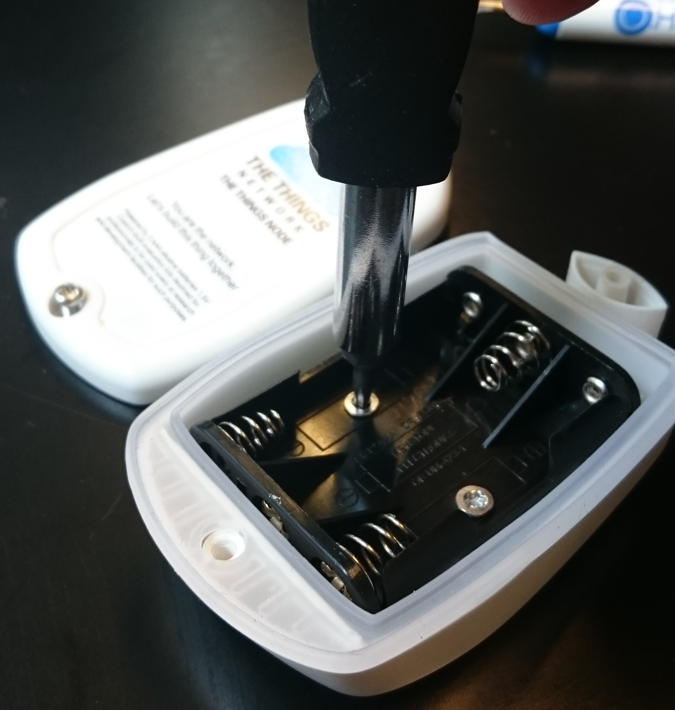
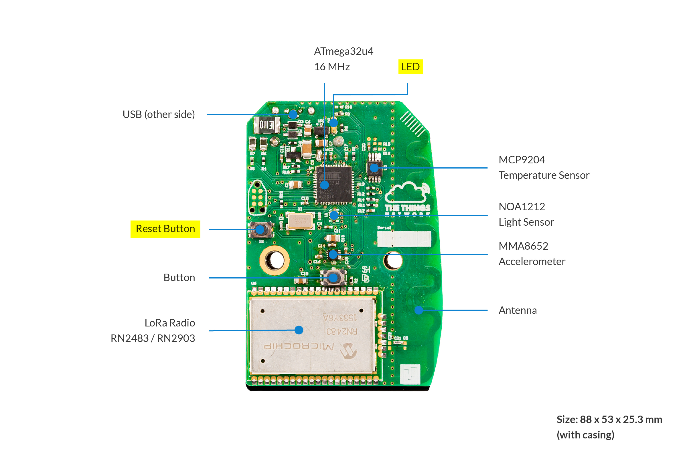

# Troubleshooting
The Things Node is based on the [SparkFun Pro Micro - 3.3V/8Mhz](https://www.sparkfun.com/products/12587). A lot of their resources apply to our board as well. In this section we'll discuss some common issues and link to relevant resources from SparkFun.

## Serial Port not showing up (Mac OS)

Since Mac OS El Capitan, there have been [many reports](https://www.google.com/search?q=arduino+usb+el+capitan+unstable) with all kinds of Arduino devices where the serial port does not show up. Both [SparkFun](https://learn.sparkfun.com/tutorials/how-to-install-ftdi-drivers/all#yosemite) and the Google search we linked give all kinds of suggestions for possible fixes. However, the simplest solution that always seems to work is to connect the Arduino via a USB hub.

## Serial Port shows up, but uploading code fails (Linux)

Try the steps documented on the Arduino Website. Normally the problem is another program also trying to access the serial port. **modemmanager** and **usb_modeswitch** are common culprits of this.
http://www.arduino.org/learning/getting-started/arduino-ide-on-linux-based-os

## Bricked
When your Things Node or Things Uno is bricked, the serial port is also not showing up. Following the common steps as laid out above does not work when the device is bricked. "Bricked" basically means that the USB-serial-port on the board is not active, meaning that you do not have a way to program it.

The most common cause of "bricking" is uploading code to the device that was verified and uploaded while an incorrectly board was chosen in the Arduino IDE. This is such an easy mistake which happens to the best of us, especially if you are switching between working on your The Things Uno and The Things Node.

SparkFun has a [guide](https://learn.sparkfun.com/tutorials/pro-micro--fio-v3-hookup-guide/troubleshooting-and-faq#ts-revive) explaining how to fix this. These steps are also valid for The Things Node and The Things Uno. We will however continue with a summary of how to unbrick a Things Node.

1. Prepare by opening the Arduino IDE. Open a new blank sketch, go to **Tools > Boards > SparkFun Pro Micro** and then **Tools > Processor > ATmega32U4 (3.3V, 8Mhz)** for The Things Node (choose Arduino Leonardo if you are using The Things Uno). Click on verify.

2. Open up the back of The Things Node using a Phillips screw driver.
   

3. Remove the batteries, and remove the two Torx screws inside the battery holder. You will need a Torx #10 screw driver for this.
   

4. Remove the PCB from the case. On the rear side you will see the Reset button (marked as **S2**) and the LED (marked as **D2**).
   

5. Plug in a USB cable between the Node and your computer. The Node should power up and the LED should blink or stay on, depending on what code is on it. Press the reset button twice, with about a second between presses. If you were successful, the LED should start fading on and off.

6. While the LED is fading on and off, the Node is in bootloader mode. While in bootloader mode you should see a USB-serial device on your computer and in the Arduino IDE. Select it from **Tools > Port**. The device only stays in bootloader mode for 8 seconds, so you have to be quick. Don't worry though, you can do this over and over again until you are successful.

7. While the device is in bootloader mode, inside the Arduino IDE open a blank sketch and click on upload. If this takes too long and the Node exits bootloader mode before the Arduino IDE can upload the new blank sketch, try first clicking on **Upload**, and then put the device into bootloader mode.

   Alternatively you can also use **avrdude** to perform an erase of the microcontroller. This is much quicker than using the Arduino IDE to upload a new sketch, but needs some more knowledge of avrdude and AVR microcontrollers.
   `avrdude -patmega32u4 -cavr109 -P/dev/ttyACM0 -b57600 -e`

8. After you have programmed the device with a blank sketch, or erased it, you should be able to program it normally.
