# Connecting to The Things Network (TTN)

The Things Network is about enabling low power devices to be used in long range gateways that connect to an open-source, decentralized network and exchange data with Applications. Learn more about the Things Network [**here**](https://www.thethingsnetwork.org/docs/). In this section, we’ll show how to connect the RAK5205 WisTrio Lora Tracker with TTN.

**1**- First, connect the RAK5205 WisTrio LoRa Tracker to your PC and open the **Serial Port Tool**.

**2**- **Select** the appropriate COM port and click **open** button (refer in the image below):

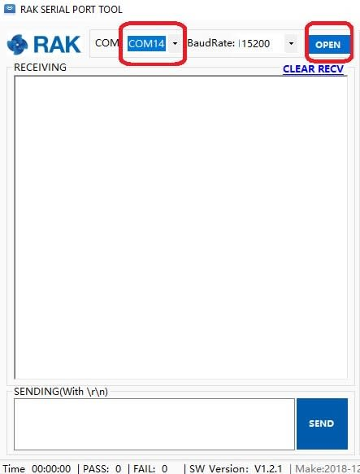

### Registering Device

>**Note** In this section, it is assumed that you have already successfully connected your RAK LoRa gateways with TTN. If not, refer to this [**link**](https://doc.rakwireless.com/quick-start/rak7243c-pilot-gateway/connecting-to-the-things-network--ttn-https://doc.rakwireless.com/quick-start/rak7243c-pilot-gateway/connecting-to-the-things-network--ttn-).

**3**- Now go to the [**TTN Website**](https://www.thethingsnetwork.org/) and Log in.


**4**- Choose "**Console**" located at the top right corner. Then, Click "**Application**".

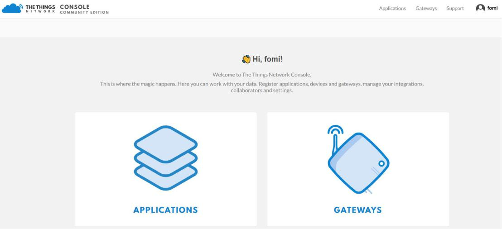

**5**- Press the "**add application**" button.

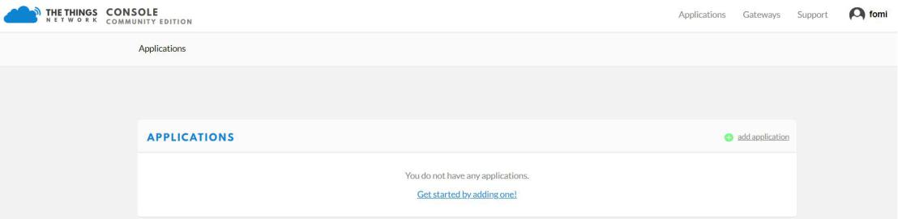

**6**- Create your own Application by filling in with correct contents.

>**Note** The Application ID is a unique combination of lower case, alphanumeric characters and nonconsecutive "-" and "_".

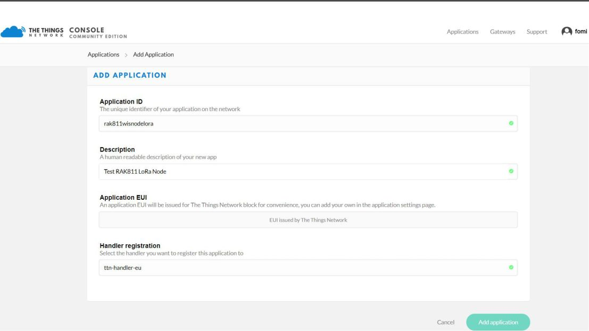

**7**- Then press the “**Add application**” button at the bottom of this page, and you can see the following page:

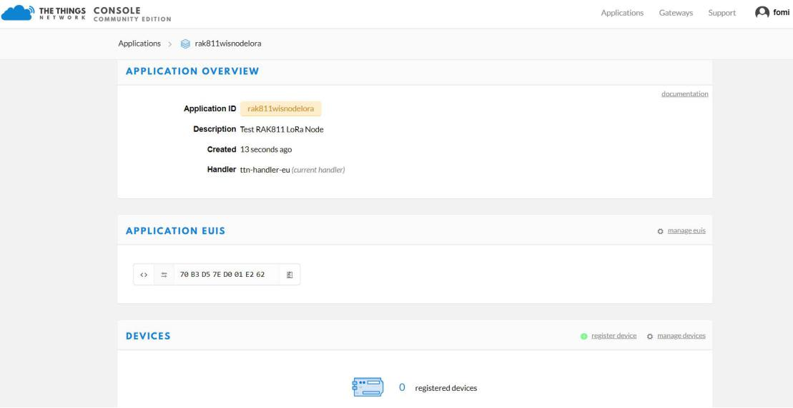

**8**- At the middle of this page, you can find the box named “**DEVICES**” and click “**register device**”.


**9**- Fill in the "**Device ID**" . Click the icon in the “**Device EUI**”, then a code is generated automatically.
* You can get the “Device EUI” of your RAK5205 with the following command, which will display all node parameters:
```
at+get_config=lora:status
```
* In case you have had TTN generate a new “Device EUI” you can use the command below to import it into the RAK5205 configuration parameters (X is the Device_EUI you want to update):
```
at+set_config=lora:dev eui:XXXX
```

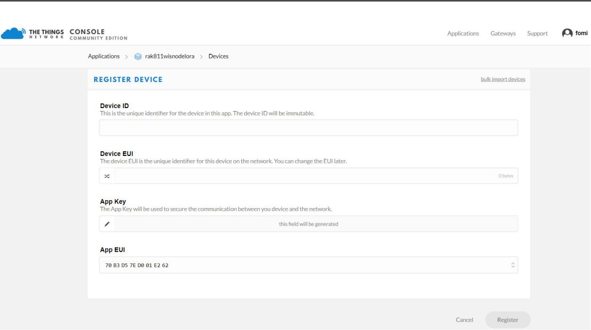


**10**- Then press the “**Register**” button at the bottom of this page to finish.

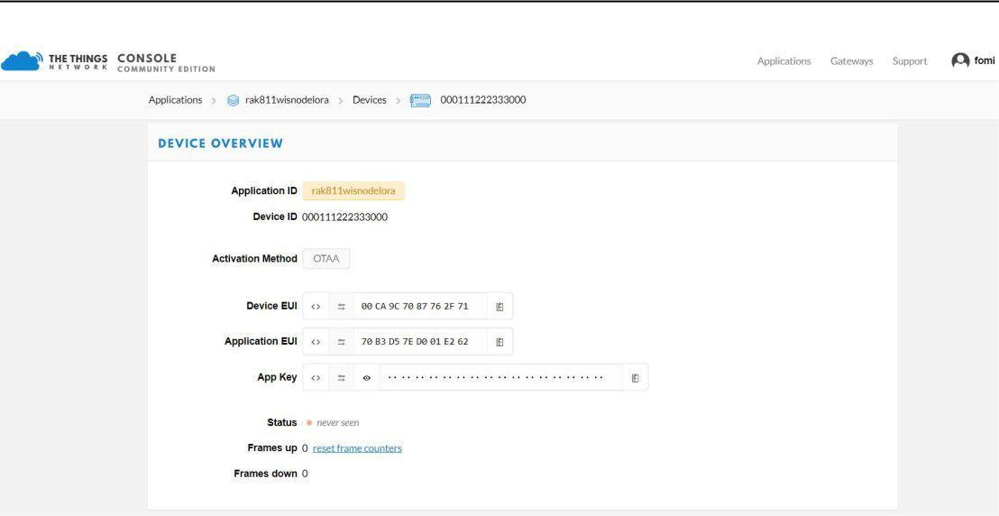

Depending on which authentication method you want to use please proceed to either the **OTAA mode** or **ABP mode** section.

### OTAA Mode

According to The Things Network, **Over-the-Air Activation (OTAA)** is the preferred and most secure way to connect with The Things Network. Thus it is chosen as the default method when registering a device.

When setting up a new device in TTN it defaults to OTAA mode. For configuring it you need the following three parameters: **Device EUI, Application EUI and App Key**. You can get them all from the **Overview page**.

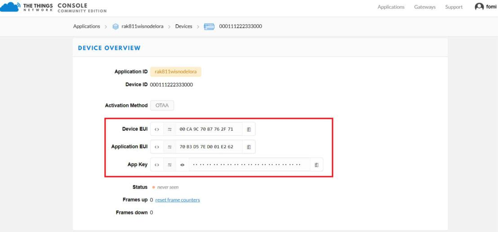

Now, let us configure the RAK5205 to work in OTAA mode in the EU868 band, as an example.

>**Note** The default LoRa working mode for the RAK5205 is LoRaWAN 1.0.2, while the default LoRa join mode is OTAA, and the default LoRa class is Class A.

**1**- Through your serial port tool, set mode to **OTAA** and LoRa device class to **Class A**, with the following set of commands:

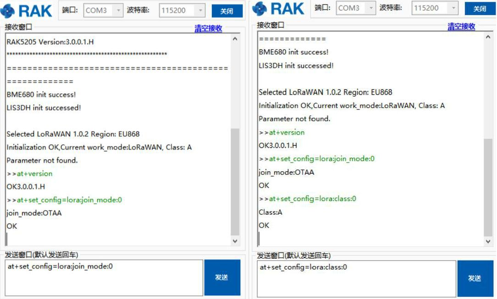

**2**- Now that the modes are set, enter the parameters: : **Frequency/Region to EU868, Device EUI, Application EUI** and **App Key**. Use the commands below. Remember to replace the "**XXXX**" with the corresponding parameter value for your particular case:

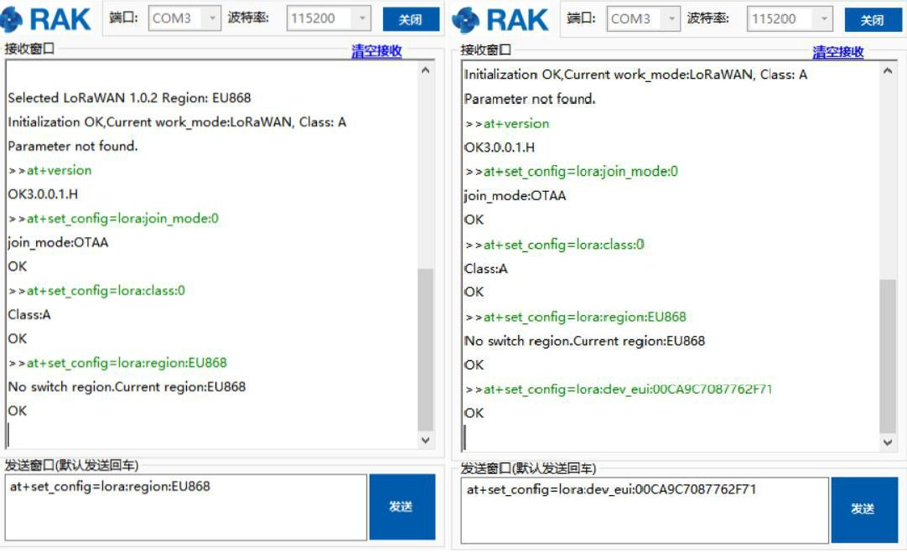


**3**- Finally execute the join command:


**4**- You can see that, once join successfully, RAK5205 will send sensor’s data in an interval loop automatically by default! You can see these data on TTN website as follow:

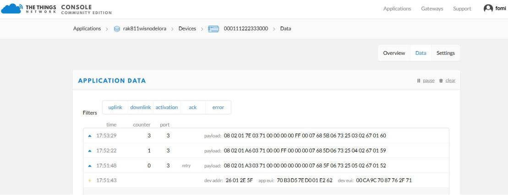

Great! That’s all about OTAA mode.

### ABP Mode

**Authentication By Personalisation (ABP)** is a LoRaWAN activation mode that enables manual configuration of encryption keys on the device and is capable of sending frames to RAK gateways without needing a 'handshake' procedure in exchanging keys unlike OTAA.

This is a mode best used for testing environments.However, it is not recommended for production, as it is less secure. In this section, we will go through the steps in connecting to TTN using ABP mode.

**1**- To start with, join the ABP mode by going to device settings then switch the activation method to ABP.

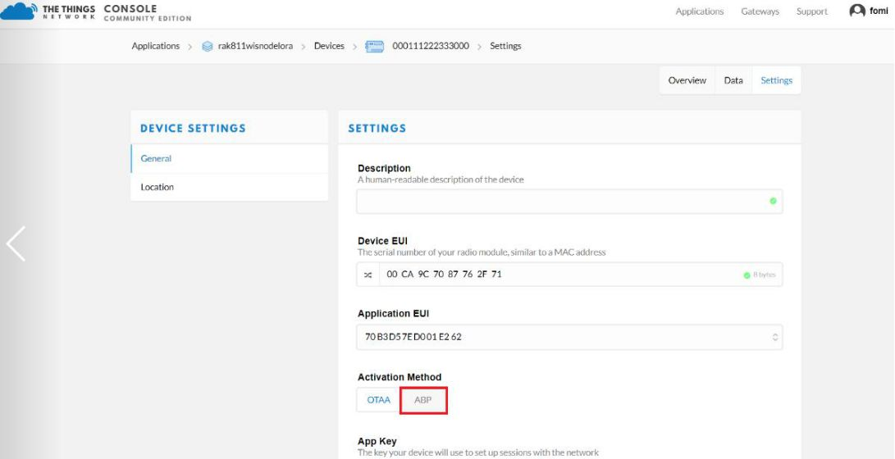

**2**- The **Device Address, Network Session Key** and **App Session Key** will be generated automatically by default.

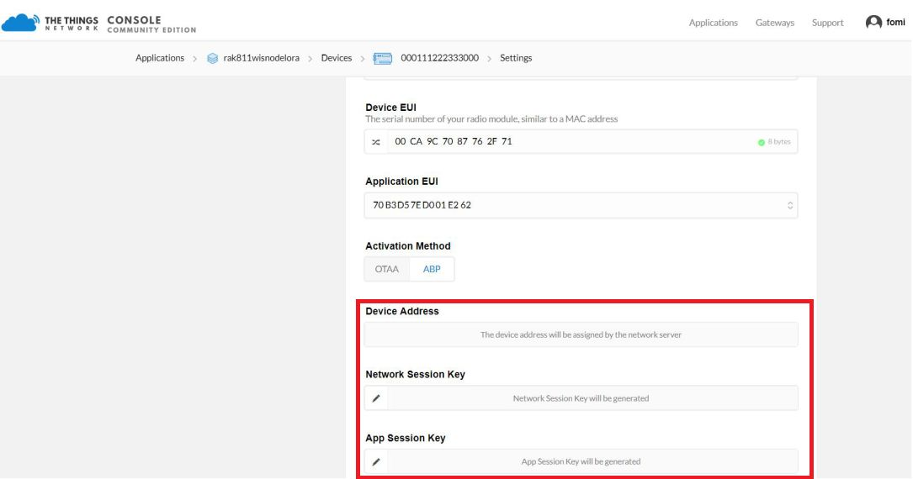

**3**- Save the mode change and return to the **Device Overview page**. You can copy the keys by pressing the button after the value fields marked in red in the image below:


**4**- Now we need to update the RAK5205 configuration (mode and parameters). Open the Serial Tool and type the command below to set this parameters: **Activation Mode** to **ABP, Device Address, Network Session Key** and App **Session Key**:

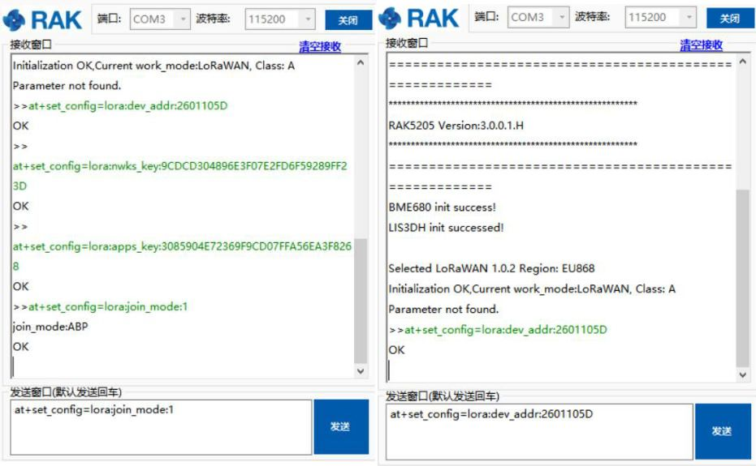

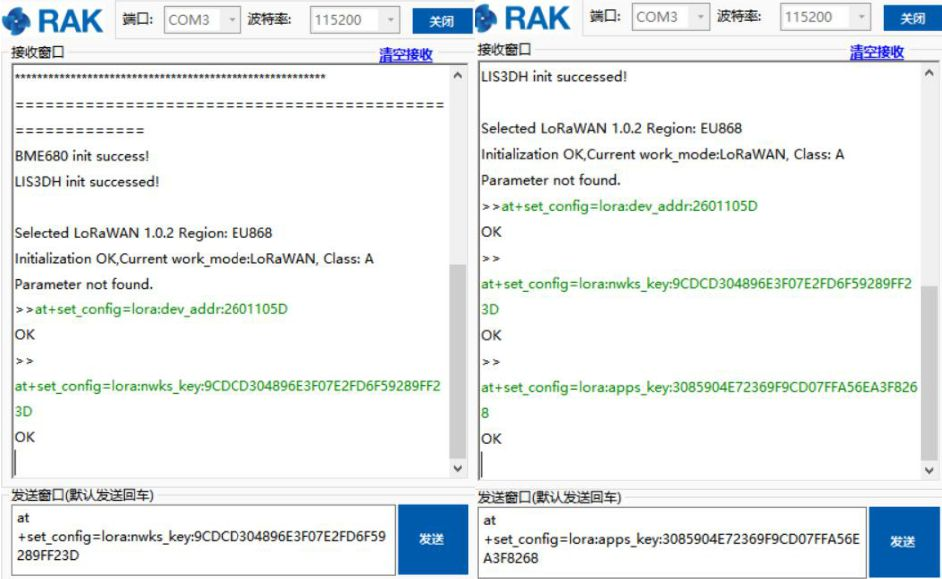

**5**- Then, join in ABP mode.

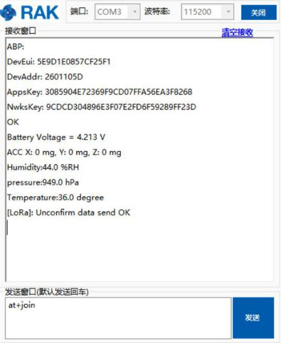

* As you see, RAK5205 has sent sensor’s data to TTN in ABP mode automatically by default, and TTN has received successfully:


Great! Your node should now work in ABP mode.

### Optional Configurations

You can also try other configurations which is supported in RAK5205 WisTrio LoRa Tracker. Click through the guides provided below to learn more. Enjoy!
* Connecting to [LoRaServer](https://doc.rakwireless.com/rak5205-wistrio-lora-tracker/connecting-to-loraserver)
* LoRa [P2P Mode](https://doc.rakwireless.com/rak5205-wistrio-lora-tracker/lora-p2p-mode)
* [RAK525 Data Analyzing](https://doc.rakwireless.com/rak5205-wistrio-lora-tracker/analyzing-the-data-from-rak5205)
* [Cayenne Integration](https://doc.rakwireless.com/rak5205-wistrio-lora-tracker/cayenne-integration)
