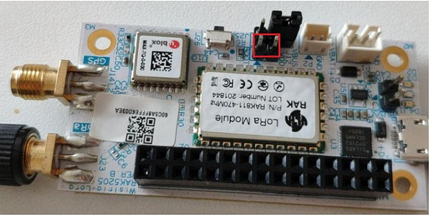
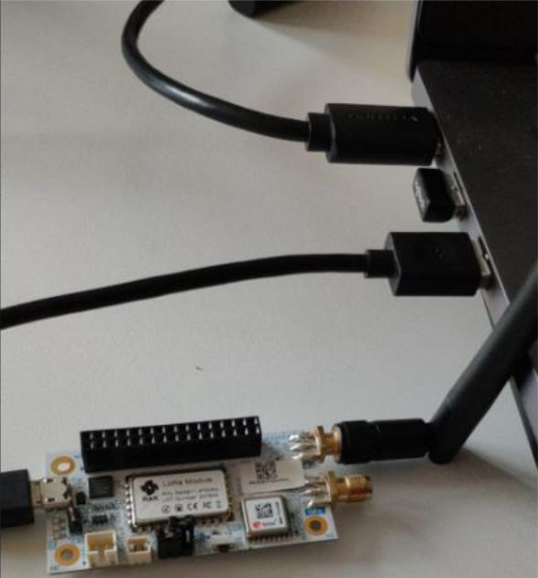
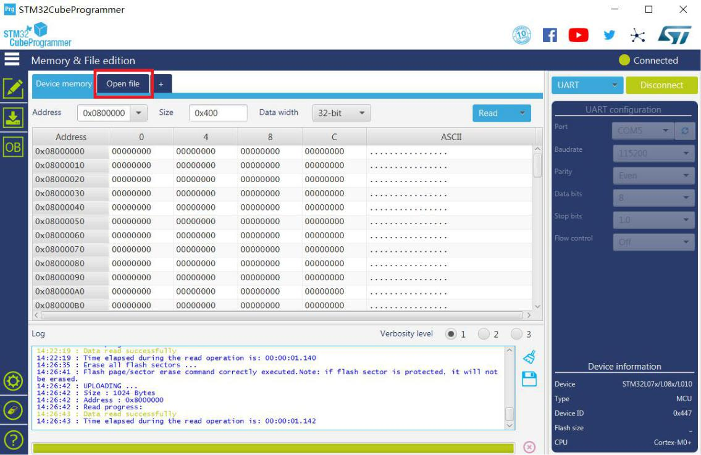
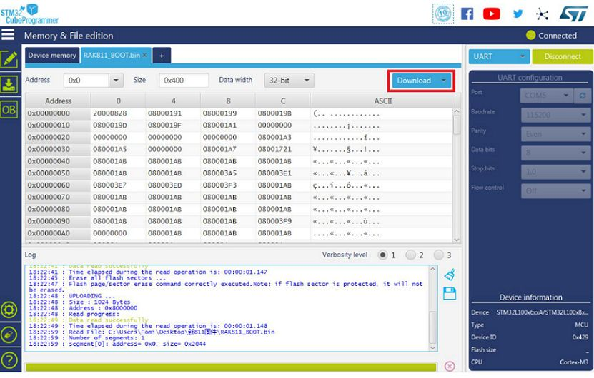
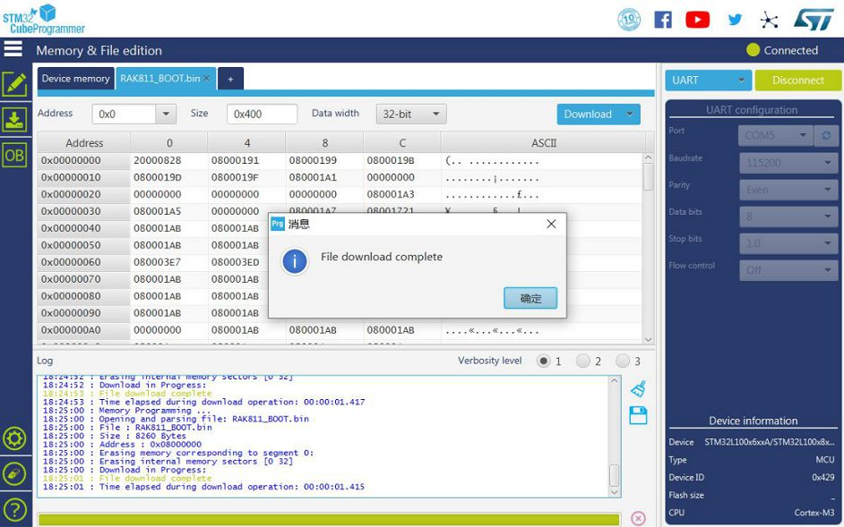
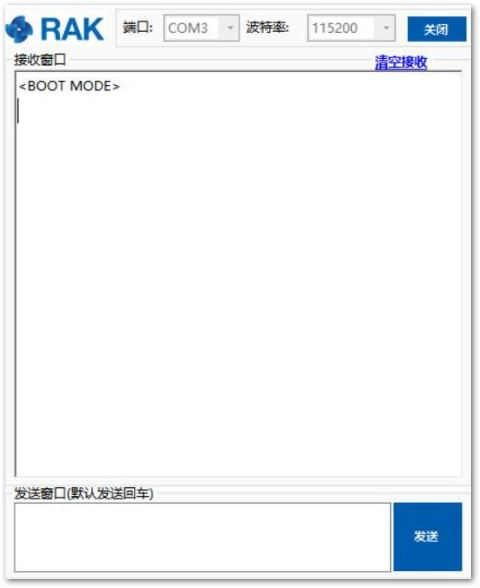

# Device Firmware Setup

**1**.Download the latest bootloader [here](https://downloads.rakwireless.com/en/LoRa/WisTrio-LoRa-RAK5205/Firmware/) in order to avoid potential problems.

>**Note:** Skip this section if you have a RAK5205 V3.0.0.0 firmware or newer, for it has already a bootloader.

**2**.To start with the bootloader burning, download and install the **STM32CubeProgrammer** tool [here](https://www.st.com/content/st_com/en/products/development-tools/software-development-tools/stm32-software-development-tools/stm32-programmers/stm32cubeprog.html#overview).

**3**.Then, configure your RAK5205 by jumping the “**BOOT**” pin and “**VCC**” pin for boot mode as the following pictures shown below:

 
**4**.Connect your RAK5205 to your PC using the USB cable as follow:

**5**.Choose the correct port number in the COM Port field. You can check this in the Device Manager. You can also check this [document](https://doc.rakwireless.com/rak5205-rak7205-wistrio-lora-tracker/interfacing-with-the-rak7205-rak5205-wistrio-lora-tracker) to learn on how to interface your RAK5205 with your computer properly.

**6**.Open the “**STM32CubeProgrammer**” tool.

**7**.Select **UART type**; go to COM Port and look for your RAK5205 Breakout Board COM Port (ex. COM5).

**8**.Configure the **Baud rate** and **Parity**.

**9**.Then, press the “**Connect**” button at the top right corner.

>**Warning:**If there are some errors in the Log box or it can’t connect, please close the STM32CubeProgrammer and reset RAK5205, then open the STM32CubeProgrammer and connect again.

* The correct Log you should see is the information like the following picture shows:

Now, let’s start burning the bootloader into the RAK5205 WisTrio LoRa® Tracker.

**10**.First, erase all data on the RAK5205 WisTrio LoRa® Tracker referred from the following picture below:

**11**.Press “**Open file**” and select the bootloader file in the pop-up window as follows:

**12**.Click the “**Download**” button to start the burning process.

**13**.OK, you have successfully burned the firmware into RAK5205 WisTrio LoRa® Tracker! You should see the same notification as shown in the image below:

**14**."**Disconnect**” and close the “**STM32CubeProgramme**r” tool. Then, power down and remove the connection between BOOT pin and VCC pin to let RAK5205 WisTrio LoRa® Tracker work in normal mode.

**15**.Then, connect RAK5205 with your PC’s USB interface again.

* If you have opened the serial port tool, you can see some content like this:

Alright! You can now start burning the firmware into RAK5205 WisTrio LoRa® Tracker.
