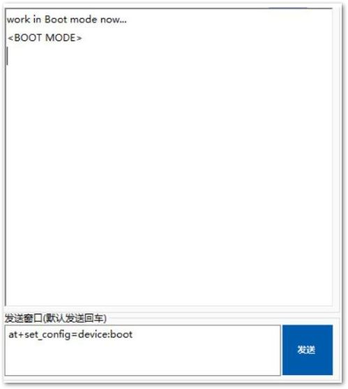
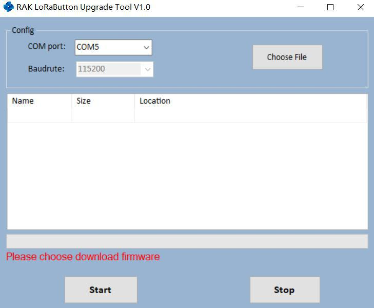
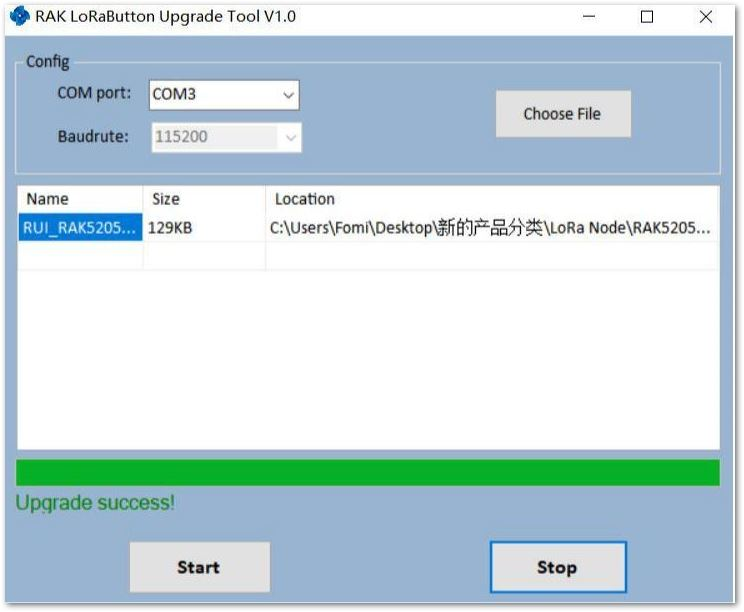

# Device Firmware Upgrading

If the firmware version of your RAK5205 WisTrio LoRa Tracker is newer than V3.0.0.0 or you have just burned the bootloader into RAK5205 WisTrio LoRa Tracker according to the Burning Bootloader into the Device section, you just need to burn the upgrade firmware according to the following steps now:

**1**- First, type the command to let the RAK5205 WisTrio LoRa Tracker work in boot mode.
```
at+set_config=device:boot
```
>**Note** If you have just burned the bootloader by yourself according to the section 2, it works in boot mode now. If the current version of the RAK5205’s firmware is newer than V3.0.0.0, you need to set an AT command <at+set_config=device:boot> to let it work in boot mode



**2**- Download the RAK Upgrade Tool from the RAKwireless website [**here**](https://downloads.rakwireless.com/en/LoRa/RAK612-LoRaButton/Tools/RAK%20LoRaButton%20Upgrade%20Tool%20V1.0.zip) then, open the tool. Again, don't forget to choose the correct port!



**3**- Download the latest RAK7200 Firmware [**here**](https://downloads.rakwireless.com/en/LoRa/WisTrio-LoRa-RAK5205/Firmware/). Click “**Choose File**” and choose the firmware you have just downloaded. Make sure you choose the one for your particular band:


**4**- Click **“Start”** to upload the Firmware and wait for a confirmation as shown in the image below. Uploading may take minutes.



## Testing the Installed Firmware

**1**- Now, close the upgrade tool and open a serial port tool.
 * We recommend you to use RAK serial port tool, because there are some ready AT commands in this tool and this will be very useful for you. You can get it from RAK website available for free at this [**RAK directory**](http://docs.rakwireless.com/en/LoRa/RAK811/Tools/RAK_SERIAL_PORT_TOOL_V1.%202.1.zip).

**2**- Choose the correct COM port and set the baud rate to 115200. Then open the serial port and enter the AT command <at+set_config=device:restart> to restart.
```
at+set_config=device:restart
```


Congrats! This information means that you have upgraded successfully the new firmware.

### Optional Configurations

Aside from all the default processes done in the Device Firmware Setup and Device Firmware Upgrading, you can have the full liberty in customizing your own firmware by following the steps in the document linked below:

* [Firmware Customizing](https://doc.rakwireless.com/rak5205-wistrio-lora-tracker/customizing-firmware)