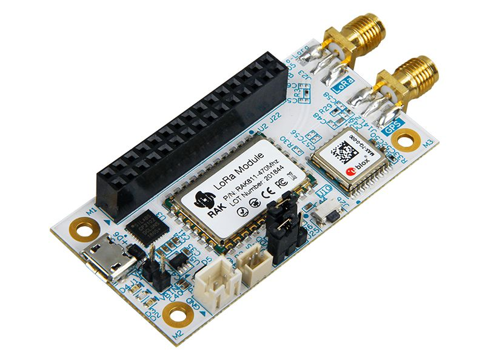

# RAK7200 LoRa Tracker

## Product Background

The [**RAK5205 LoRa Tracker**](https://store.rakwireless.com/products/rak5205-lora-tracker) board is built on the Semtech SX1276 chip, with the STM32L1 MCU at its core. It is a feature-packed sensor board with LoRa connectivity and built-in GPS. It provides various interfaces for easy application development.

This node module is ideal as a quick prototyping tool for LoRaWAN applications. It is perfect for use case scenarios such as asset tracking, smart vehicle management and location-based services.

## Product Features
* Compatible with 96Boards IoT Edition Specification
* SX1276 LoRa and Ublox Max 7Q GPS chips
* ARM Cortex-M3 STM32L1 MCU
* Built-in environmental sensor BME680 (gas, pressure, humidity, temperature) and 3-axis MEMS sensor LIS3DH (accelerometer)
* SMA/iPEX antenna interfaces
* LoRaWAN 1.0.2 protocol compatibility
* Rechargeable battery and solar panel connection ports
* Global LoRaWAN bands supported (EU433, CN470, IN865, EU868, US915, AU915, AS920, KR920, and AS923)
* I2C, ADC, built-in UART converter
