# Connecting to The Things Network (TTN)

In this section, we will be connecting the RAK7200 LoRa Tracker to The Things Network (TTN). If you don't have an account yet, head on to [**The Things Network**] (https://www.thethingsnetwork.org/) website and create one. Once done, Log in to your account and go to the console which can be found here:


### Adding Application

**1**- Upon logging-in, choose **Application** and click "**add application**" as shown in the image below:


**2**- You should see a new window which asks for device credentials as seen in the image below. Fill in with the details with individual guides as follows:

* **Application ID** - this will be the unique id of your application in the Network. Please note that characters should be in lower case, no spaces are allowed.
* **Description** - this is a short and concise human readable description of your application.
* **Application EUI** - this will be generated automatically by The Things Network for convenience.
* **Handler Registration** - handler you want to register this application to.


**3**- After you fill in the necessary information, press the "Add application" button at the bottom of this page. If you see the following page, this means that you have successfully registered your application.


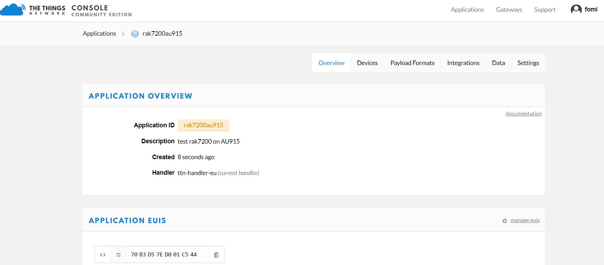

### Registering Device

**1**- Scroll down until you see the Devices section, or you can also click the "**Devices**" button at the top. Then, click "**register device**".

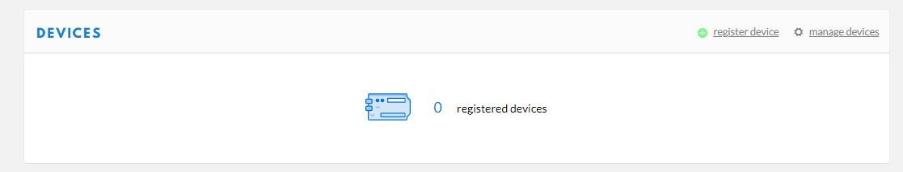

**2**- Fill-in the necessary details for the registration in the sample form in the image below together with the guide in each of the parameter needed.

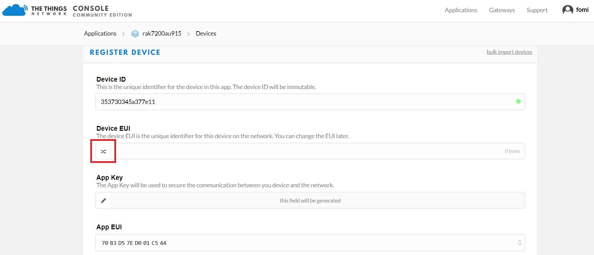

Here are the things that you should take note in registering your device:

* **Device ID** - this is the unique identifier for your RAK7200 LoRa Tracker in your application. You need to enter this manually.
* **Device EUI** - this is the unique identifier for your device in the network. You can change it later, if you want.
>**Note:** Click the following icon and the Device EUI will be automatically generated. The App Key should be in auto generation mode by default.

**3**- Lastly, click the Register button. Now, your device is registered under the corresponding application.


### OTAA Mode

According to The Things Network, **Over-the-Air Activation (OTAA)** is the preferred and most secure way to connect with The Things Network. Thus it is chosen as the default method when registering a device.

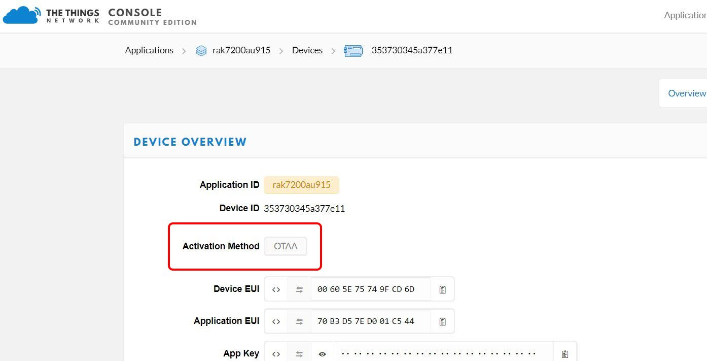

**1**- Take note of the **Device EUI**, **Application EUI** and the **App Key**

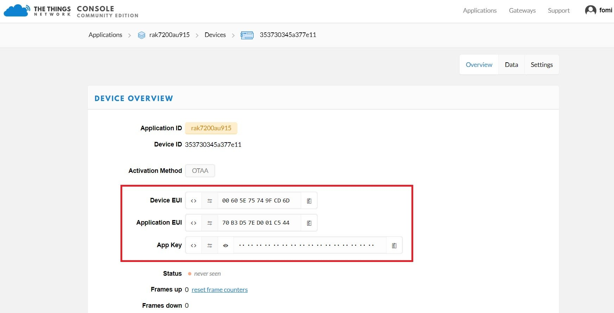

>**Note:**Make sure your LoRa Tracker is still Connected to the RAK Serial Port Tool.

**2**- Now, let's join in OTAA Mode and set your device to AU915 Frequency for example. The default LoRa work mode is LoRaWAN 1.0.2, the default LoRa join mode is OTAA, and the default LoRa class is Class A. For the full list of AT Commands [**here**](/quick-start/rak7200-lora-tracker/configuring-the-rak7200-lora-tracker-using-at-commands).

* at+set_config=lora:join_mode:0 - set the join mode in OTAA.
* at+set_config=lora:class:0 -set the LoRa Class to Class A.
* at+set_config=lora:region:AU915 -this will set the frequency band to the 915Mhz for the AU region, you need to enter the corresponding frequency band for your location ( Check the corresponding frequency plan by country [**here**](https://www.thethingsnetwork.org/docs/lorawan/frequencies-by-country.html).

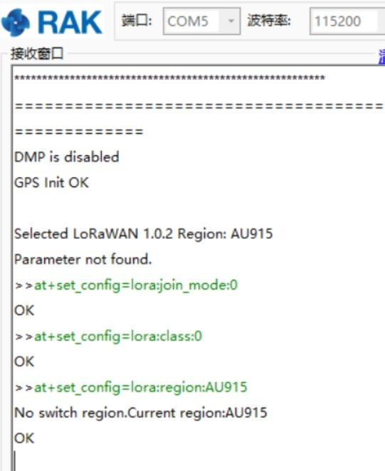

**3**- After , we need to set the Device EUI, Application EUI and the Application Key to our RAK7200. To do this, enter the following commands:

* at+set_config=lora:dev_eui:XXX- where XXX is your Device EUI copied from TTN.
* at+set_config=lora:app_eui:XXX- where XXX is your Application EUI copied from TTN.

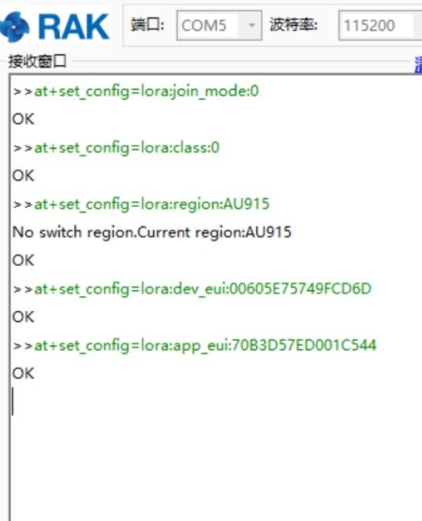

** at+set_config=lora:app_key:XXX - where XXX is your Application Key copied from TTN.

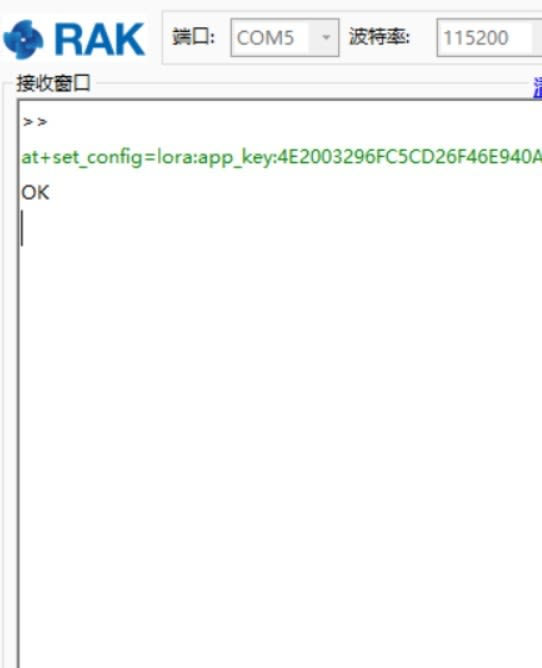

**4**- This will perform OTAA (Over the air activation) and authenticate the node with TTN. It should now be registered and you can send and receive data. Finally reset the node via the Reset button. If there are no issues you should see a the following information in the Receiving window:


**5**- Go to the Device Overview in the TTN and you can see that the status is now Green (Online). Now your RAK7200 is transmitting sensor data to TTN. You can see it in its raw form in TTN, by going to the Data tab:


### ABP Mode

**1**- To join the ABP mode, go to device settings and switch the activation method to ABP.

**2**- The Device Address, Network Session Key and App Session Key will be generated automatically by default.


**3**- Save the mode change and return to the Device Overview page. You can copy the keys by pressing the button after the value fields marked red below:

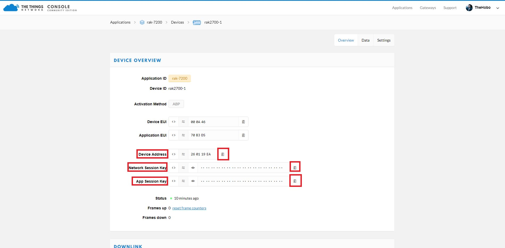

**4**- Now we need to update the RAK7200 configuration (mode and parameters). Open the Serial Tool and type the command below to change the region (in case you have not done so already):
```
at+set_config=lora:region:EU868
```
As you can see in Figure 3, as we were in the same region (EU868), there was no change.

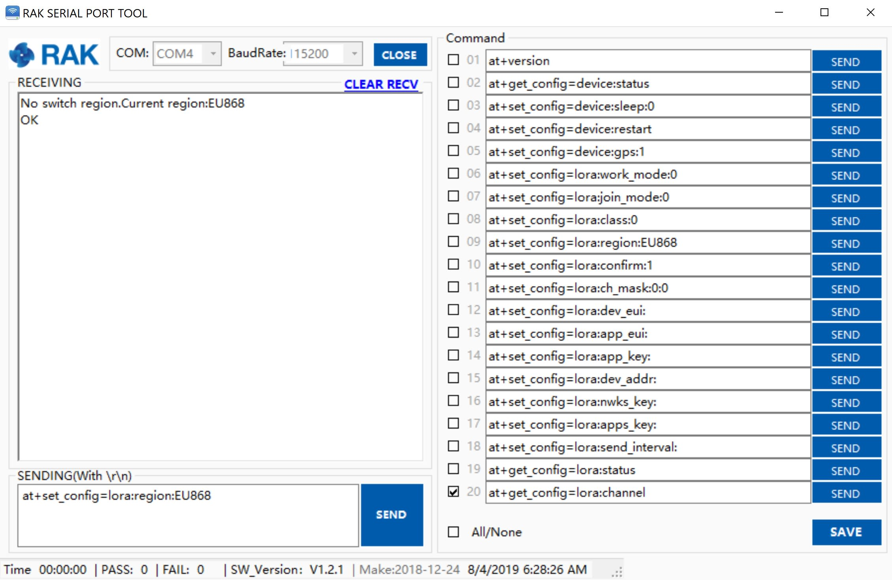

**5**- Change the mode to ABP with the command:
```
at+set_config=lora:join_mode:1
```

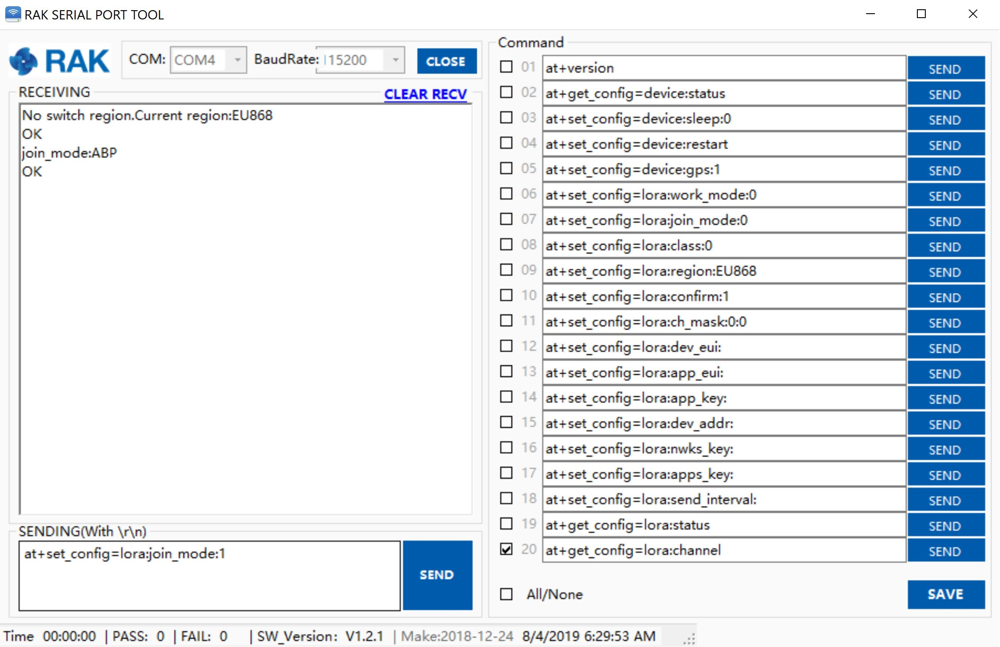

**6**- Now that the mode has been changed, enter the parameters: Device Address, Network Session Key, and Application Session Key. Use the commands below. Remember to replace the "X" with the corresponding parameter value for your particular case.
```
at+set_config=lora:dev_addr:X
at+set_config=lora:nwks_key:X
at+set_config=lora:apps_key:X
```

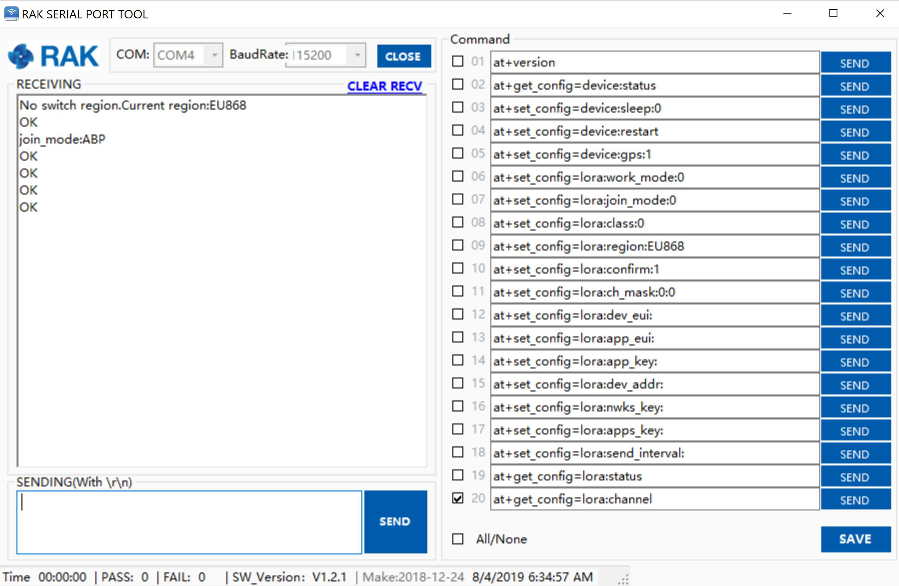

**7**- Finally execute the join command:
```
at+join
```


**8**- You can test the connection by sending an uplink frame. Use the following for example:
```
at+send=lora:1:12345678
```


If you get a response in your TTN live data feed as in the image below, then you are all set!

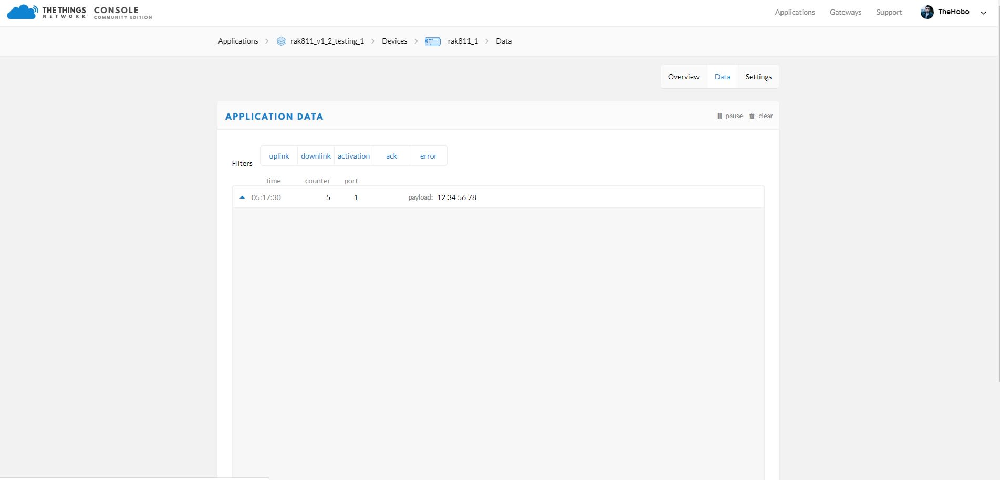

### Optional Configurations
You can also try other configurations which is supported in RAK7200 LoRa Tracker. Click through the guides provided below to learn more. Enjoy!
* Connecting to [LoRaServer](https://doc.rakwireless.com/rak7200-lora-tracker/connect-to-loraserver)
* [RAK7200 Data Analyzing](https://doc.rakwireless.com/rak7200-lora-tracker/analyzing-the-data-from-rak7200)