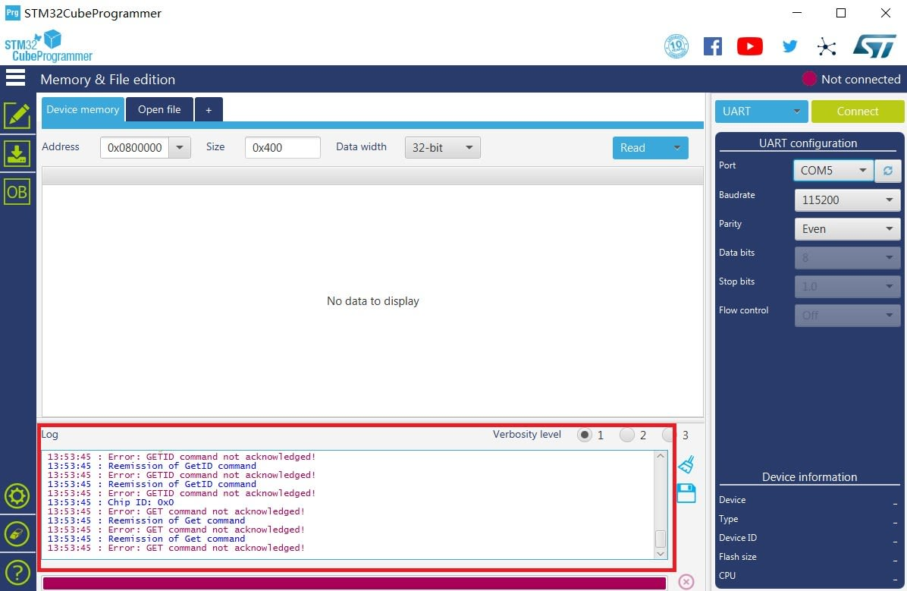
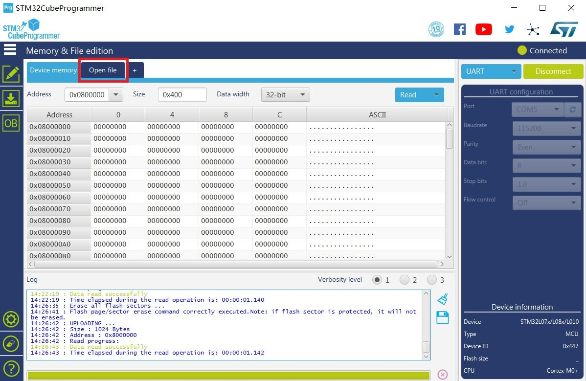
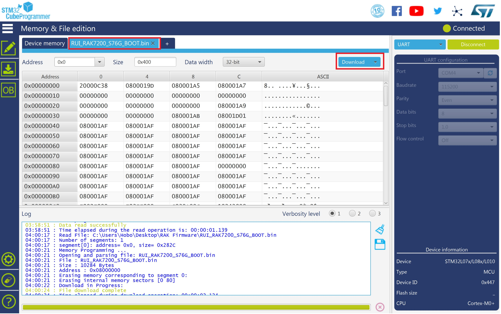
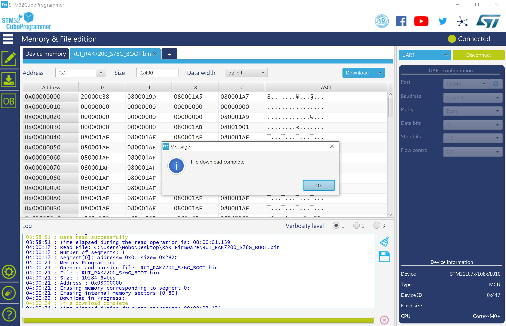

# Device Firmware Setup

* Download the latest bootloader [here](https://downloads.rakwireless.com/en/LoRa/RAK7200-Tracker/Firmware/) in order to avoid potential problems.
* To start with the bootloader burning, download and install the **STM32CubeProgrammer** tool [here](https://www.st.com/content/st_com/en/products/development-tools/software-development-tools/stm32-software-development-tools/stm32-programmers/stm32cubeprog.html#overview)
* Plug in the provided Micro-USB cable into the RAK7200 LoRa Tracker and insert it in your PC. We need to set the RAK7200 first to work in **Boot Mode**. Refer to below and do the following: Hold down the BOOT0 Button, then press the Reset Button for a couple of seconds. Release the Reset and the BOOT0 Button.

 
* Open the STM32CubeProgrammer Software and Select UART type. Choose the appropriate port number in the COM Port field. Set the **Baud Rate** to **115200**, **Parity** to **Even** and the press **Connect** as shown in the image below:

>**Note:** If you didn't properly set your RAK7200 device to work in BOOT Mode, you will see the following information in the Log Section of the Software as shown in the image below.

* If this happens, go back to the section above and set your RAK7200 device to work in Boot Mode again.
* If all works well, you will then see the following log:

* Now that you have successfully connected your RAK7200 to the STM32CubeProgrammer Tool, click the "**Erase Chip**" button to erase all the data on RAK7200 before going through the burning proce as shown in the image below.

* Afterwhich, click "**Open File**" and select the correct Bootloader file that you have just downloaded.

* Click the "**Download**" Button to start the burning process:

* After a couple of seconds, you will see the following window telling that you have successfully burned the Bootloader to your RAK7200!

* “Disconnect” and close the “STM32CubeProgrammer” tool.