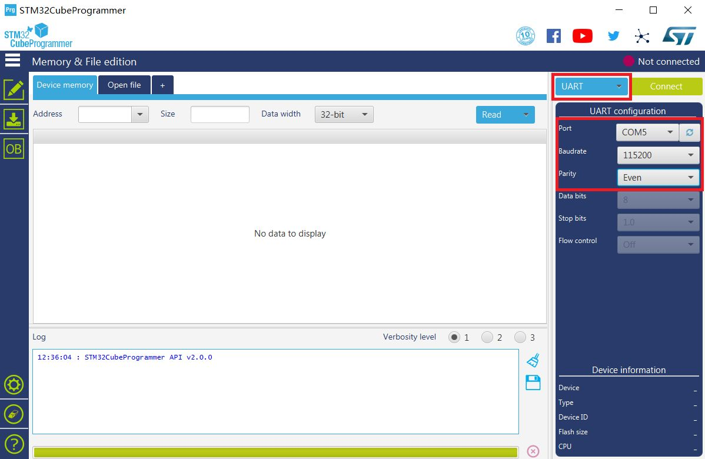

# Burning Bootloader into the Device

Please use the the latest firmware for the RAK7204 LoRa Environmental Sensor accessible in this [directory](https://downloads.rakwireless.com/en/LoRa/RAK7204/Firmware/) in order to avoid potential problems. Burning the Bootloader into the device is done as follows:

>**Note:** Skip this section if you have a RAK7204 with V3.0.0.0 firmware or newer, for it has already a bootloader.

1 . To start with, download and install the “STM32CubeProgrammer” tool in your PC through this [link](https://www.st.com/content/st_com/en/products/development-tools/software-development-tools/stm32-software-development-tools/stm32-programmers/stm32cubeprog.html#overview) or through this [RAK directory](https://downloads.rakwireless.com/en/LoRa/RAK811/Tools/SetupSTM32CubeProgrammer-2.1.0.rar).

2 . Then, configure your RAK7204 by jumping the “BOOT” pin and “VCC” pin for boot mode as the following pictures shown below:

3 . Connect your RAK7204 to your PC using the USB cable as follow:

4 . Choose the correct port number in the COM Port field. You can check this in the Device Manager.

5 . Open the “STM32CubeProgrammer” tool.

6 . Select UART type; go to COM Port and look for your RAK7204 LoRa Environmental Sensor COM Port (ex. COM5).

7 . Configure the Baud rate and Parity.

8 . Then, press the “Connect” button at the top right corner.

>**Warning:** If there are some errors in the Log box or it can’t connect, please close the STM32CubeProgrammer and reset
RAK7204, then open the STM32CubeProgrammer and connect again.

* The correct Log you should see is the information like the following picture shows:

Now, let’s start burning the bootloader into the RAK7204 LoRa Environmental Sensor.

9 . First, erase all data on the RAK7204 LoRa Environmental Sensor referred from the following picture below:

10 . Download the bootloader file accessible to this [link](https://downloads.rakwireless.com/en/LoRa/RAK7204/Firmware/). Then, press “Open file” and select the bootloader file:

11 . Click the “Download” button to start the burning process

12 . OK, you have successfully burned the firmware into RAK7204 LoRa Environmental Sensor!

13 . "Disconnect” and close the “STM32CubeProgrammer” tool. Then, power down and remove the connection between BOOT pin and VCC pin to let RAK7204 LoRa Environmental Sensor work in normal mode.

14 . Then, connect RAK7204 with your PC’s USB interface again.

Alright! You can now start burning the firmware into RAK7204 WisTrio LoRa Tracker.