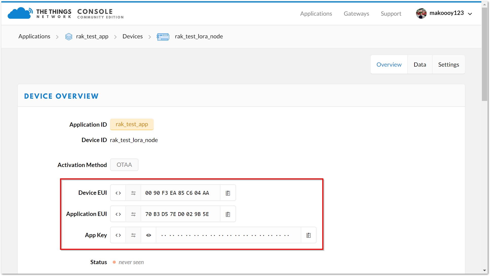

# Connecting to The Things Network (TTN)

The Things Network (TTN) is about enabling low power devices to use long range gateways to connect to an open-source, decentralized network to exchange data with Application. Learn more about the Things Network [here](https://www.thethingsnetwork.org/).

**1**. First, connect RAK811 LoRa Breakout Module to your PC and open the **RAK Serial Port Tool**.

**2**.”**Select**” the appropriate COM port and click “**OPEN**” button same with the image shown below. Read more on how to interface your RAK811 LoRa Breakout Module with your computer in this [document](https://doc.rakwireless.com/rak811-lora---breakout-module/interfacing-with-rak811-lora-breakout-module). 


>**Note:** In this section, it is assumed that you have connected your LoRa gateway with TTN correctly. If not, refer to the individual documentation of all the RAK LoRAWAN™ Gateways through [here](https://doc.rakwireless.com/).

**3**.Now, go to the [The Things Network (TTN)](https://www.thethingsnetwork.org/) website ang click login.


**4**.Choose “**Console**” located at the top right corner. Then, Click “**Application**”.


**5**.Press the "**add application**" button.


**6**.Create your own Application by filling in the correct parameters.
>**Note:** Your Device ID is a unique ID of lower case, alphanumeric characters and nonconsecutive - and _.


**7**.Then, press the “**Add application**” button at the bottom of this page, and you can see the following page: 


**8**.At the middle of this page, you can find the box named “**DEVICES**” and click “**register device**”. 


**9**.Fill in the “**Device ID**” . Click the icon in the “**Device EUI**”, then a code is generated automatically.

* You can get the “**Device EUI**” of your RAK811 LoRa Breakout Module with the following command, which will display all node parameters:
```
at+get_config=lora:status
```
* In case you have had The Things Network (TTN) generate a new “**Device EUI**”, you can use the command below to import it into the RAK811 LoRa Breakout Module configuration parameters (XXXX is the Device_EUI you want to update):
```
at+set_config=lora:dev eui:XXXX
```


**10**.Then press the “**Register**” button at the bottom of this page to finish.


When you connect the RAK811 LoRa Breakout Module to a LoRaWAN Gateway, we need some amount of security and trust to be established amongst them. There are two connection modes, and we distinguish between them using the criteria of security and ease of implementation. These are the **Over-The-Air Activation (OTAA)** and **Activation By Personalization (ABP)**.

### OTAA Mode

According to The Things Network (TTN), **Over-the-Air Activation (OTAA)** is the preferred and most secure way to connect with The Things Network (TTN). Thus, it is chosen as the default method when registering a device. For configuring it you need the following three parameters: **Device EUI, Application EUI and App Key**. You can get them all from the **Overview page**.



>**Note:** The default LoRa work mode is LoRaWAN 1.0.2, while the default LoRa join mode is OOTA, and the default LoRa Class is A.

**1**.Using the RAK Serial Port Tool, set mode to **OTAA**, device class to **Class A** and your **LoRaWAN™ Region** to your correct frequency band, with the following set of commands below. Remember to replace **XXX** with the your LoRaWAN™ region, see this [link](https://www.thethingsnetwork.org/docs/lorawan/frequencies-by-country.html) for your frequency plan.
```
at+set_config=lora:join_mode:0
```
```
at+set_config=lora:class:0
```
```
at+set_config=lora:region:XXX
```


**2**.Now that the modes are set, enter the parameters: : **Device EUI, Application EUI and App Key**. Use the commands below. Remember to replace the “**XXXX**” with the corresponding parameter value for your particular case:
```
at+set_config=lora:dev_eui:XXXX
```
```
at+set_config=lora:app_eui:XXXX
```
```
at+set_config=lora:app_key:XXXX
```


**3**.Finally, execute the join command:
```
at+join
```


**4**.Test the connection by sending an uplink frame. Use the following as an example:
```
at+send=lora:1:12345678
```


**5**.If you get a response in your TTN live data feed as in the figure below, then you are all set!


### ABP Mode

**Authentication By Personalisation (ABP)** is a LoRaWAN™ activation mode that enables manual configuration of encryption keys on the device and is capable of sending frames to RAK gateways without needing a 'handshake' procedure in exchanging keys unlike OTAA.

This is a mode best used for testing environments.However, it is not recommended for production, as it is less secure. In this section, we will go through the steps in connecting to TTN using ABP mode.

**1**.To start with, join the ABP mode by going to device settings then switch the activation method to ABP.


**2**.The **Device Address, Network Session Key** and **App Session Key** will be generated automatically by default.Save the mode change and return to the **Device Overview page**. You can copy the keys by pressing the button after the value fields marked in red in the image below:


**3**.Now, we need to update the RAK811 LoRa Breakout Module configuration. Open the RAK Serial Port Tool and type the command below to set these parameters: **Activation Mode** to **ABP, Device Address, Network Session Key** and **Applicatio Session Key** and your **LoRaWAN™ Region** to your correct frequency band. Remember to replace XXX with the your LoRaWAN™ region, see this [link](https://www.thethingsnetwork.org/docs/lorawan/frequencies-by-country.html) for your frequency plan.
```
at+set_config=lora:region:XXX
```
```
at+set_config=lora:join_mode:1
```

```
at+set_config=lora:dev_addr:XXXX
```
```
at+set_config=lora:nwks_key:XXXX
```
```
at+set_config=lora:apps_key:XXXX
```

Type the following AT command to set the: **Frequency/Region to EU868, Device Address, Network Session Key and App Session Key**:
**4**.Then, join in ABP mode.
```
at+join
```


>**Note:** It is actually unnecessary to join in ABP mode. But, it is a good practice to set this AT Command to validate the parameters set for ABP Mode.

**5**.You can test the connection by sending an uplink frame. Use the following as an example:
```
at+send=lora:1:12345678
```


Great! Your node should now work in ABP mode.


### Optional Configurations
You can also try other configurations which is supported in RAK811 LoRa Breakout Module. Click through the guides provided below to learn more. Enjoy!
* Connecting to [Chirpstack](https://doc.rakwireless.com/rak811-lora---breakout-module/connecting-to-chirpstack)
* LoRa [P2P Mode](https://doc.rakwireless.com/rak811-lora---breakout-module/lora-p2p-mode)
