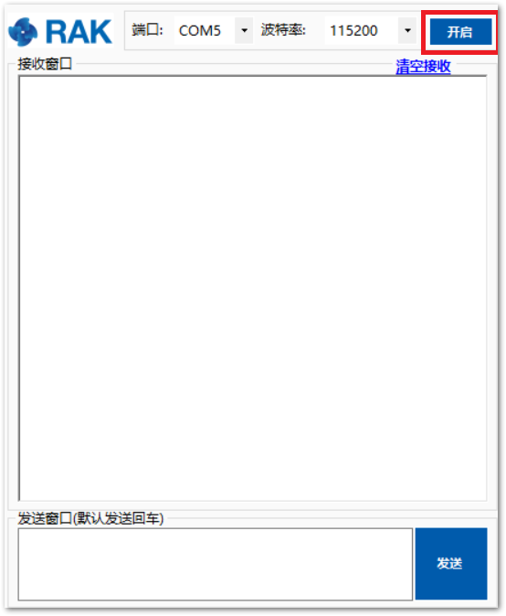
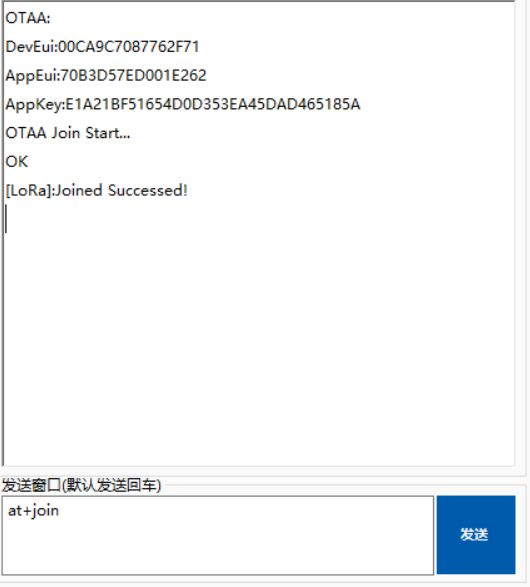
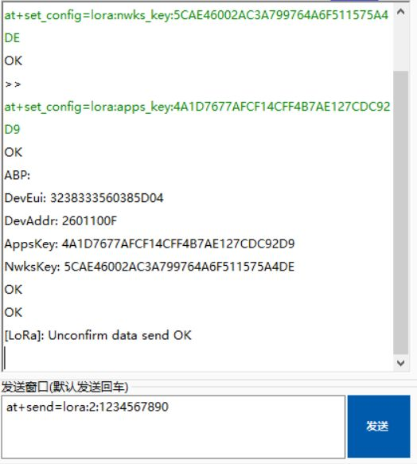

# Connecting to The Things Network (TTN)

The Things Network is about enabling low power devices to use long range gateways to connect to an open-source, decentralized network to exchange data with Application. Learn more about the Things Network here.

* First, connect RAK811 WisDuo LoRa Module with your PC and open the serial port tool on your PC.
* Second, open the serial port by clicking the following button: 

>**Note:** In this section, it is assumed that you have connected your LoRa gateway with TTN correctly. If not, please have a look  at the document of RAK LoRa Gateway.

* Now go to the [The Things Network](https://www.thethingsnetwork.org/) website ang click login. Fill in the necessary credentials and in the "**Console**" tab, pick "**Application**" as shown in the image below.

* Press the "**add application**" button.
* Create your own Application by filling up with correct contents.
>**Note:** Your Device ID is a unique ID of lower case, alphanumeric characters and nonconsecutive - and _.

* Then press the “Add application” button at the bottom of this page, and you can see the following page: 

* At the middle of this page, you can find the box named “**DEVICES**”. Then, click "**Register Device**". 

* Fill in the "**Device ID**" . Click the icon in the “**Device EUI**”, then a code is generated automatically. Then press the “**Register**” button at the bottom of this page to finish.

When you connect the RAK811 to a LoRa Gateway, we need some amount of security and trust to be established amongst them. There are two connection modes, and we distinguish between them using the criteria of security and ease of implementation. These are the Over-The-Air Activation (OTAA) and Activation By Personalization (ABP).

## Join in OTAA Mode

From the previous section, it can be seen that the default activation for TTN is OTAA. In joining OTAA, these three parameters are necessary: Device EUI, Application EUI and App Key.

>**Note:** The default LoRa work mode is LoRaWAN 1.0.2, while the default LoRa join mode is OOTA, and the default LoRa Class is A.

* If the join mode is not in OTAA, just set the LoRa join mode to OTAA and LoRa class to Class A. Open your RAK811 Firmware and type the following commands.

* Type the following AT command to set the: **Frequency/Region to EU868, Device EUI, Application EUI and Application Key**:

* Then, join in OTAA mode.

* Joined Successfully! Now, try sending data from our RAK811 WisDuo LoRa Module to TTN.

* We can view the data sent from the RAK811 WisDuo LoRa Module to our The Things Network Application Data

## Join in ABP Mode

To join the ABP mode, go to device settings and switch the activation method to ABP.

* Set the Device Address, Network Session Key and App Session Key. These three parameters will be used on RAK811 WisDuo LoRa Module:

OK! Now, let’s join in ABP mode and set EU868 frequency as an example.

* If the join mode is not in ABP, just set the LoRa join mode to ABP and LoRa class to Class A. Open your RAK811 Firmware and type the following commands

Type the following AT command to set the: **Frequency/Region to EU868, Device Address, Network Session Key and App Session Key**:

* Then, join in ABP mode.

>**Note:** Actually, it is not necessary to join in ABP mode. But, you still need to set this ATcommand to validate the parameters set for ABP Mode.

* Joined Successfully. Now, try sending data from our RAK811 WisDuo LoRa Module to TTN.

* We can view the data sent from the RAK811 WisDuo LoRa Module to our The Things Network Application Data

### Optional Configurations
You can also try other configurations which is supported in RAK811 WisDuo Module. Click through the guides provided below to learn more. Enjoy!
* Connecting to [LoRaServer](https://doc.rakwireless.com/rak811-wisduo-lora-module/connecting-to-loraserver)
* LoRa [P2P Mode](https://doc.rakwireless.com/rak811-wisduo-lora-module/lora-p2p-mode)
