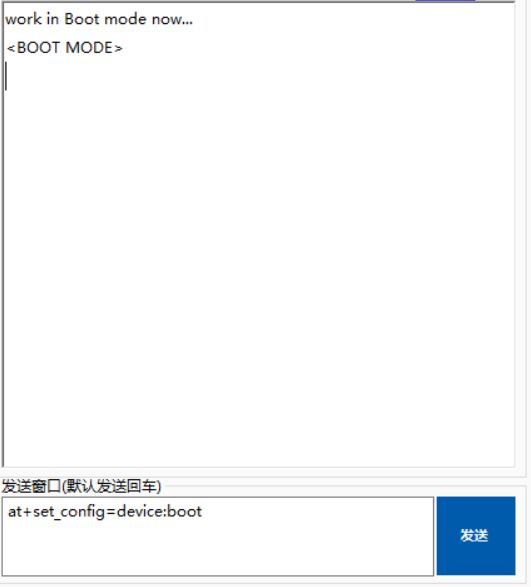
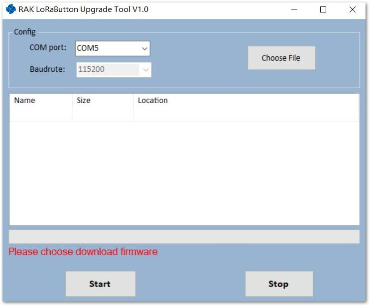

# Device Firmware Upgrading

If the firmware version of your RAK811 WisDuo LoRa Module is newer than V3.0.0.0 or you have just burned the bootloader into RAK811 WisDuo LoRa Module according to the Burning Bootloader into the Device section, you just need to burn the upgrade firmware according to the following steps now:

* First, type the command below to let the RAK811 WisDuo LoRa Module work in boot mode.
```
at+set_config=device:boot
```



Next, close the serial port tool and download the RAK Upgrade Tool from this [website](https://www.rakwireless.com/en/download/LoRa/RAK612-LoRaButton). Then, open the tool.
 


* Click “**Choose File**” button to choose the correct upgrade file:
* Click “**Start**” to upgrade, this may take a minute:


* Now, close the upgrade tool and open a serial port tool.
* We recommend you to use RAK serial port tool, because there are some ready AT commands in this tool and this will be very useful for you. You can get it from RAK website available for free at this RAK [directory](http://docs.rakwireless.com/en/LoRa/RAK811/Tools/RAK_SERIAL_PORT_TOOL_V1.%202.1.zip).
* Choose the correct **COM port** and set the baud rate to **115200**. Then open the serial port and enter the AT command provided below to restart.
```
at+set_config=device:restart
```

Congrats! This information means that you have upgraded successfully the new firmware.