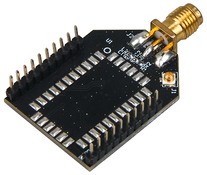

# RAK811 LoRa Module Breakout Board

## Product Background

The [**RAK811 LoRa Module Breakout Board**](https://store.rakwireless.com/products/rak811-breakout-board) is a wireless remote sensor node solution based from RAK811 + MEMS Sensor. The board uses the latest LoRaWAN Version 1.0.2 and supports the LoRaWAN working mode, making it easier to link into the LoRaWAN network.

This node has an expandable sensor interface, which greatly increases the product's application scenarios. It is equipped with advanced 3D acceleration chip that allows faster motion detection. The device has low-power features at stationary, reducing overall consumption and increasing battery life.

Overall, this node has various functionalities and applications designed in single board that could help you develop your own LoRa Projects.

## Product Features
* Supports LoRaWAN Version 1.0.2  
* Equipped with MEMS
* Supports both ABP and OTAA activation
* Operation Temperature: -20 Celsius ~ 60 Celsius
* Supports both iPEX and SMA interface antennas
* Compatible with RAK811 Chipset
* Micro USB interface for charging and configuration
* Supports Lithium battery power supply
