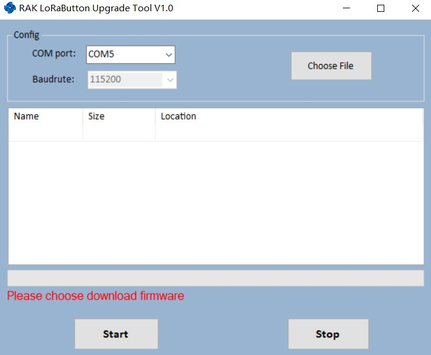
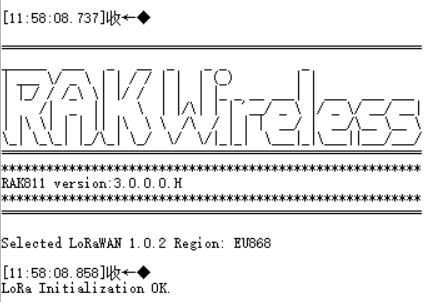

# Burning the Firmware

If the firmware version of your RAK811 WisNode LoRa Module is newer than V3.0.0.0 or you have just burned the bootloader into RAK811 according to the Burning Bootloader into the Device section, you just need to burn the upgrade firmware according to the following steps now:

1 . First, open and download the RAK Serial Port Tool [here](https://downloads.rakwireless.com/en/LoRa/RAK811/Tools/RAK_SERIAL_PORT_TOOL_V1.2.1.zip). 

In case you have not just burned the bootloader, as instructed in the previous section you need to manually go into boot mode. Connect you board via the USB interface and enter the following AT command after you have connected via the proper COM port:
```
at+set_config=device:boot
```


2 . Next, download the RAK Upgrade Tool from the RAKwireless website [here](https://downloads.rakwireless.com/en/LoRa/RAK612-LoRaButton/Tools/RAK%20LoRaButton%20Upgrade%20Tool%20V1.0.zip) then, open the tool.



3 . Download the latest firmware [here](https://downloads.rakwireless.com/en/LoRa/WisNode/Firmware/) for the RAK811 WisNode LoRa Module.

>**Note:** Make sure to pick the appropriate bin file depending on the region you are in.
"**RUI_RAK811_V3.x.x.x.H**" supported regions are: IN865, EU868, US915, AU915, KR920, AS920, AS923 while "**RUI_RAK811_V3.x.x.x.L**” supported regions are: EU433, CN470. <br/>
Visit this [article](https://www.thethingsnetwork.org/docs/lorawan/frequencies-by-country.html) for more information on your local TTN frequency plan.

4 . Click "Choose File" then choose the firmware that you have just downloaded:


5 . Choose the correct "**COM Port**", then click Start to Upgrade and wait for a couple of minutes.


6 . Now, close the upgrade tool and open a serial port tool.

* We recommend you to use RAK serial port tool with AT command capabilities. You can get it from RAK website available for free at this [RAK directory](http://docs.rakwireless.com/en/LoRa/RAK811/Tools/RAK_SERIAL_PORT_TOOL_V1.%202.1.zip).

7 . Choose the correct COM port and set the baud rate to 115200. Then open the serial port and enter the AT command below to restart.
```
at+set_config=device:restart
```



Congrats! This information means that you have upgraded successfully the new firmware.

In the next section, you will know how to configure your RAK811 WisNode LoRa Module using the available AT commands.