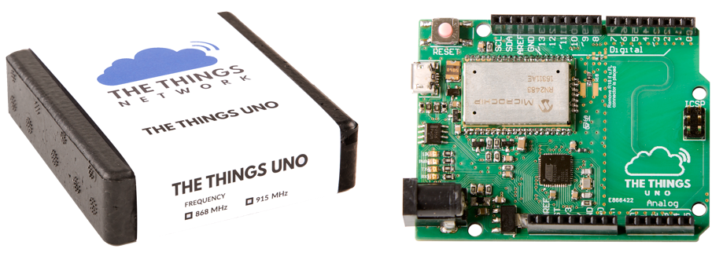

# The Things Uno

The Things Uno is the perfect board to start prototyping your IoT ideas or make an existing project wireless with up to 10km range by simply swapping boards.

[The Things Uno](https://shop.thethingsnetwork.com/index.php/product/the-things-uno/) is based on the [Arduino Leonardo](https://www.arduino.cc/en/Guide/ArduinoLeonardoMicro) ([not the Arduino Uno](https://www.arduino.cc/en/Guide/ArduinoLeonardoMicro#toc9)) with an added [Microchip LoRaWAN module](http://www.microchip.com/design-centers/wireless-connectivity/embedded-wireless/lora-technology). It is fully compatible with the [Arduino IDE](https://www.arduino.cc/en/Main/Software) and existing shields.
