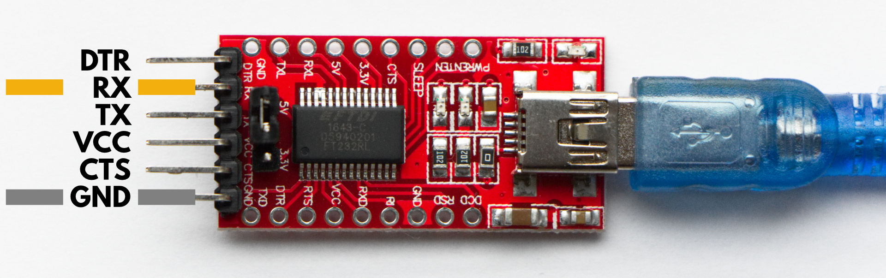

# Gateway FAQ

This page consolidates some of the most frequently asked questions on [The Things Gateway](../gateway/index.md).

> This section contains the most frequent issues and queries pertaining to the The Things Gateway. If you find issues that are not covered in this page, feel free to reach out to [The Things Network community forum](https://www.thethingsnetwork.org/forum).

#### Q. How do I get started with The Things Gateway?

Getting started with The Things Gateway is a 3 step process:

- First step - Connect the antenna and plug the gateway into a power outlet
- Second step - Go to the website (https://ttn.fyi/activate)
- Third step - Follow the instructions on the website

#### Q. How can I reset my gateway?

- Pressing the button shortly while powered on restarts the gateway.
- Holding the button for 2 seconds while powered on it erases the WiFi settings.
- Holding the button for 5 seconds while powered on it erases the WiFi settings and activation settings.
- Holding the button while powering on it will erase the full serial flash.

#### Q. The second time I power my gateway, it takes time to start up. why?

Upon every power cycle and every 24 hours, the gateway checks for new firmware. If the latest firmware is not downloaded yet, it will download the new image and perform a reboot in order to install the image. This will take a few minutes. The process is indicated by a flashing power LED. Power cycling during this process is not dangerous, but this process will be restarted on the next start-up. So, please be patient.

#### Q. My gateway stays in AP mode. What do I do?

This behaviour occurs when there is a glitch in the wifi connection of the gateway. When this happens, your gateway will turn into an AP(Access Point) and devices you used to set up the gateway can connect to it (your laptop or phone). To avoid this issue, you should remove the gateway from the list of APs from your laptop/phone(Network Settings-> Things-Gateway-XXXX -> forget this network).

#### Q. I want to get in-depth insight/read debug messages of my gateway. Is that possible?
The gateway has a UART port on which it prints debug messages. To see these messages you need to connect a device between the gateway and your computer that can read out a UART (e.g. an FTDI cable/board).

- Connect a UART-interface device to your computer and the RX line -> RX pin and GND line -> GND pin (Please refer to the images below).

    **FTDI Board**
    

    **UART pins on the gateway**
    

    **Sample Gateway to UART connection**
    

- Start a terminal session (putty: windows, terminal: macOS/linux) to UART with 115200@8N

#### Q. What do the LED lights on the gateway indicate?

The LED lights are a great way of understanding the current state of the gateway. Click [here](ledstatus.md) for the complete list.

#### Q. What steps do I need to take if I want to relocate my gateway?

There is no need to re-configure it in this case. However, for better accuracy, it is recommended to update the location settings in the Console (Settings->Location).

#### Q. How do I connect to the WiFi access point of the gateway?

After going to  (https://ttn.fyi/activate) and registering your gateway, you will have to connect to the WiFi of the gateway and then connect to your home/office network. 

Connect to the gateways WiFi access point ``Things-Gateway-XXXX`` using the password thethings.

#### Q. How can I check if the gateway is working or not?

To check the status of the gateway, go to the console as directed afterwards in the activation process. Under the gateway section (https://console.thethingsnetwork.org/gateways), you can see the status. If any device sends data through your gateway, you can check it under the ‘traffic’ section.

When connected to the same network, some information can be seen at http://things-gateway.local/info.