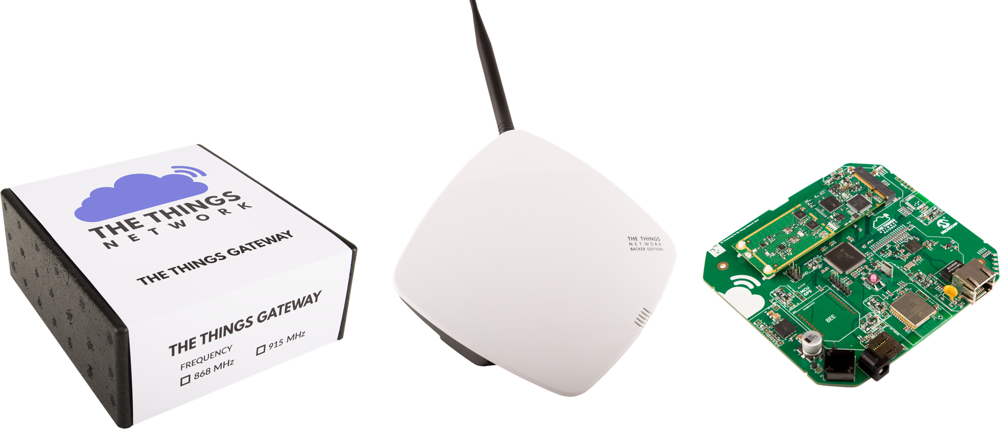

# The Things Gateway

Following a [successful Kickstarter](https://www.kickstarter.com/projects/419277966/the-things-network) our own LoRa Gateway will be available world-wide before the end of this year. At a price of just €300 and with its easy, web-based setup it is the best choice to help build The Things Network.

> [Pre-order your The Things Gateway now!](https://shop.thethingsnetwork.com/index.php/product/the-things-gateway/)

## Frequently Asked Questions

**Q. I want to get in-depth insight in what my gateway is doing, is that possible?**

A. The gateway has a UART port on which it prints debug messages. To see these messages you need to connect a device between the gateway and your computer that can read out a UART (e.g. an FTDI cable/board).

Connect UART-interface device to your computer and the RX line to the RX pin. Start terminal to UART with 115200@8N1.

Red = UART RX, brown = GND
Example connection FTDI:

**Q. My gateway stays in AP mode, what do I do?**

A. This behaviour occurs when there is a hick up in the wifi connection of the gateway.
When this happens, your gateway will turn into an AP and devices you used to set up the gateway can connect to it (your laptop oThe reset button is indicated with the text: Moder phone). To avoid this issue, you should 'forget' the wifi AP of the gateway on your phone/laptop.

**Q. How can I reset my gateway?**
A. * Pressing the button shortly while powered on restarts the gateway.
* Holding the button for 2 seconds while powered on it erased the WiFi settings.
* Holding the button for 5 seconds while powered on it erases the WiFi settings and activation settings.
* Holding the button while powering on it will erase the full serial flash

The reset button is indicated with the text: Mode

**Q. The second time I power my Gateway it takes a time to start up, why?**
A. On power cycle and every 24 hours it checks for new firmware. If the latest firmware is not downloaded yet it will download the new image and perform are reboot in order to install the image. This will take a few minutes. The process is indicated by a flashing power LED. Power cycling during this process is not dangerous, but will be restarted once started up again. Please be patient. 

**Q. What does the LED light on the gateway indicate?**
A. If in the process of activating the gateway, it takes too long then probably something went wrong. Check the LED’s on the gateway to find out what is going on.

     LED 1: On
     LED 2: Slowly blinking
     Status - Connecting to the internet

     LED 1: On
     LED 2: Fast blinking
     Status - Could not connect to the internet

     LED 1: On
     LED 2: On
     LED 3: Slowly blinking
     Status - Still activating

     LED 1: On
     LED 2: On
     LED 3: Fast blinking
     Status - Could not activate (start from step 1)

     LED 1: On
     LED 2: On
     LED 3: On
     Status - Activated

     LED 1: On
     LED 2: On
     LED 3: On
     LED 4: On
     Status - Connected to the router

     LED 1: On
     LED 2: Fast blinking
     Status - Could not connect to the internet

