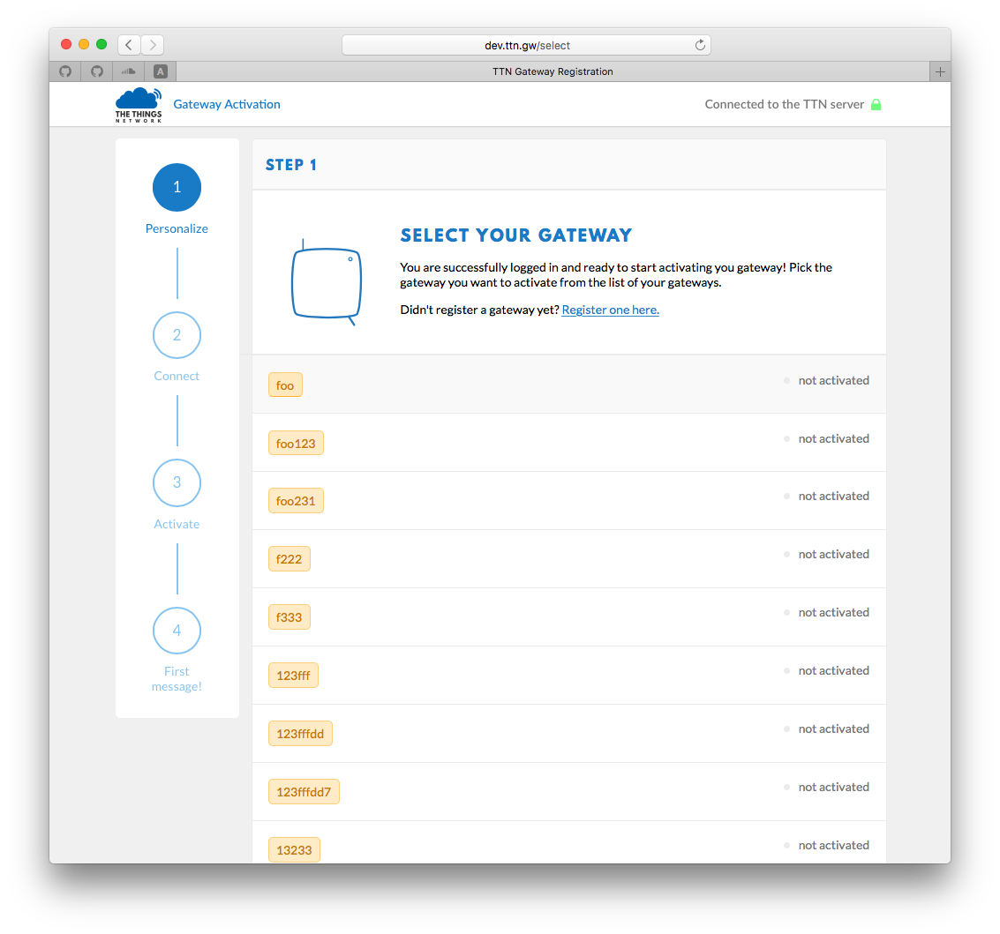

# Troubleshooting
We've try hard for The Things Gateway to never cause you any trouble, but when it does here is some help to get back on your feet quickly.

## It somehow stopped working
Like with all hardware, the first thing you'll want to try is press the reset button briefly to reboot it.

## I've deleted my registration
Oops! No worries. Press the reset button for 10 seconds until the LEDs start to blink. Then [activate](activate.md) your gateway again.

## I've changed my wifi's name or password
Press the reset button for 10 seconds until the LEDs start to blink. Then [activate](activate.md) your gateway again. Since the registration is still there, don't do this again but click **Select it here** to select the existing registration and continue from there.

