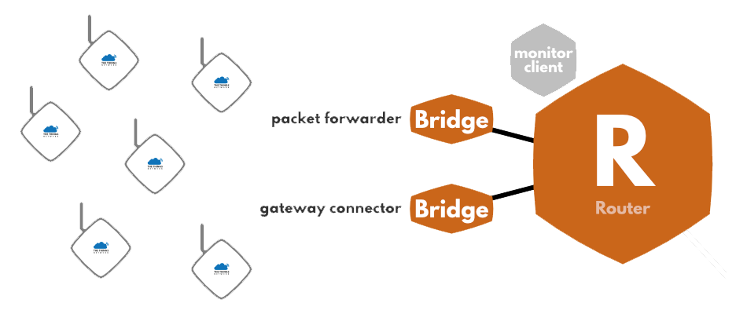

# Gateways

Gateways form the bridge between devices and The Things Network. Devices use low power networks like LoRaWAN to connect to the Gateway, while the Gateway uses high bandwidth networks like WiFi, Ethernet or Cellular to connect to The Things Network.

**All gateways within reach of a device will receive its messages and forward them to The Things Network.** The network will deduplicate the messages and select the best gateway to forward any messages queued for the device. A single gateway can serve thousands of devices.

## How do gateways work?

Gateways are routers equipped with a **LoRa concentrator**, allowing them to receive LoRa packets. You can usually find two kinds of gateways:

+ Gateways running on a **minimal firmware**, making them low-cost and easy to use (e.g. The Things Gateway), running only the packet forwarding software.

+ Gateways running an **operating system**, for which the packet forwarding software is run as a background program (e.g. Kerlink IoT Station, Multitech Conduit). This gives more liberty to the gateway administrator to manage their gateway and to install their own software.

## Help build a global network

No coverage where your device lives? Need more bandwidth? Simply add another Gateway to extend the network for both your own use and anyone else's.

We are getting ready to ship the affordable [The Things Gateway](https://www.kickstarter.com/projects/419277966/the-things-network) before the end of this year. But you can use any standard LoRa gateway with The Things Network. Under [Hardware](hardware/index.md), you can find how to buy or build your own gateway to extend the network!

> If you'd like to document and promote another gateway, [contact us](mailto:johan@thethingsnetwork.org) for our Ambassador & Partner programs.
