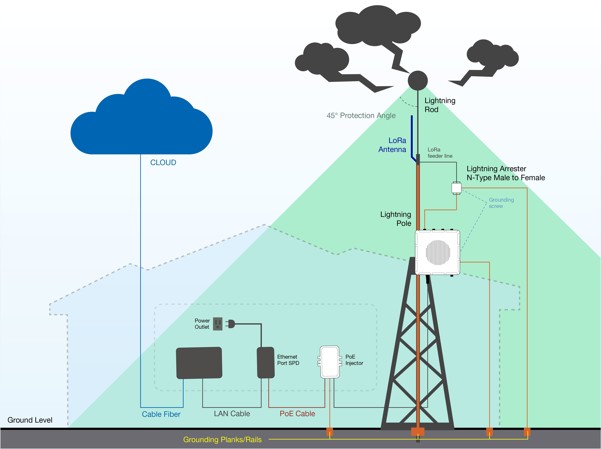

# Lightning protection

When using an outdoor antenna, please consider installing surge protection devices on the antenna and/or ethernet cables. Even the electrical field of a nearby lightning strike can destroy all connected equipment (also inside the building).

## Citel

* Coax: [P8AX09](http://www.citel.fr/en/produit/citel-radiocommunication-surge-protectors/citel-coaxial-gdt/gamme-coaxial-P8AX/p8ax09-nmf.html)
* Ethernet: [MJ8-POE-B](http://www.citel.fr/en/produit/citel-surge-protector-for-dataline-network/poe-surge-protector/surge-protectors-MJ8-POE/mj8-poe-b.html)

## WiMood

* [Ubiquiti Gigabit Ethernet Surge Protector](https://www.wimoodshop.nl/product/1095/Ubiquiti-Ethernet-Surge-Protector-Gen2)

## Huber+Suhner

* [Lightning protection](http://www.hubersuhner.com/en/products/radio-frequency/lightning-emp-protectors)

## Aliexpress

* [RJ45 lightning protection](https://www.aliexpress.com/item/100-1000M-POE-IP-Camera-Network-POE-Switch-RJ45-POE-Surge-Protector-Protection-device-Lightning-Arrester/32917720379.html) _(Assuming you use power over ethernet)_
* [PoE Injector + lightning protection](https://www.aliexpress.com/item/Gigabit-POE-6-Port-Power-over-Ethernet-Injector-For-UBNT-IP-Camera-VOIP-phone-WiFi-Access/32850552905.html)

## Rakwireless

### Recommended Equipment
* [Lightning Arrestor for the LoRa, LTE, and Wi-Fi antennas](https://store.rakwireless.com/products/lightning-arrestor): This is a surge protective device for securing transceivers against over-voltage and surge current induced by bolts of lightning. RAKwireless recommends installing lightning arrestor on all N-type antenna terminals including LoRa, LTE, and 2.4G Wi-Fi antennas.

* [Lightning Arrestor for the GPS Antenna](https://store.rakwireless.com/products/lightning-arrestor-for-gps-antenna): This lightning arrestor connects between antenna and GPS receiver. A surge protection device for securing transceiver against transients, over-voltage, and surge currents induced by bolts of lightning.

* [Antenna Feeder Line](https://store.rakwireless.com/products/antenna-feeder-line): Antenna Feeder Line for RAK7249 Lightning Protection. This antenna feeder line is an NJ-NF adapter cable with a length of 1.5m. It is an RG8 coaxial cable with N-type connector as the antenna feeder.

* [Signal Surge Protective](https://store.rakwireless.com/products/signal-surge-protective): This surge protective device is suitable to Category 6 cable or Class E cable for protection of equipment from surge and over-voltage induced by lightning or produced in the inner systems. It is widely used in office and industry comprehensive network wiring projects or the similar telecommunication applications, such as Gigabit Ethernet, ATM, ISDN and VoIP systems.

* [Ethernet Cabling](https://store.rakwireless.com/products/cat5-ethernet-cable): CAT5 Ethernet Cable for outdoor surge protection system. It is used for connections between the PoE injector, Ethernet SPD, router/switch, and the Ethernet/PoE port on RAK7249. The length of this product is 1 meter.

> If you want to learn more in detail about the Lightning Protection for the RAK7249 Macro Outdoor Gateway, go to this following [guide](https://doc.rakwireless.com/rak7249----macro-outdoor-gateway/lightning-protection---rak7249)
