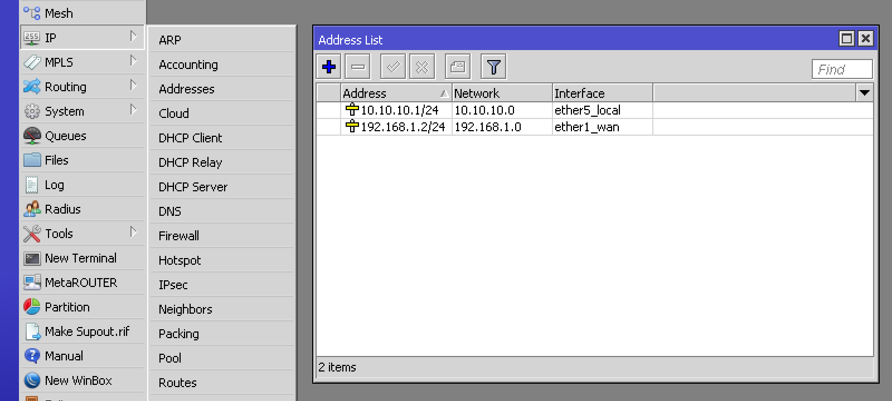

# Change Static IP Address
To check the network's IP range, connect your computer and [find its IP address](https://kb.iu.edu/d/aapa). The first 3 numbers have to match that of the LR2. If they don't, you'll need to change the static IP address for the LR2 to be able to connect to the internet.

1.  Connect to the LR2 via [Winbox Tools](winbox.md).
2.  Go to **IP > Addresses** and double-click the **ether1_wan** row: 

    

3.  Set **Address** to a static IP address within your network range and end with `/24`. Set **Network** to the same address but with `0` as last number:

    

    > You probably also have a DHCP server on your network so make sure to use an IP outside the range it uses to hand out dynamic IP addresses.
    
4.  Go to **IP > Routes** and double-click the **0.0.0.0/0** row:

    
    
5.  Set **Gateway** to [your network's gateway IP address](http://www.noip.com/support/knowledgebase/finding-your-default-gateway/). In most cases this identical to your local IP with `1` as last number.

    
