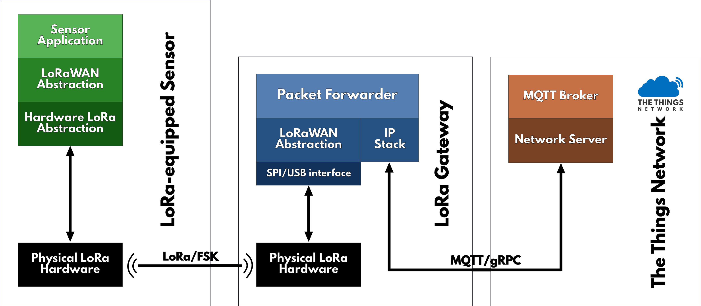

# Packet Forwarders

A Packet Forwarder is a program running on a gateway, that interacts:

+ with the **LoRa chip**, to receive and transmits LoRa packets ;

+ with the **network**, to transmit them for applications.

