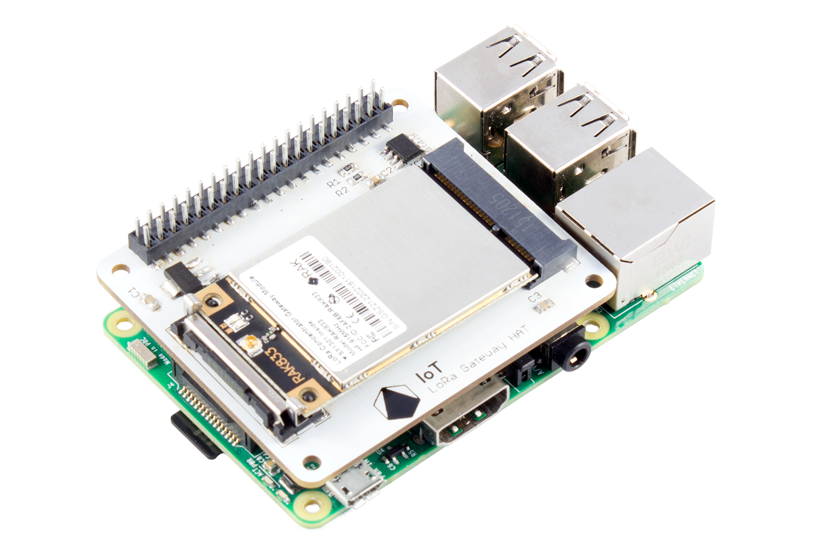
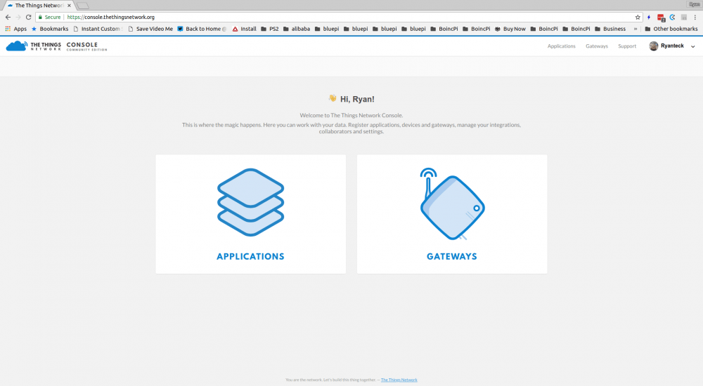
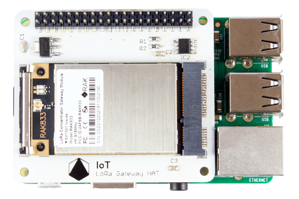
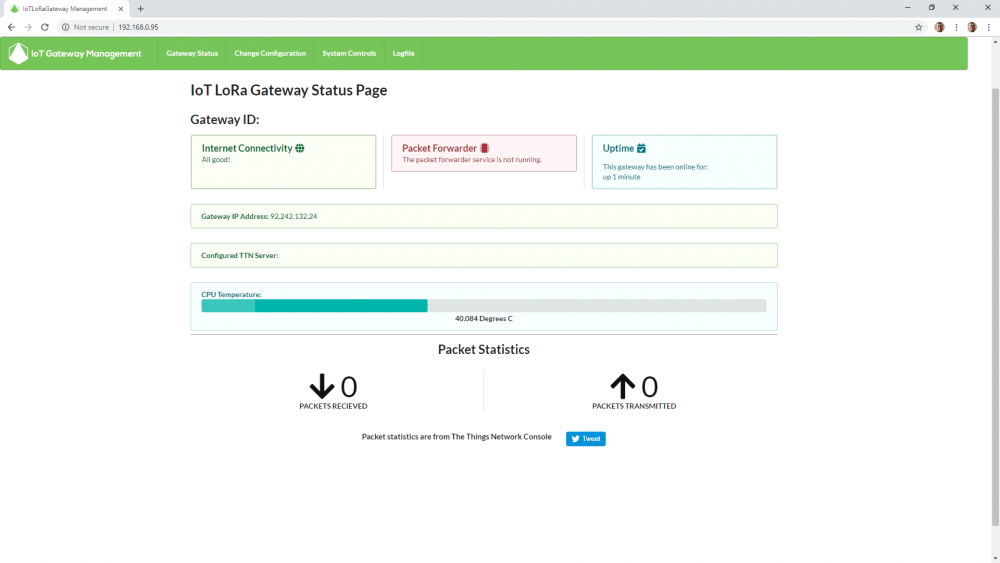
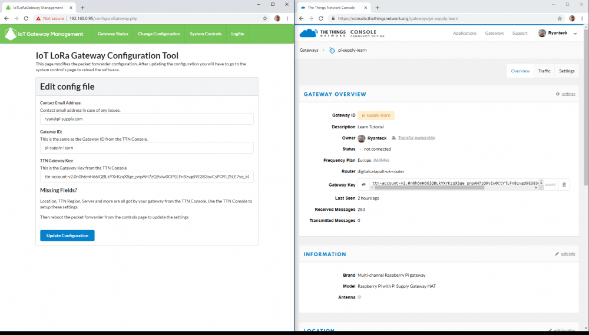
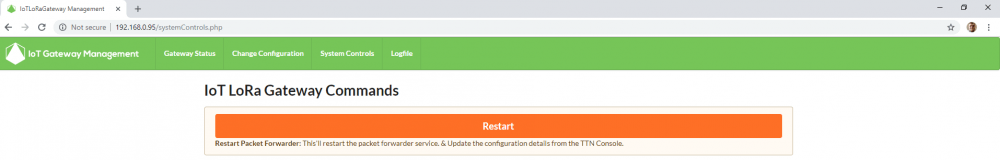
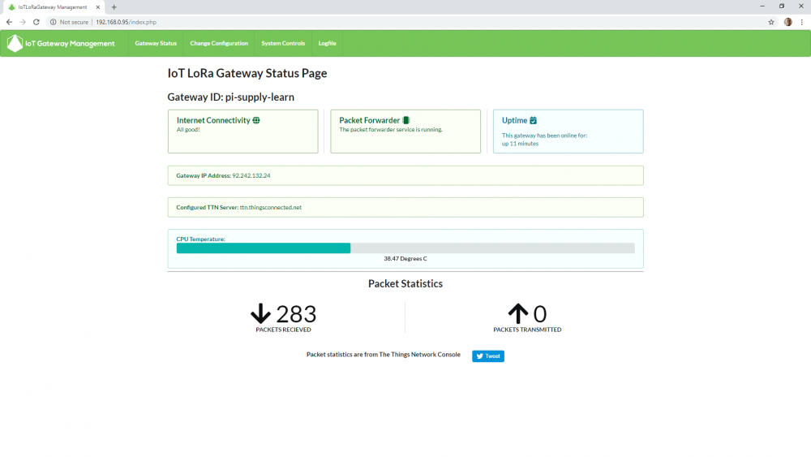

# Setup your Pi Supply IoT LoRa Gateway HAT
In this tutorial we will go over setting up the Pi Supply IoT LoRa Gateway HAT.

The method we are using is with our Pre Built SD Card Image. However other methods are available at https://learn.pi-supply.com/make/category/lora/

Reminder: Make sure the antenna is connected before turning the Raspberry Pi on

## What you need
To be able to follow this tutorial you will need:

* Raspberry Pi, Most models will work but ideally with an Ethernet Connection such as B+, Pi 2 B, Pi 3 B, Pi 3 B+
* Pi Supply IoT LoRa Gateway Hat
* SD Card – Preferably at least 8GB Class 10
* SD Card Reader
* Power Supply, At least 2A

# Step 1 - Download the SD Card image

Begin by downloading the SD Card image form our Google Drive, do this by going to http://pisupp.ly/iotsd and clicking on the Zip File to download.

The version of the SD Card image may change over time with all previous verisons avialble in the archive folder. However the one in the main folder should be used.

After it has downloaded you do not need to extract the file.

# Step 2- Image the SD Card

Next we need to write the SD card, before we can do this we need to first download a tool to write the data to the SD Card. For this we recommend balenaEtcher (Previously Resin) as it’s compatible with most Operating Systems and is easy to use.

Download Etcher from https://www.balena.io/etcher & install it on your computer and then run it.

Next select the SD Card image by clicking Select Image, and navigating to where the zip file downloaded on your computer (Usually in your downloads folder).

Then select the SD Card you wish to have the image written to, this is usually the only one that shows up if you only have one SD card plugged in.

And then click flash! The software will now write the data to the SD Card and present you with this screen when completed.

If you have it where it says validation error then the image may not have been written correctly. Try removing the SD Card, plugging it back into your computer and repeating the process. If this then still fails you may have a faulty SD Card. The process can take 5-10 minutes depending on the speed of the SD Card, writer and computer.

Once completed you should get this screen.

# Step 3 – Adding the gateway to the TTN Console

Begin by going to https://console.thethingsnetwork.org/ and creating an account if not already signed up and then login.

You should be presented with a page like this.

Now click gateways and then on the top right of the gateway box click register gateway.

On this window you need to fill out the following fields:

**Gateway ID:** This has to be a unique ID, this can be anything you like but has to be unique.

**Description:** This can be anything you like for you to have a description of a gateway.

**Frequency Plan:** This is the frequency of the gateway and should match your gateway. As we’re in Europe I’ve selected the Europe 868Mhz Plan.

**Router:** This is the closest server to your location, as we’re in Europe I’ve selected Europe but you might find there is a router closer to you.

**Location:** The location of the gateway is handy to put in, while not required it may be useful in the future and for signal coverage mapping.

**Antenna Placement:** If the gateway and antenna is indoors then select indoors, if the antenna is mounted externally select outdoors.

**All of these settings can be modified later except for the gateway ID**

**Next we want to modify a few settings.**

Click on the settings tab and you should be able to see the settings we configured and then on the information tab to the left.

Then in brand type in **Multi-channel Raspberry Pi gateway**, it should auto complete.

And for model select **Raspberry Pi with Pi Supply Gateway HAT**.

Finally click update gateway and return to the main screen. The overview should look similar to this.

# Step 4 – Plug it all in!
Now we’re ready for assembly, start by putting the RAK833 module into the Gateway HAT and then push the Gateway HAT onto the Raspberry Pi’s GPIO Headers.

Put the SD Card into the Raspberry Pi and connect it to Ethernet (if not using wireless) and finally connect a power adapter.

You should see the Red light turn on on your Raspberry Pi and the Green LED Blink.
If your Red light doesn’t turn on or blinks intermittently then try a different power supply. If the Green LED Doesn’t blink at all repeat Step 2.

**Wait for around 1-2 Minutes for the first time you boot your gateway while the initialization of Raspbian is completed.**

# Step 5 – Gateway Configuration
Finally we need to configure our gateway. To begin you will need to connect to your gateway from a computer on the same network.

Open a web browser, we have tested this in Google Chrome.

If you are on Mac OS or Linux you should be able to connect to your gateway by visiting  **http://iotloragateway.local** , on Windows you will have to find the IP Address of your gateway. This can usually be done by looking at your router’s list of devices on the network and looking for the device with iotloragateway.  

This is the home page for our IoT LoRa Gateway Mangement software. We want to configure our gateway so we visit the Change Configuration Page.

On this page you will need to type in your email address in the first box. The gateway ID in the second box and copy and paste the Gateway Key from the TTN Console into the TTN Gateway Key Box.

You can see this side by side completed.

**Now Click Update Configuration**

To get the gateway to start we now need to go to the system controls tab at the top and click the restart button.

Once you click this button you will see a progress bar go across the screen and by the end the blue light should now be showing on the LoRa module and you will be re-directed to the homepage.

**You should now be able to see your gateway’s ID, how many packet’s it has received and other handy information!**

You can also use the Things Network Console to view packets live as they are received by your gateway. However for this to work a node must be transmitting LoRa Packets nearby!

****
