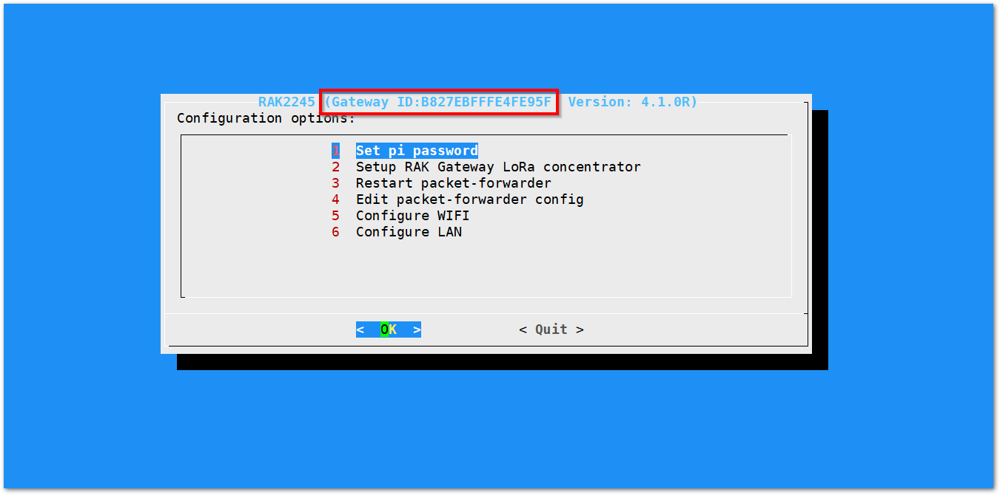
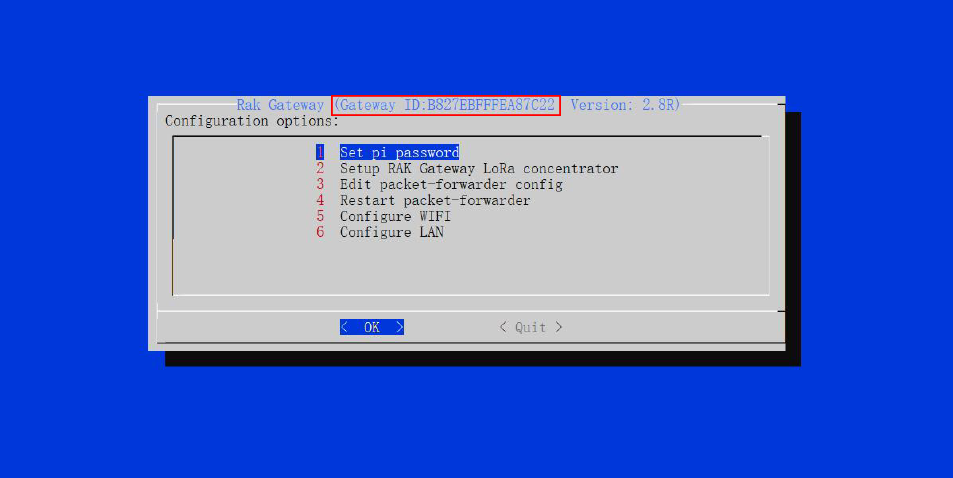

## Configuring the Gateway
Assuming you have successfully logged into your LoRa Gateway using SSH. Enter the following command in the command line:
```
sudo gateway-config
```

You will now then see a page like the following picture below



1. **Set pi password** - used to set/change the password of the LoRa Gateway.
2. **Set up RAK Gateway LoRa Concenterator** - used to configure the frequency, which the LoRa Gateway will operate on, and the LoRa Server which the LoRa Gateway will work with.
3. **Edit packet-forwarder config**- used to open the global_conf.json file, in order to edit LoRaWAN parameters manually.
4. **Restart packet -forwarder** - used to restart the LoRa packet forwarded process.
5. **Configure Wifi** - used to configure the Wi-Fi settings in order to connect to a network.
6. **Configure LAN** - used to configure the Ethernet adapter settings.

>**Gateway ID** A unique ID will be generated in for LoRa Gateway. This is also called Gateway EUI and is essential for registering the gateway with any LoRa Network Server (TTN, LoRaServer).



There is also another way to get your "Gateway ID", just enter the command below in the command line:

```
gateway-version
```


### Set a new password for the LoRa Gateway
It is a good security practice to change the default password **"raspberry"** which is the same on all Raspberry Pi devices.


You will be asked to enter your new password twice then press "Enter".

### Set up RAK Gateway LoRa concentrator
This menu allows you to select your LoRa frequency band and one of the two available Networks Server options:
* **TTN (The Things Network).** If you choose TTN as the LoRa Server, you will see the following page. Visit this [article](https://www.thethingsnetwork.org/docs/lorawan/frequencies-by-country.html) for more information on your local TTN frequency plan. This will allow you to choose the correct plan.


* **LoRaServer.** If you choose LoRaServer as your LoRa Server, you will see the following page:


Just like with TTN, choose the appropriate frequency for your country. Next, you need to set the IP Address of the LoRaServer, which you want your LoRa Gateway to work with.


The default IP Address is `127.0.0.1`. If you want to use an external LoRaServer, you need to set it to its IP Address.


## Connect the LoRa Gateway to a Router

If you want to use TTN or an independent LoRaServer which may be deployed in Local area network or Internet, you need to connect your LoRa Gateway to a router first.

### Connect through Wi-Fi
If you want to connect through Wi-Fi, it can easily be done with the Wireless capabilities of the Raspberry Pi.


There are 4 options to choose from in the Wi-Fi configuration menu:

1. **Enable AP Mode/Disable Client Mode** - the LoRa Gateway will work in Wi-Fi Access Point Mode after rebooting while the Wi-Fi Client Mode will be disabled (this is the default mode).
2. **Enable Client Mode/Disable AP Mode** - the LoRa Gateway will work in Wi-Fi Client mode after rebooting, while Wi-FI AP Mode will be disabled.
3. **Modify SSID and pwd for AP Mode** - used to modify the SSID and password of the Wi-Fi AP. Only works if the Wi-Fi AP Mode is enabled.
4. **Add New SSID for Client** - this is used if you want to connect to a new Wi-Fi Network. Only works in Wi-Fi Client mode.

### Connect through Ethernet
If you want to connect to router through Ethernet Cable, do the following steps:

* Just fill a static IP Address according to the IP address of the router you want to connect. Please note that the LoRa gateway and the router must be in the same network segment, otherwise the connection will fail.
* By default, the IP Address of the LoRa Gateway's Ethernet is `192.168.10.10`


* Then configure the IP address of the Router. This is the LAN Interface IP address of the router:


* Press OK then reboot the LoRa Gateway using the command `sudo reboot now` in the command line and it will connect to the router successfully through Ethernet.