# Connecting to an LTE Network
The RAK7243C comes with the RAK2013 Cellular making it capable of connecting through LTE network. In this section, you will learn on how to connect your Gateway to an LTE network.

* First, insert a SIM card of the appropriate type and size into the SIM card slot. Power on the Gateway.

* Then, log into the Gateway through SSH, and enter the command: 

```
sudo gateway-config
```
* Next, in the main configuration menu choose “**7 Configure LTE Module**”:
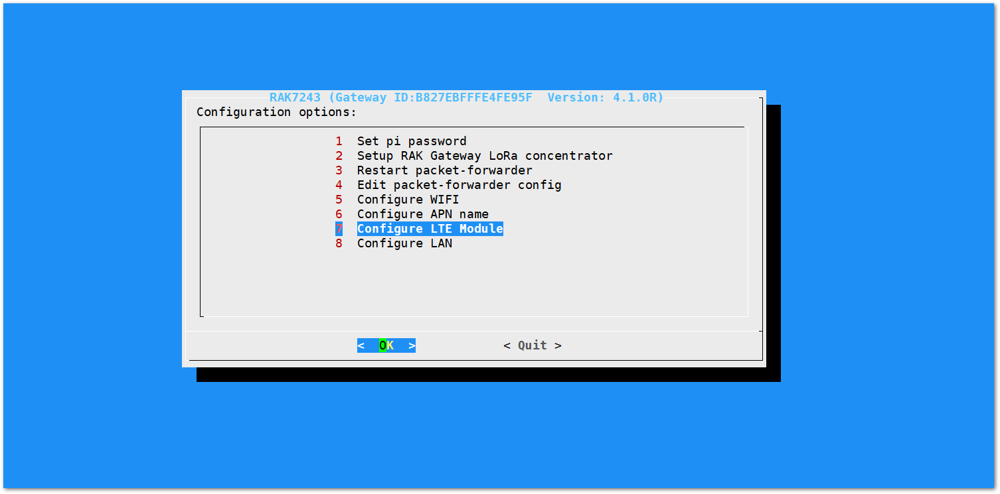

Two configuration options are available for your LTE.

1. Enable LTE Automatic Dial-up - the default option and is used to enable automatic connection during start-up.
2. Disable LTE Automatic Dial-up - used to disable automatic connection during start-up.

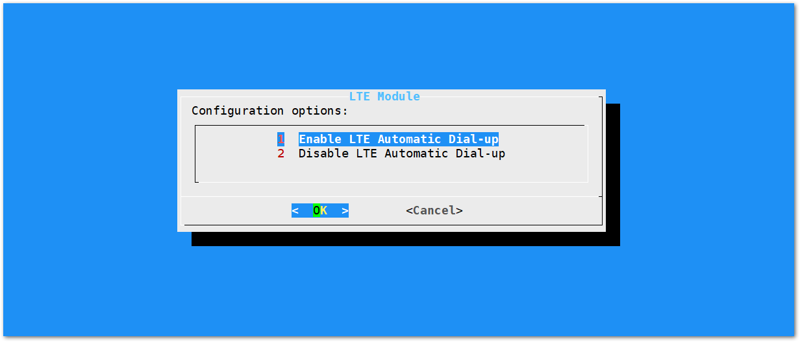

After that, you need to configure the LTE network operator’s information. Make sure to disable the automatic connection on start-up feature before starting.

* Execute the command below in the console to start minicom tool:
```
sudo minicom -D /dev/ttyAMA0 -b 115200
```

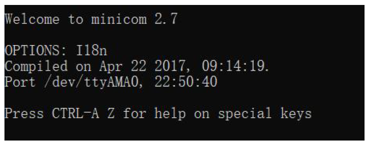

* Then, try entering the command “at” in the tool, if it returns with “OK”, it means you have opened the serial port successfully:
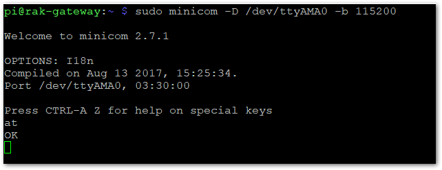

> **Note:** If you can't see the "at", which you just entered try to hold "CTRL+A" , press "Z" then press "Z". This should allow you to go the command entering mode.

* Next, execute the AT command `“at+cops=?”` to look for all available LTE networks in range:
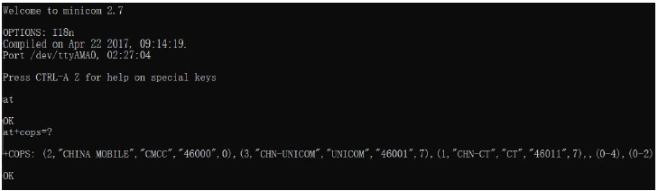

This may take a couple of seconds. After that, you'll see the available LTE Network information similar to the image below.

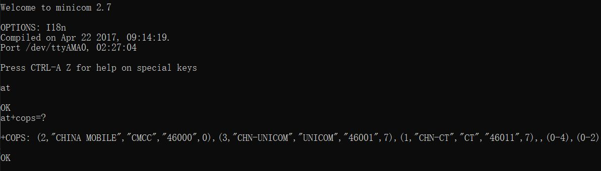

> The image above shows the available LTE network in China. These information may vary depending on the available network in your region. For instance in China, the available  network are “CHINA MOBILE”, “CHN-UNICOM”, or “CHN-CT”.

* Next, execute the AT command below to set the information of the LTE network operator that you want to use.

```
at+cops=1,0,XXX,YYY
```
1. **XXX** -  this parameter is set to describe the network operator. For example, "CHINA MOBILE”, “CHN-UNICOM”, or “CHN-CT”
2. **YYY** - this parameter is set as the last value of every operator. Choose the network with 0 value as this is the currently used network.

Now let’s take this LTE network in Europe (Bulgaria) as an example:

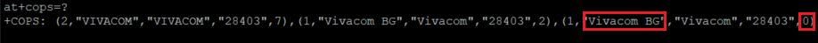

Then, using the sample AT command described above, the command will be:


After then, you will receive "OK" which means you have successfully configured the LTE network.

> **How to Quit Minicom?** : In order for you to exit Minicom. Press Enter, Ctrl + A then press Q. A pop up will appear and choose Yes.

* Proceed to setting the APN name for the pppd process. From the main configuration menu choose “6 Configure APN name”.
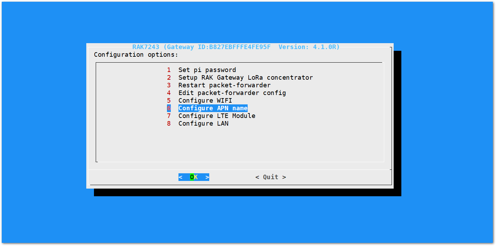

* Then, you will see the window option below where you can change the APN Name or retain its default name.
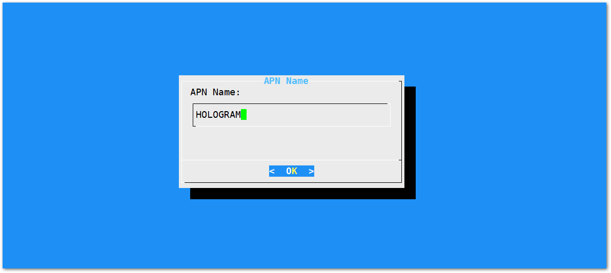

> **Note**: If you want to modify the APN Name, make sure it is a real and valid APN Name

* Lastly, set the baud rate. The default value is 115200.
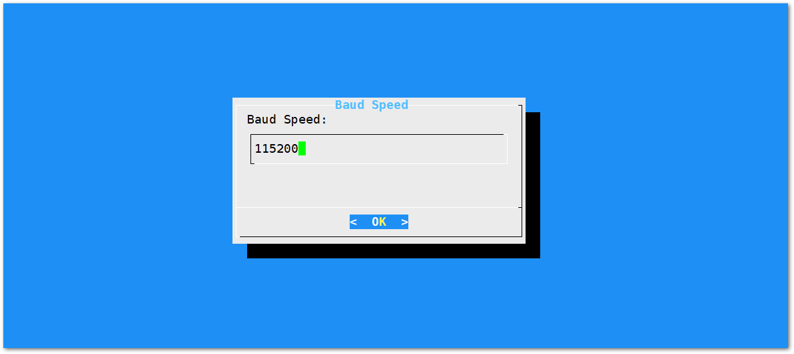

Great! You have finished configuring your LTE network. Now, let's test and verify the connection.

* Execute the command. in the terminal.
```
sudo pppd call gprs
```
There will be a series of logs but after that, you will see the the following information at the end.

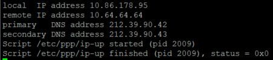

You will be assigned with an IP address (local and remote) along with the DNS addresses. Having these information signifies that your connection has successfully established.

Also, do not forget to re-enable the automatic LTE connection on start up


Alright, you had successfully connect through the three interfaces: Wi-Fi, Ethernet and Cellular, so let us proceed on how to extract the application data through the different servers.