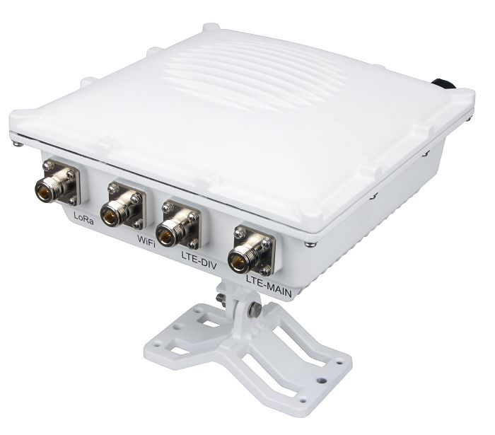

# RAK7249 - Macro Outdoor Gateway

## Product Background

The Enterprise Grade [**RAK7249 Macro Outdoor Gateway**](https://store.rakwireless.com/products/rak7249-diy-outdoor-gateway) is an ideal product for IoT commercial deployment. It contains the Main Board, Operator-grade waterproof enclosure, backup battery and mounting accessories. The hardware main board completely integrates the **WIFI**, **4G**, **GPS** and **PoE main supply** with an **integrated back-up battery**. The firmware implements a fully featured LoRaWAN™ compliant network base station. The Gateway has a range of over **15 Kilometer line-of-sight** and over **2 Kilometer in dense urban environments**.

The Macro Outdoor Gateway brings more flexibility for the developer to create an enterprise grade solution: our most important difference is our flexible development support structure, allowing for faster development and time to market. We offer both a ready-to-go firmware image for openWRT based platforms and an open SDK for integration into hardware to support the needs of each customer.

## Main Features
* Enterprise grade network gateway with your own configuration.
* LoRaWAN™ Stack Inside and integrate the Web UI for management.
* Complete Hardware specification including LoRa concentrator, Cellular, GPS and WIFI.
* Supports Power of Ethernet (PoE) IEEE 802.3af/at-Compliant Class 4, 48V.
* Battery Backup sustains operation for about 10 hours under typical conditions.
* IP67 waterproof enclosure with cable gland.

## Main Board
* **CPU**: RAK634 Module (MT7628 inside)
* **RAM**: 128MB DDR2
* **Flash**: 16MB
* **WiFi**: 2x2 MIMO 802.11b/g/n
* **LoRa Concentrator**: up to 2 LoRa Concentrator modules for up to 16 LoRa channels
* **Tx Power**: up to 25dBm
* **Rx sensitivity**: down to -139dBm.
* **4G Cellular**: Quectel EG95 for CAT4 cellular network
* **GPS**: L70 GPS Module
* **Power-over-Ethernet (PoE)**: 100M base-T Ethernet with IEEE802.3af/at standard Power-over-Ethernet

## Main Board
* IP67 waterproof white color
* **Interface**: 5 x N-Type connectors for Antenna,1 PoE port and 1 reserve port.
* **Weight (with cable)**: approximately 70.54oz (2kg)
* **Dimensions**: 220mm x 220mm x 104mm
* **Wall thickness**: 2mm.
* **Support**: up to 70~100 mm diameter pole mount'

## Backup Battery
* The maximum space in the Enclosure can be placed 12V/10AH batteries for about 10 hours lifetime under typical operation
* Battery powered real time clock
* Battery Within 140 x 70 x 30mm
* DC 5.5 x 2.1 circular joint with two interfaces, one male and one female

## Accessories
* Mounting Kit
* PoE Injector
* WiFI Antenna
* GPS Antenna
* LoRa Antenna
* LTE Antenna

The bellow table shows the main board configurations of the Macro Outdoor Gateway.

