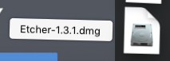
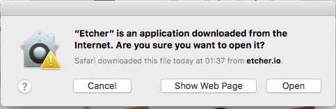

# Install etcher for OSX

1. Download etcher from http://etcher.io

1. Open the downloaded file

1. Drag the 'Etcher' icon on the left to the 'Applications' on the right

1. Close the 'Etcher' window
1. Find 'Etcher' (the old fashioned LP icon) in you applications and open it.

1. Confirm you want to 'Open' it.

1. If you see the screen below the installation was successful

1. Close the software (for now)