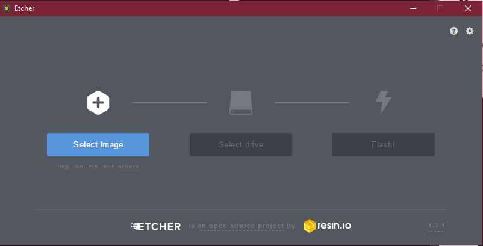

# 'Install' Etcher for windows
For Windows we will be using the Portable version of Etcher. This version does not require installation.

1. Download etcher from http://etcher.io, choose the '(Portable)' version matching your windows installation

1. Start the software from your downloads directory to check it starts properly

1. Iconize or close the software for now
