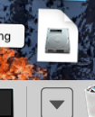
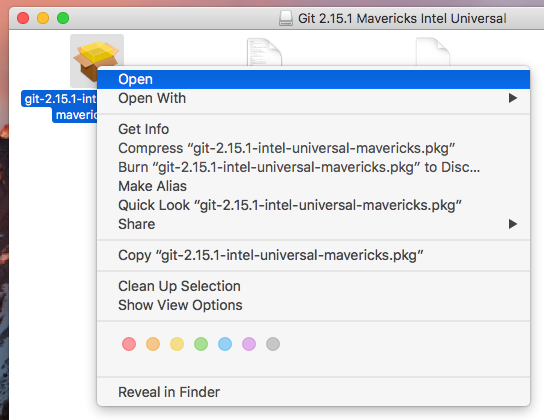
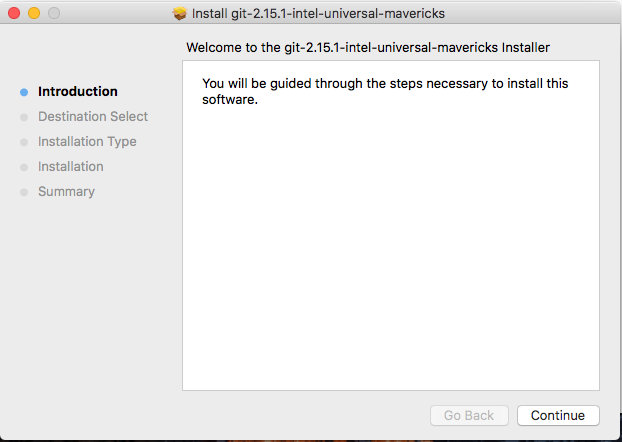

# Installation instructions for GIT client on OSX

1. Go to https://git-scm.com/downloads and download the OSX installer.

2. Open the dmg file in the downloads

3. Double click on the newly opened Git 2.XX.X ... Universal icon

4. Control click git-2.xx.. and select open from the menu

5. Select 'Open' when asked if you are sure

6. In the next screen select "Continue"

7. Select "Install"

8. Provide your password to proceed with the installation

9. Once the "The installation was successful." screen appears, close the installer.

10. "Keep" the installer for now.

11. Open the "Terminal" and run "git" (no quotes)

12. If you get a message *and only if you get that message* 'The "git" command requires the command line developer tools' run
sudo mv /usr/bin/git /usr/bin/git-system
13. You successfully installed GIT
