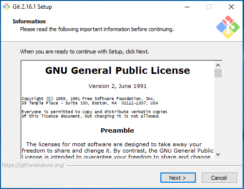
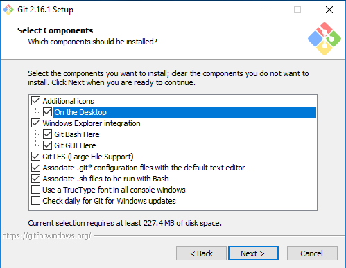
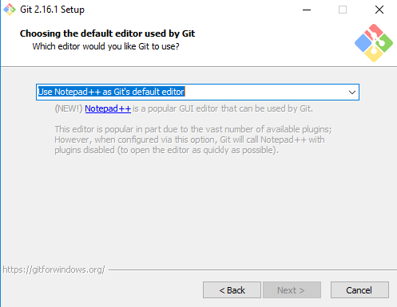

# Installation instructions for GIT client on windows

1. Go to https://git-scm.com/download/win and download the software

2. Click 'Next' to accept the license

3. Check the checkbox for 'On the Desktop' for easy access to the software

4. Choose 'Use the Nano editor by default' from the selections (unless you prefer one of the other options)

5. Select 'Use Git from the Windows Command Prompt'

6. Select 'Use the OpenSSL library'

7. Keep the default 'Checkout Windows-style, commit Unix-style line endings' selected

8. Keep 'Use MinTTY' selected

9. Check 'Enable file system caching' and 'Enable Git Credential Manager' and 'Install'

Close the installer once it is finished.
