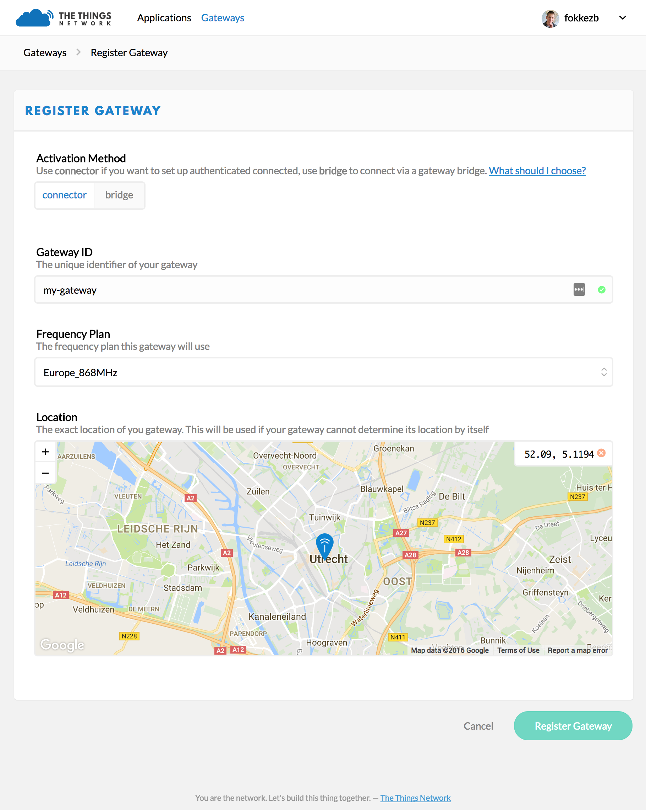

# Gateway Registration

There are mainly two types of packet forwarders that can be running on your gateway:

+ Packet forwarders that connect using the Semtech UDP protocol (such as the [poly packet forwarder](https://github.com/TheThingsNetwork/packet_forwarder/tree/legacy)). This protocol is not encrypted, less reliable (UDP-based), but its simplicity makes it work on a large number of gateways.

+ Packet forwarders that connect using the new TTN Gateway Connector protocol (such as the [TTN Packet Forwarder](https://github.com/TheThingsNetwork/packet_forwarder/tree/master)). This protocol is more secure and safer.

Please read this guide carefully to understand how to register your gateway with The Things Network.

> If you have an off-the-shelf gateway with the default software, it most likely uses the Semtech UDP protocol. Follow the steps for connecting using the [UDP Packet Forwarder](#via-udp-packet-forwarder).

## Via TTN Packet Forwarder

The Things Network Packet Forwarder uses an authenticated and encrypted TCP connection to our network server and has support for Kerlink, Multitech and other Linux based gateways. This is the preferred packet forwarder to use with The Things Network.

### Start with Registration

You start by [registering your gateway](https://console.thethingsnetwork.org/gateways/register) in the Console.

- For **Protocol**, leave **gateway connector** selected.
- For **Gateway ID**, choose a unique ID of lower case, alphanumeric characters and nonconsecutive `-` and `_`.
- Select the frequency plan ([determined by your region](https://www.thethingsnetwork.org/wiki/LoRaWAN/Frequencies/By-Country)) the gateway uses.
- Click to drop the pin at the exact location (pan and zoom in before you drop).
- Click **Register Gateway** to finish.

  This will take you to the Gateway's screen where you'll find the generated **Gateway Key** you need next.

> After registering the gateway, select **Settings** from the top right menu on the Gateway screen so set the gateway description, location altitude, privacy settings and other information.

### Configure gateway with TTN Packet Forwarder

Make sure your gateway runs [The Things Network Packet Forwarder](https://github.com/TheThingsNetwork/packet_forwarder/tree/master) before you continue. Then configure it with the ID and Key from the registration on the console. This allows you to manage most of the gateway's configuration from the Console, without having to log on to the gateway.

> If your gateway does not have a GPS module we advise you not to configure a manual location in the gateway. Do this in the Console instead so that you can change it without accessing the gateway.

## Via UDP Packet Forwarder
The UDP Packet Forwarder is deprecated, but will still be supported by TTN. We advise you to upgrade to the TTN Packet Forwarder.

### Start with Configuration
Follow your gateway's manual to configure it to forward packets to The Things Network. Configure it to forward to the correct [router address](https://www.thethingsnetwork.org/wiki/Backend/Connect/Gateway#connect-a-gateway_server-addresses) for [your region](https://www.thethingsnetwork.org/wiki/LoRaWAN/Frequencies/By-Country). The guide should also help you set or retrieve the gateway's EUI, likely the MAC address of the LoRa module which looks like `B827EBFFFE87BD11`.

You will likely also need the `global_conf.json` file for the frequency plan used in your region. You can find it on [our github repo](https://github.com/TheThingsNetwork/gateway-conf).

> If your gateway does not have a GPS module we advise you not to configure a manual location in the gateway. Do this in the Console instead so that you can change it without accessing the gateway.

### Packet Forwarder Bridge
We have a special bridge in place that will continue to accept packages from gateways using the UDP Packet Forwarder. It will lowercase the EUI and prefix it with `eui-`. So a gateway with EUI `B827EBFFFE87BD11` will appear in meta data and APIs as `eui-b827ebfffe87bd11`.

### Register 
[Register your gateway](https://console.thethingsnetwork.org/gateways/register) via the console. This will link it to your account so that you can manage it.

- For **Protocol**, select **packet forwarder**.
- For **Gateway EUI**, paste your gateway's EUI (8 bytes).
- Select the frequency plan ([determined by your region](https://www.thethingsnetwork.org/wiki/LoRaWAN/Frequencies/By-Country)) the gateway uses.
- Click to drop the pin at the exact location (pan and zoom in before you drop).

> After registering the gateway, select **Settings** from the top right menu on the Gateway screen so set the gateway description, location altitude, privacy settings and other information.

### Unregistered Gateways
If you don't register your gateway, The Things Network will still accept packets it forwards, but mark them as **untrusted**. The gateway will appear on the [map](https://www.thethingsnetwork.org/map) as **Unregistered**. You will not be able to manage its configuration (e.g. location) from the Console.

## Troubleshooting & FAQ

### Could not register gateway
If you return to the Gateways screen without seeing the newly registered gateway you will probably also see the following error on the top right:

This means someone else already registered this Gateway ID or EUI. If you registered to use TTN Packet Forwarder, simply think of a new ID. If you registered to use the UDP Packet Forwarder, check the manual of your gateway to see if you can configure it with a [different (random) EUI](https://www.randomlists.com/string?length=16).

### How can I switch from the UDP Packet Forwarder to TTN Packet Forwarder?
You just need to install [TTN Packet Forwarder](https://github.com/TheThingsNetwork/packet_forwarder/tree/master) on your gateway and configure it with the gateway ID and Key as listed on the console.
