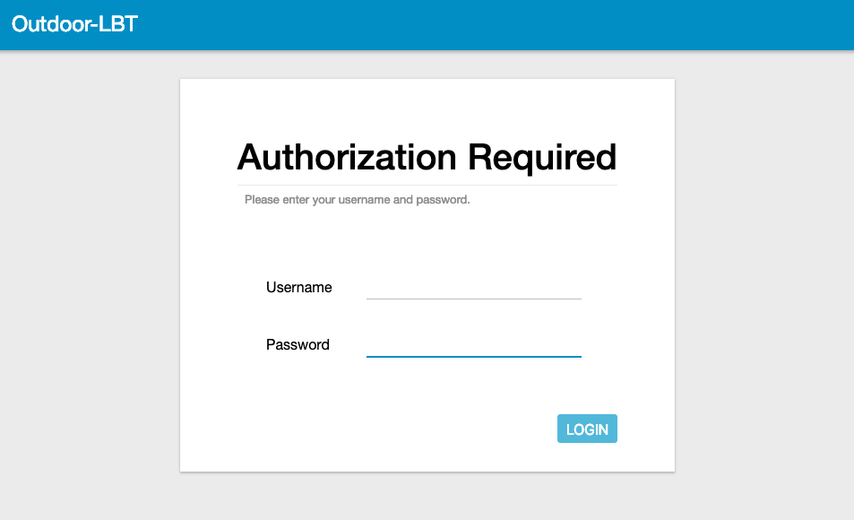

# The Things Outdoor Gateway

The Things Outdoor Gateway (TTOG) is an industrial, outdoor and fully compliant gateway at a very low cost.

**Salient Features:**

* LoRaWAN 1.0.2 compliant
* Supports eight channels for EU868 and US915 bands
* 3G/4G backhaul via built in modem
* Supports LBT (Listen Before Talk)
* EU868, US915, AS923 and CN470 versions available
* IP67 waterproof enclosure
* Dimensions: 230 x 200 x 68mm
* Weight: 2.05kg
* Power voltage: 55VDC/0.6A via included PoE adapter

The outdoor gateway is currently available from [Connected Things Store](https://connectedthings.store) in both EU and US versions.

## Set up your gateway

1. Connect all antennas:
 - ANT 1 - GPS
 - ANT 2 - LTE antenna
 - ANT 3 - LoRaWAN antenna
 - ANT 4 - (not used)
2. Connect the PoE injector output cable to the Gateway Ethernet connector. Connect the PoE input cable to your network.

## Activate your gateway

The ODU GUI is a web interface to configure all network settings. The ODU GUI uses the IP address assigned by the Gateway to enter the network setting page.

1. Connect and power the gateway as above. The gateway will use DHCP to request an IP address from the network. Find this IP address from your router and enter the IP address assigned to the Gateway into the web browser to access the ODU GUI interface. The configuration page should look like this:
 
2. Login with the username and password: `admin` / and the password from the label on the back of your unit (older firmware versions used the password `admin`)
 > Make sure to update the password the first time you login!
3. Connect the gateway to The Things Network via: **Packet Forward** > **Module 1 Settings** and enter the following settings:
 - **Server Address:** [Router address for you region](https://www.thethingsnetwork.org/docs/gateways/packet-forwarder/semtech-udp.html#router-addresses); 
 - **Server Uplink Port:** 1700;
 - **Server Downlink Port:** 1700
  
4. Save the **Gateway ID**, you will need this later on when adding the gateway The Things Network using the console.
5. Set the network settings via **Network** > **WAN**. You can choose to connect via Ethernet or 3G/LTE. Reboot the gateway after configuring the network settings.
 
 > Did you connect the gateway via 3G/LTE? It will take a few minutes before the gateway will start routing messages. 
 > To open the ODU GUI again, you can access the web interface via the fallback IP address: [192.168.11.10](http://192.168.11.10).
 > You will need to set your PC's IP address in the same range, e.g.:
 > IP address: `192.168.11.100`
 > Subnet Mask: `255.255.255.0`
 > Router: `192.168.11.10`
 

## Connecting to the The Things Network Backend

1. To connect this gateway to the [The Things Network console](https://console.thethingsnetwork.org/), register the gateway using the **I'm using the Legacy Packet Forwarder** option. 
2. The EUI of the gateway can be derived from the Gateway ID which can be found in the ODE GUI, under **Packet Forward** > **Module 1 Settings**. Add `0000` at the beginning of the Gateway ID to get the Gateway EUI. For example `80029c10xxxx` becomes `000080029c10xxxx`.
4. This is the value to be entered in the Gateway ID field on the [console](https://console.thethingsnetwork.org).
5. Enter the other details such as location, frequency plan and router.
6. If your configuration was successful, you should start receiving packets (if there are LoRaWAN nodes transmitting nearby).

## Troubleshooting

* When you cannot find a way to change the LoRaWAN settings, you might need to update the System Firmware. You can do so via:
 * **System** > **System Firmware** 
 * Download [this file](https://connectedthings.store/files/WAPS-232N_LW_OPDK_GUI_1.01.09_3416004962.tar.gz), making sure to keep the file name exactly the same (don't try to unzip this file)
 * Upload the file to and click **Upgrade**
  
 * The gateway will automatically reboot with the upgraded firmware
