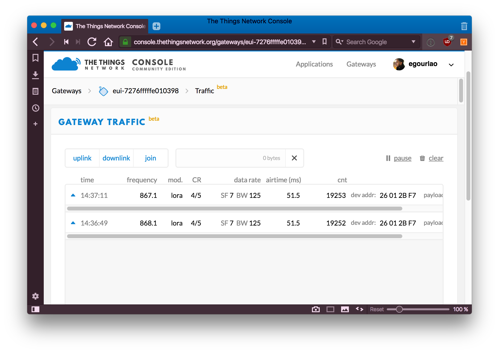

# Troubleshooting a gateway

Your gateway doesn't seem to send data to The Things Network? This section is here to help you find out the issue might come from. We'll give you a few leads to help you troubleshoot your gateway.

## From the console

The Things Network's [console](https://console.thethingsnetwork.org) is connected to our Network Operations Center, which monitors the gateways across the network. This means you can now see if the gateway is estimated to be connected or not connected:


If your gateway is considered to be connected, you can also see the traffic going through this gateway:



The availability of these features depends however on the [status](https://status.thethings.network) of the NOC.

## From the gateway

If you think the network isn't receiving any traffic from your gateway, you'll want to figure out why.

Here are a few leads of questions to which the answer will give you a better insight:

+ Does your gateway have a working network connection? To test this, connect to your gateway, and execute a few pings or DNS lookups: `ping www.google.com` or `nslookup account.thethingsnetwork.org`, for Linux gateways. If these tests are unsuccessful, you'll probably want to check the network connection of your gateway.

+ Is the packet forwarder running on your gateway? The way to answer this question depends on your type of gateway. Many gateways rely on SystemV or systemd managers, which can give you the status of the packet forwarder. Other gateways rely on [resin.io](https://resin.io), for which you can consult the status from a Web interface. Some other, like the Kerlink IoT Station, have their own init systems - often, consulting the list of running processes (with `ps -a`) can give you insight on whether the packet forwarder is running.

+ Does the packet forwarder have a successful connection to The Things Network? For example, in the legacy Semtech packet forwarder, some logs indicate whether acknowledgments are being sent by the network:

```
INFO: [up] PUSH_ACK for server router.thethings.network received in 61 ms
```
