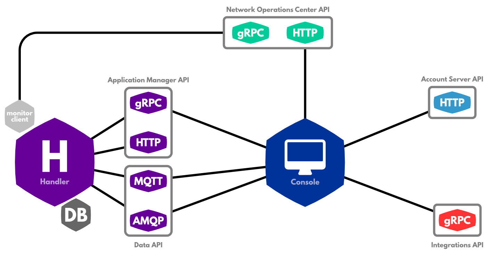

# The Things Network Console

Your Applications and Devices can be managed via [The Things Network Console](https://console.thethingsnetwork.org). This is a closed-source interface over our open-source [CLI](../cli/index.md) and the same APIs of our open-source server components that your [applications](../../applications/index.md) can use.

In addition to that it provides a UI to our closed-source Network Operations Center to monitor your use of the network, as well as point-and-click integrations for popular application platforms.

